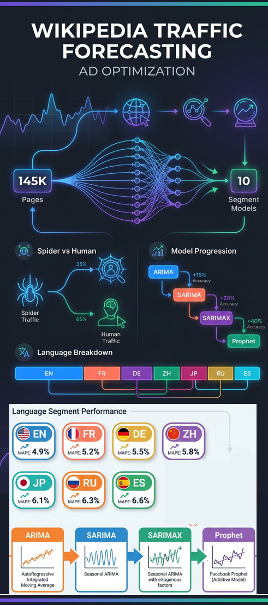
# Wikipedia Traffic Forecasting & Ad Optimization

## 1. Project Overview & Problem Statement
The objective of this project is to use historical Wikipedia page-view data to forecast future traffic trends. This analysis aims to assist advertisers in making data-driven decisions regarding ad placement based on language and region.

**The Core Business Question:**
A user wants to place an ad and needs to know:
*"If I place my ad on French pages versus English pages, how many page views can I expect?"*

**Expected Outcome:**
To predict page views per specific **segment** (e.g., Language or User Type) to facilitate capacity planning and budget allocation for ad campaigns.

---
How to gain maximum from this README
- Read Section 2 to 5 to get the main conclusions of the study
- Read Section 6 for a deep dive into code and actual steps performed.  
- Gives you 
  - all intermediate decisions
  - all intermediate 
  - some code
  - all final results and plots !

---

## 2. Modeling Strategy: The Aggregated Approach

### The Methodology
Rather than building separate models for each of the ~145,000 Wikipedia pages, I adopted an **Aggregated Time Series Approach**. Daily pageviews across all pages within a specific segment (e.g., "All English Non-Spider Traffic") were summed to create a single representative time series per segment.

### Why this approach?
This approach offers three distinct advantages over page-level modeling:
1.  **Computational Efficiency:** Reduced the workload from training ~145,000 individual models to just ~10 high-quality segment models.
2.  **Statistical Robustness:** Aggregation smooths out outliers and sparse pages that suffer from near-zero traffic, providing a cleaner signal for forecasting.
3.  **Alignment with Business Objectives:** Since the user goal is capacity planning and resource allocation at the *region/language level*, segment-level forecasts are more directly actionable than individual page predictions.

### Alternative Approaches Considered
Before selecting the aggregated approach, I evaluated several other methodologies:
*   **Multi-Sample Parameter Tuning:** Testing parameters on 50-100 random pages to find robust settings, but this lacks the smoothing benefits of aggregation.
*   **Global ML Model:** Training a single Machine Learning model (e.g., LightGBM) on all series simultaneously.
*   **Cluster-then-Forecast:** Grouping similar pages using clustering algorithms, then training separate models per cluster.
*   **Deep Learning:** Using neural architectures (DeepAR, N-BEATS) designed for large-scale multi-series forecasting.

*Result:* The **Aggregated Model** was chosen as the ideal balance of simplicity, efficiency, and direct alignment with the segment-level forecasting requirements.

---

## 3. Architecture & Pipeline

### Data Segmentation Logic
We identified that `access_origin` (Spider vs. Human) and `language` were the strongest drivers of variance. The data was segmented accordingly.

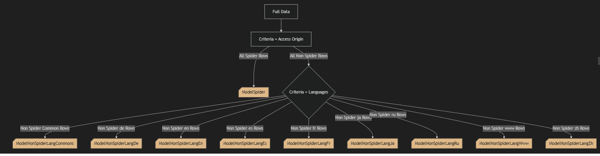
*Figure 1: Logic used to segment the 145k pages into clusters for modeling.*

### Modeling Pipeline
The pipeline ingests raw daily data, splits it into the identified segments, and applies the specific forecasting model (SARIMAX or Prophet) best suited for that segment's characteristics.

<p align="center">
  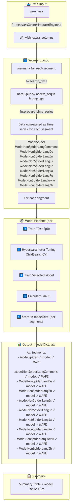
</p>

*Figure 2: End-to-end pipeline: Input Data -> Split by Segment -> Train/Test -> Forecast.*

---

## 4. Data Summary
**Total Data:** 145,063 Rows (Pages) x 550 Columns.
**History:** Daily page views from 2015-07-01 to 2016-12-31.
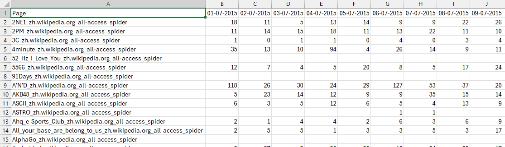
*Figure: Sample data.*

| Feature | Details | Importance |
| :--- | :--- | :--- |
| **Page** | Metadata (Name, Language, Access) | Unique Identifier |
| **Date Columns** | 550 days of click counts | The Time Series target |
| **Access Origin** | `spider` vs `all-agents` | **Critical:** Spiders behave differently than humans. |
| **Language** | `en`, `fr`, `de`, `zh`, etc. | **Critical:** Key segmentation criteria. |
| **Access Type** | `mobile`, `desktop`, `all-access` | Used for EDA. |

---

## 4. Model Results
We compared **SARIMAX**, **Prophet**, and **SARIMA** against a baseline. The aggregated models showed significant improvement over baseline methods.

| Segment | Best Model | Best MAPE (%) | Improvement over Baseline (pp) |
| :--- | :--- | :--- | :--- |
| **Non-Spider (Chinese)** | SARIMAX | 4.7% | 1.8 |
| **Non-Spider (English)** | Prophet | 4.8% | 2.1 |
| **Non-Spider (German)** | SARIMAX | 5.5% | 1.9 |
| **Non-Spider (Japanese)** | SARIMAX | 6.4% | 2.4 |
| **Non-Spider (French)** | SARIMAX | 7.1% | 4.6 |
| **Non-Spider (Russian)** | SARIMA | 7.1% | 25.0 |
| **Non-Spider (Spanish)** | Prophet | 7.5% | 10.6 |
| **Spider Traffic** | SARIMAX | 11.5% | **62.3** |
| **Commons (Media)** | Prophet | 13.9% | 0.8 |
| **WWW (Main)** | Prophet | 15.1% | **63.5** |


- 
---

## 5. Key Insights & Actionable Recommendations

### Traffic Behavior
*   **Spider vs. Human:** Spider traffic has almost no seasonality (flat with random spikes), whereas human traffic shows clear weekly cycles.
*   **Language Differences:** English pages show dramatic variance compared to German or French pages.
*   **Impact of Campaigns:** Marketing campaigns cause multi-fold positive spikes in page views, which the models must account for.

### Recommendations
1.  **Separate Bot Traffic:** Always filter `access_origin == 'spider'` when forecasting for ad placement, as bots do not monetize ads.
2.  **Segment by Language:** Do not use a "one-size-fits-all" model. English and Spanish pages require different forecasting parameters (Prophet) compared to German or Chinese pages (SARIMAX).
3.  **Capacity Planning:** Use the "Spider" model specifically for server load testing (capacity planning), as bots generate significant but unpredictable load.
4.  

---

## 6. Detailed Walkthrough of EDA and Modeling

Let me take you to a deep dive journey of how this case study was done.

### EDA
1. We split the first column into multiple columns - page title, domain, access_type, access_origin and language
2. We realized that modeling on per page basis is not feasible (we tried fitting models on single pages, later in the study and found that MAPE was obnoxious, around 89%.  
   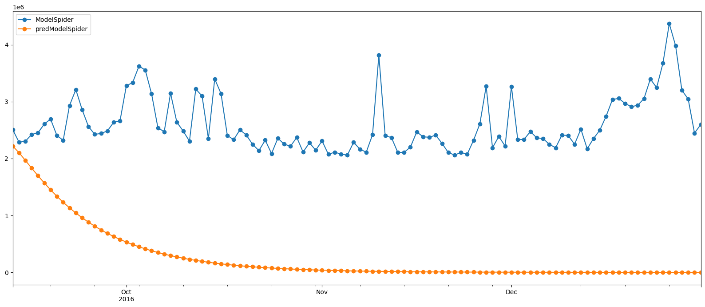
3. That's when we circled back, and went in for the **aggregated approach** described earlier in this document. Data from all segments was added across pages, and considered ONE time series. (*As expected, EDA is a iterative exploratory step, and such back and forth are but expected.*)
   
4. Performed univariate and bivariate analysis on aggregated data.  Important insights were 
   - Page access by spiders (bot) is quite different from normal access
     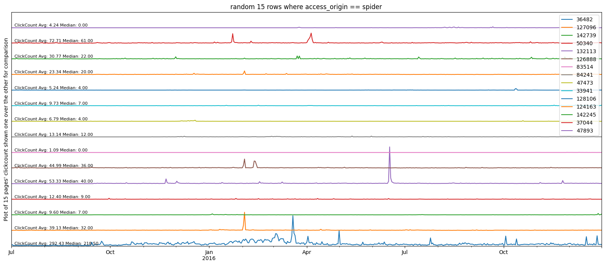
     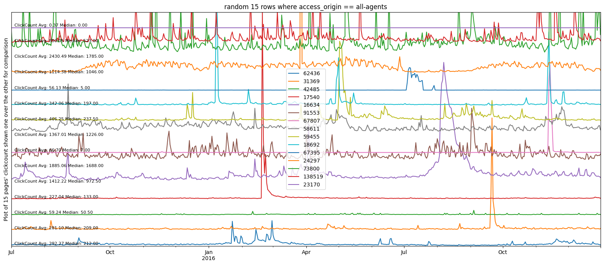
   - So definitely this can be a segmentation criteria
   - Next we analysed page view data across languages. Here too we found variations.
     - EN pages are quite different compared to other languages.  There are dramatic ups and downs 
     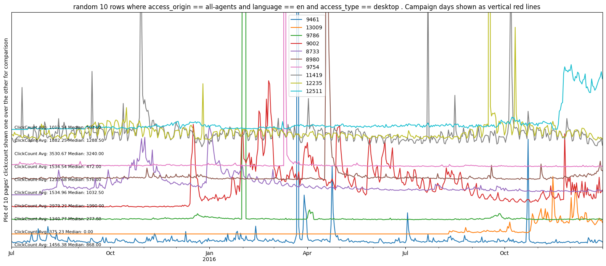
     - ZH pages are having much less spikes
     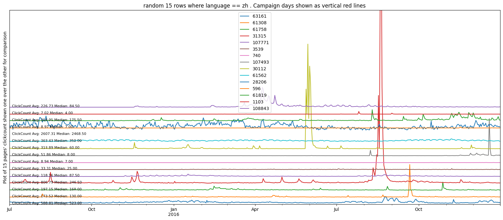
     - Compared to langugage pages, www has almost NO spikes !  Even commons is also flattish
     - FR is flattish
     - Overall conclusion was that we should build different models for different languages.
   - We have figured out from all the EDA analysis that `access_origin` and `language`s are two good criteria for segmenting the data.
   - As expected in a typical web based business ,there is a weekly cycle.  
   - Campaigns can have very significant (multifold) positive impact on page views.
   - We were provided exogeneous data about English pages.  Plotting the same revealed exogeneous variable does make sense.
   - 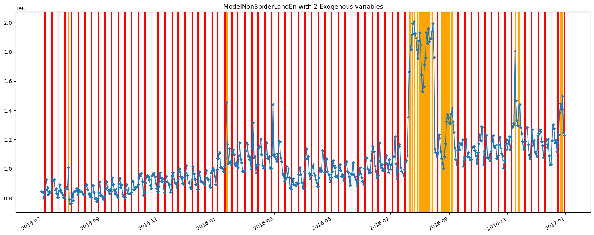
   - We also explored using a embedding model to cluster page titles as the page name has useful info.
     - This study was done separately and **sentence-transformers/paraphrase-multilingual-MiniLM-L12-v2** was used to embed (as the data contains multiple languages)
     - After that we ran HDBScan on it to auto identify clusters.
     - Following clusters were identified    
     - 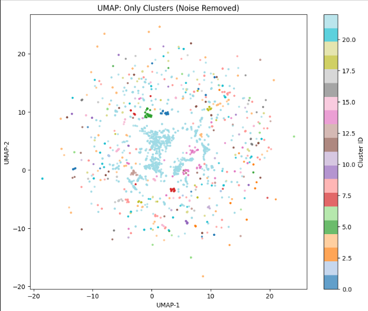   
      - Next step is to use a LLM to identify titles for these clusters by passing it some of the pages in these clusters and asking it to give a nice representative cluster name..
     - This train of thought is not incorporated in current study due to time constraints.  Can be done in future.

### Modelling  
- Data was segmented using spider-non spider and non spider data was further split based on language column (see Section **Data Segmentation Logic**)
- Then we built a pipeline that could apply a algorithm on relevant segment
- We checked for stationarity.  Found that some series were stationary, some were not. 
  
  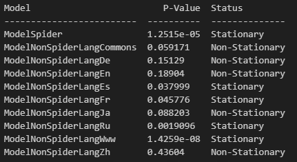 
- After making them stationary, we checked ACF PACF plots to identify appropriated parameter valeus for p,q,d
- However we ultimately used grid search to find the best params.  
  ```python
  ARIMA_SEARCH_SPACE = {
    "ModelSpider": {
        "p": [1, 2, 3, 4],
        "d": [0],
        "q": [0],
        "P": [0],
        "D": [0],
        "Q": [0],
        "s": [0]
    },
        ...
    "ModelNonSpiderLangEn": {
        "p": [0, 1],
        "d": [1],
        "q": [0, 1],
        "P": [0],
        "D": [0],
        "Q": [0],
        "s": [0],
        "numExog": 0
    },
...
    }
  ```
  ```
  Here is the function we wrote that was utilized across ARIMA, SARIMA and SARIMAX
  ```python
  from statsmodels.tsa.statespace.sarimax import SARIMAX
import warnings
import numpy as np
import pandas as pd
from itertools import product
import time

def gridSearchSARIMAX(y, space, exog_df=pd.DataFrame(),
                      train_ratio=0.8, metric='mape', verbose=True):
    """
    Grid search for optimal SARIMAX parameters on a single series.
    
    Parameters:
    -----------
    y : array-like - Time series data
    p_range : list/range - AR orders to try (e.g., [0, 1, 2])
    d_range : list/range - Differencing orders (e.g., [0, 1])
    q_range : list/range - MA orders (e.g., [0, 1, 2])
    P_range : list/range - Seasonal AR orders
    D_range : list/range - Seasonal differencing orders
    Q_range : list/range - Seasonal MA orders
    s : int - Seasonal period (default 7 for weekly)
    exogSeries: Exogeneous regressor series.
    train_ratio : float - Train/test split ratio
    metric : str - 'mape', 'aic', 'bic', or 'rmse'
    verbose : bool - Print progress
    
    Returns:
    --------
    results_df : DataFrame with all combinations and scores
    best_params : dict with best parameters
    """


    
    # Train/test split
    n = len(y)
    train_size = int(n * train_ratio)
    y_train = y[:train_size]
    y_test = y[train_size:]
    if(exog_df is None or len(exog_df.columns)==0):
        exog_train=None
        exog_test=None
        exog_cols=''
    else:        
        exog_train = exog_df[:train_size]
        exog_test = exog_df[train_size:]    
        exog_cols= exog_train.columns
    
    # Generate all combinations
    import math; 
    total_combinations = math.prod(len(v) for v in space.values())
    
    #Always printed text, even with Verbose=False
    print(f"Testing {total_combinations} combinations...")

    if verbose:
        # print(f"Testing {total_combinations} combinations...")
        print(f"Train size: {train_size}, Test size: {len(y_test)}")
    
    results = []
    tested = 0
    
    for p in space["p"]:
        for d in space["d"]:
            for q in space["q"]:
                for P in space["P"]:
                    for D in space["D"]:
                        for Q in space["Q"]:
                            for s in space["s"]:
                                tested += 1                                
                                try:
                                    with warnings.catch_warnings():
                                        warnings.simplefilter("ignore")
                                       
                                        # Fit model
                                        model = SARIMAX(endog=y_train,
                                                    order=(p, d, q),
                                                    seasonal_order=(P, D, Q, s),
                                                    exog=exog_train,
                                                    enforce_stationarity=False,
                                                    enforce_invertibility=False)
                                        
                                        fitted = model.fit(disp=False, maxiter=200)
                                        
                                        # Forecast
                                        forecast = fitted.forecast(steps=len(y_test), exog=exog_test)
                                        
                                        # Calculate metrics
                                        mape,rmse, mae = performance(y_test, forecast, verbose=False)
                                        results.append({
                                            'order': f'{p,d,q}',
                                            'seasonal_order':  f'{(P, D, Q, s)}',
                                            'exog': exog_cols,
                                            'aic': fitted.aic,
                                            'bic': fitted.bic,
                                            'mape': mape,
                                            'rmse': rmse,
                                            'mae': mae,
                                            'converged': True
                                        })
                                        
                                        if verbose and tested % 20 == 0:
                                            print(f"  Progress: {tested}/{total_combinations} ({100*tested/total_combinations:.1f}%)")
                                        
                                except Exception as e:
                                    results.append({
                                        'order': f'({p,d,q})',
                                        'seasonal_order':  f'({(P, D, Q, s)})',
                                        'aic': np.nan, 'bic': np.nan,
                                        'mape': np.nan, 'rmse': np.nan, 'mae': np.nan,
                                        'converged': False,
                                        'error': str(e)
                                    })
    
    # Create results DataFrame
    results_df = pd.DataFrame(results)
    
    # Find best parameters
    if metric == 'mape':
        best_idx = results_df['mape'].idxmin()
    elif metric == 'aic':
        best_idx = results_df['aic'].idxmin()
    elif metric == 'bic':
        best_idx = results_df['bic'].idxmin()
    elif metric == 'rmse':
        best_idx = results_df['rmse'].idxmin()
    else:
        best_idx = results_df['mape'].idxmin()
    
    best_row = results_df.loc[best_idx]
    best_params = {
        'order': best_row['order'],
        'seasonal_order': best_row['seasonal_order'],
        'exog': exog_cols,
        'mape': best_row['mape'],
        'aic': best_row['aic'],
        'bic': best_row['bic'],
        'rmse': best_row['rmse']
    }
    #Always printed text, even with Verbose=False
    print("MAPE:",best_row['mape'])

    
    if verbose:
        print(f"\n✅ Best by {metric.upper()}:")
        print(f"   Order: {best_params['order']}")
        print(f"   Seasonal: {best_params['seasonal_order']}")
        print(f"   MAPE: {best_params['mape']:.2f}%")
        print(f"   AIC: {best_params['aic']:.2f}")
    
    return results_df, best_params
  ```
- We also created a way to store all our experiements (MLOPs implemented from scratch)
  **Data Structure:**
```python
modelDict = {
    "ModelName": {
        # ===== DATA =====
        "data": DataFrame,              # Segmented data
        "aggregatedData": DataFrame,    # Total daily page views for this segment. 
                                        #THIS IS THE TIME SERIES we are trying to model in this case study
        
        # ===== MODELS TRIED =====
        "modelsTried": [
            {
                "modelName": "ARIMA",           # Model type
                "modelParams": (1, 0, 1),       # Order / hyperparameters
                "mape": 12.35,                  # MAPE score
                "comments": "Baseline from ACF/PACF analysis"
            },
            {
                "modelName": "ARIMA",
                "modelParams": (2, 1, 0),
                "mape": 10.21,
                "comments": "After differencing"
            },
            # ... more attempts
        ],
        
        # ===== BEST MODEL =====
        "bestModel": {
            "modelName": "ARIMA",
            "modelParams": (2, 1, 0),
            "mape": 10.21,
            "comments": "After differencing"
            "fittedModel": <model_object>,     # Optional: store fitted model
        },
    },
    ...
}
    ...
}

r,b = gridSearchSARIMAXAllSegments(timeSeriesCombined_df=timeSeriesFull_df, 
                                modelNames=modelNames, 
                                modelDict=modelDict, 
                                searchSpace=ARIMA_SEARCH_SPACE,
                                exog_all_segments_df=None,
                                train_ratio=0.8,
                                metric='mape', 
                                searchTitle="ARIMA GridSearch", 
                                comments="Used ARIMA_SEARCH_SPACE",
                                verbose=False)
  ```
- At this stage, our results for various segments were as follows
 
  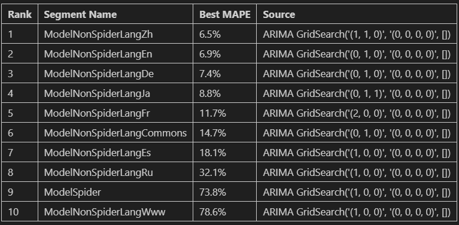
- Next we identified seasonality length as 7 using multiple ways- PACF and plotting average weekl page hits 
  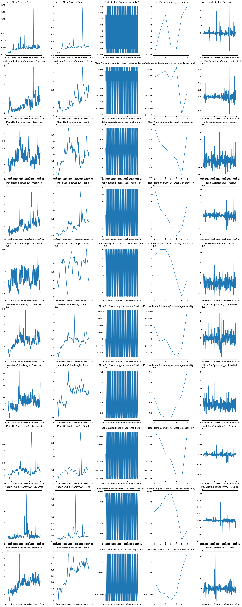

- Then we fitted SARIMA. Again a grid search was performed.
    ```python
    SARIMA_SEARCH_SPACE = {
    "ModelSpider": {
        "p": [1, 2, 3],
        "d": [0],
        "q": [0],
        "P": [0, 1],
        "D": [0],
        "Q": [0],
        "s": [7]
    },
    ...
    "ModelNonSpiderLangEn": {
        "p": [0, 1],
        "d": [1],
        "q": [0, 1],
        "P": [0, 1],
        "D": [1],
        "Q": [0],
        "s": [7]
    ...
    
    r,b = gridSearchSARIMAXAllSegments(timeSeriesCombined_df=timeSeriesFull_df, 
                                modelNames=modelNames, 
                                modelDict=modelDict, 
                                searchSpace=ARIMA_SEARCH_SPACE,
                                exog_all_segments_df=None,
                                train_ratio=0.8,
                                metric='mape', 
                                searchTitle="ARIMA GridSearch", 
                                comments="Used ARIMA_SEARCH_SPACE",
                                verbose=False)
    ```
    - At this stage our best models (based on ARIMA and SARIMA were as follows)
    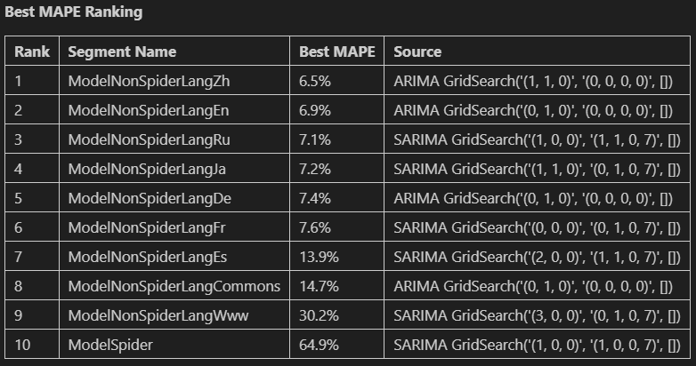
- Next, we did SARIMAX.  We had exogeneous data for en pages. We additionally created another exogeneous variable called weekend.  So for all languages except en, we had one exogeneous column, for en we had two !
- 
- As SARIMAX is the final model in this family of models, we expanded search space too
 ```python
 SARIMAX_SEARCH_SPACE = {
    "ModelSpider": {
        "p": [1, 2, 3, 4],
        "d": [0, 1],
        "q": [0, 1],
        "P": [0, 1],
        "D": [0, 1],
        "Q": [0, 1],
        "s": [7]
    },
    ...
    "ModelNonSpiderLangEn": {
        "p": [1, 2, 3, 4],
        "d": [0, 1],
        "q": [0, 1],
        "P": [0, 1],
        "D": [0, 1],
        "Q": [0, 1],
        "s": [7]
    }, 
    ...
    r,b = gridSearchSARIMAXAllSegments(timeSeriesCombined_df = timeSeriesFull_df, 
                                modelNames=modelNames, 
                                modelDict=modelDict, 
                                searchSpace=SARIMAX_SEARCH_SPACE,
                                exog_all_segments_df=exog_df,
                                train_ratio=0.8,
                                metric='mape', 
                                searchTitle="SARIMAX GridSearch", 
                                comments="Used SARIMAX_SEARCH_SPACE",
                                verbose=False)
 ```
- At this stage, our results for various segments were as follows
 
  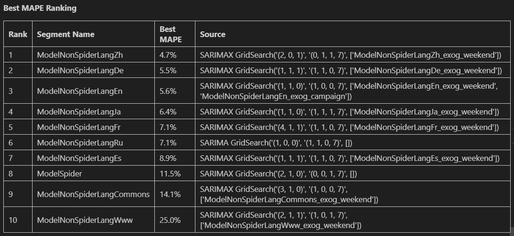
- Finally we fitted Prophet
  
 ```python
  from prophet import Prophet

def fitProphetWithRegressors(prophet_df, exog_cols,
                              train_ratio=0.8,
                              seasonality_mode='multiplicative',
                              changepoint_prior_scale=0.1,
                              seasonality_prior_scale=0.1,
                              weekly_seasonality=True,
                              yearly_seasonality=False,
                              verbose=True):
    """
    Fit Prophet model with exogenous regressors.
    
    Parameters:
    -----------
    prophet_df : DataFrame with ds, y and any exogeneous columns.
    exog_cols : str or list - exogenous variable column(s)
    train_ratio : float
    seasonality_mode : 'additive' or 'multiplicative'
    changepoint_prior_scale : float
    seasonality_prior_scale : float
    weekly_seasonality : bool
    yearly_seasonality : bool
    verbose : bool
    
    Returns:
    --------
    results : dict with model, forecast, metrics
    """
    # Remove NaN
    prophet_df = prophet_df.dropna()
    
    # Train/test split
    n = len(prophet_df)
    train_size = int(n * train_ratio)
    
    train_df = prophet_df.iloc[:train_size].copy()
    test_df = prophet_df.iloc[train_size:].copy()
    
    if verbose:
        print(f"Regressors: {exog_cols}")
        print(f"Train size: {len(train_df)}, Test size: {len(test_df)}")
        print(f"Params: seasonality_mode={seasonality_mode}, "
              f"changepoint_prior={changepoint_prior_scale}, "
              f"seasonality_prior={seasonality_prior_scale}")
    
    try:
        with warnings.catch_warnings():
            warnings.simplefilter("ignore")
            
            # Initialize Prophet
            model = Prophet(
                seasonality_mode=seasonality_mode,
                changepoint_prior_scale=changepoint_prior_scale,
                seasonality_prior_scale=seasonality_prior_scale,
                weekly_seasonality=weekly_seasonality,
                yearly_seasonality=yearly_seasonality
            )
            
            # Add regressors
            for col in exog_cols:
                model.add_regressor(col)
            
            # Fit
            model.fit(train_df)
            
            # Create future dataframe with regressors
            future = model.make_future_dataframe(periods=len(test_df), freq='D')
            
            # Add regressor values to future
            full_regressors = prophet_df[exog_cols].values
            for i, col in enumerate(exog_cols):
                future[col] = np.concatenate([
                    full_regressors[:, i],
                    np.zeros(max(0, len(future) - len(full_regressors)))  # Pad if needed
                ])[:len(future)]
            
            # Predict
            forecast = model.predict(future)
            
            # Extract test predictions
            y_pred = forecast.iloc[train_size:]['yhat'].values[:len(test_df)]
            y_test = test_df['y'].values
            
            mape,rmse, mae = performance(y_test, y_pred, verbose=False)
            
            if verbose:
                print(f"\n✅ Prophet with Regressors Results:")
                print(f"   MAPE: {mape:.2f}%")
                print(f"   RMSE: {rmse:.2f}")
                print(f"   MAE: {mae:.2f}")
            
            results = {
                'model': model,
                'forecast': forecast,
                'y_test': y_test,
                'y_pred': y_pred,
                'mape': mape,
                'rmse': rmse,
                'mae': mae,
                'train_size': train_size,
                
                'params': {
                    'seasonality_mode': seasonality_mode,
                    'changepoint_prior_scale': changepoint_prior_scale,
                    'seasonality_prior_scale': seasonality_prior_scale,
                    'weekly_seasonality': weekly_seasonality,
                    'yearly_seasonality': yearly_seasonality,
                    'exog': exog_cols
                }
            }
            
            return results
            
    except Exception as e:
        print(f"❌ Error: {str(e)}")
        import traceback
        traceback.print_exc()
        return {'error': str(e)}
  ```
  - Following was the parameter grid used
```python
    # Parameter grid
    param_grid_comprehensive = {
        'seasonality_mode': ['additive', 'multiplicative'],
        'changepoint_prior_scale': [0.001, 0.01, 0.05, 0.1, 0.5],
        'seasonality_prior_scale': [0.1, 1.0, 10.0],
        'weekly_seasonality': [True],  # True = auto, or custom Fourier order
        'yearly_seasonality': [False, True]
    }

    prophet_grid_results, prophet_best_params = gridSearchProphetAllSegments(
   timeSeriesCombined_df=timeSeriesFull_df,
    modelNames=modelNames,
    modelDict=modelDict,
    exog_all_segments_df=exog_df    
)
```
- And then we got our FINAL Models !
  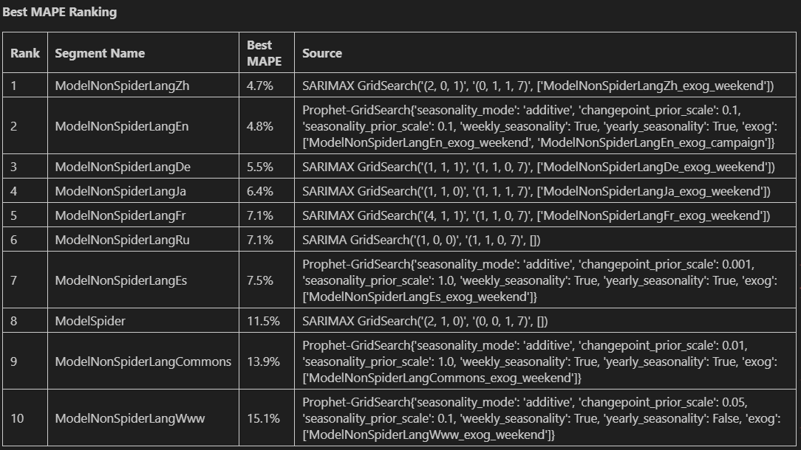
- Here is a visual that brings out how our modelling MAPE improved as we used ARIMA -> SARIMA -> SARIMAX and Prophet
  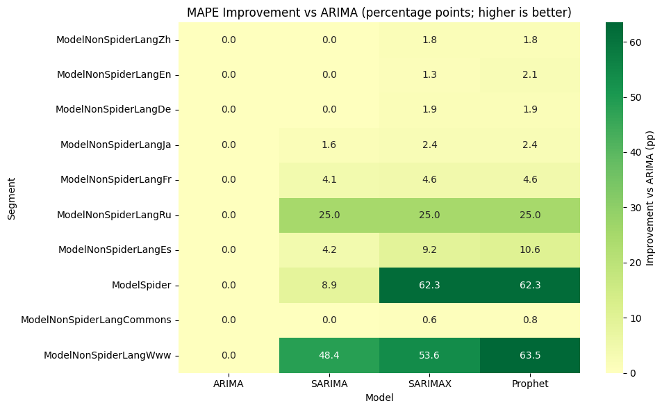
- The models were saved in a pickle file.
- We used the fitted models to predict on entire data to get a "feel" how they are performing. We plotted the confidence interval to show that while the models may have some error (MAPE between 4-15%), once we consider the confidence intervals while communicating with client, the models are performing awesome job.

    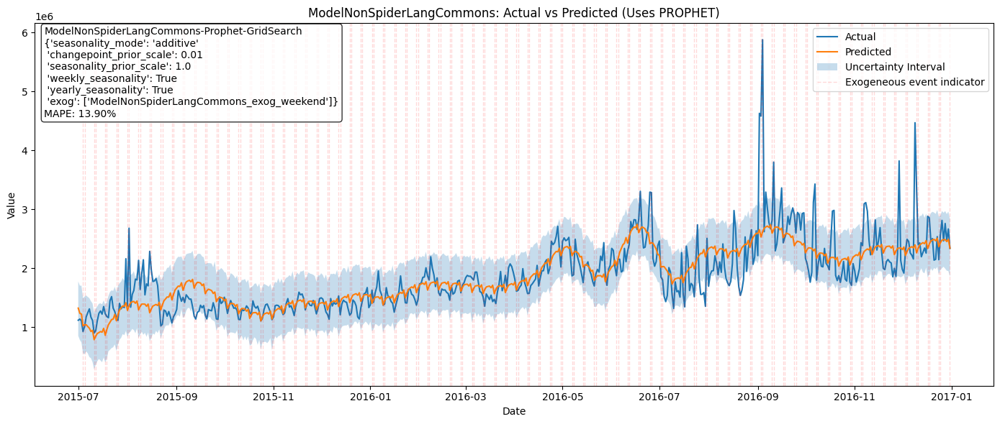
    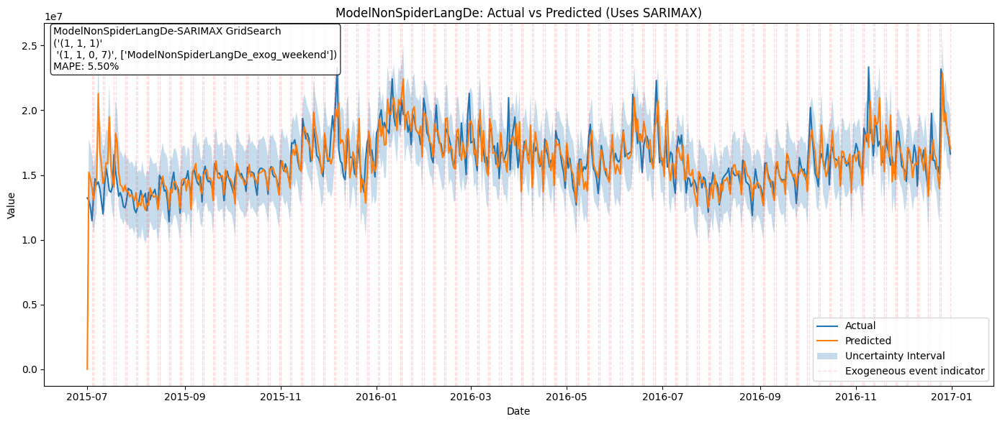
    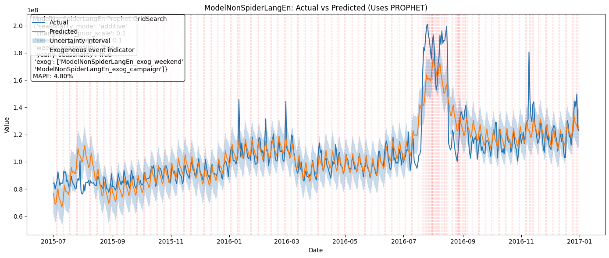
    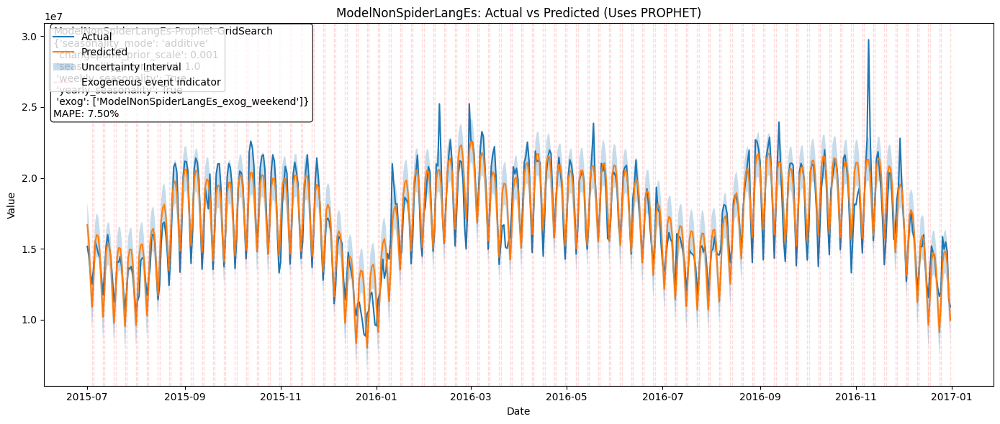
    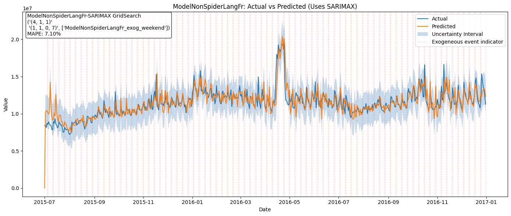
    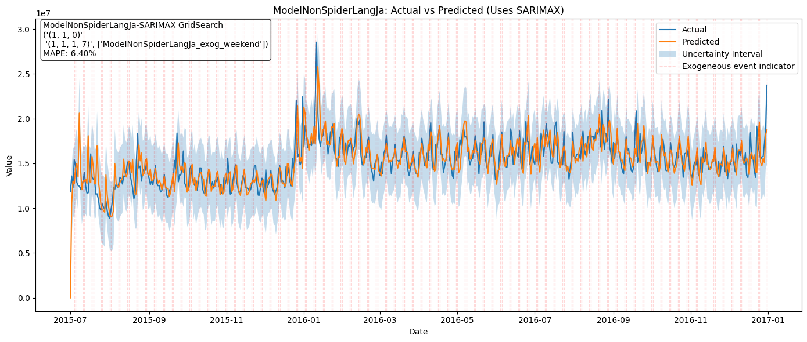
    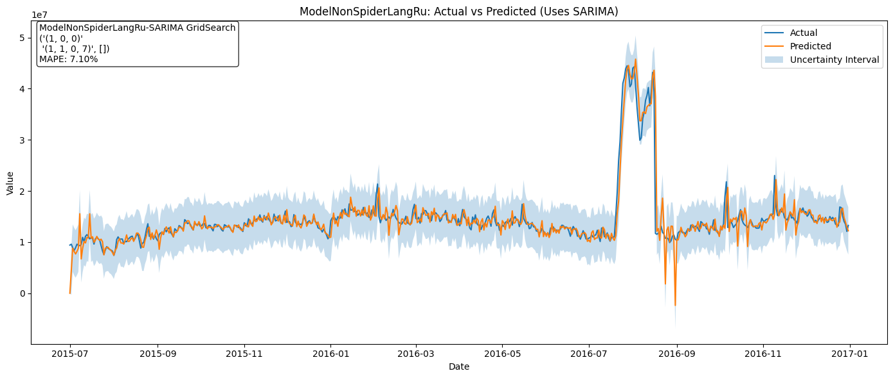
    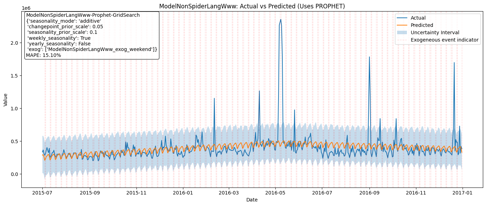
    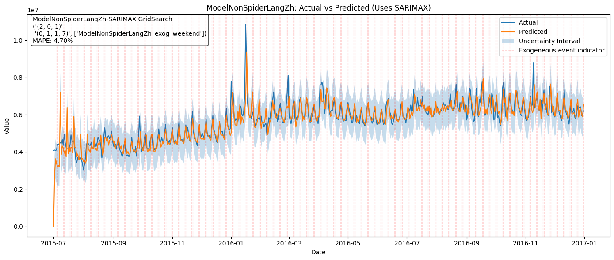

