# Memory-Efficient Text Classifier

# 📚 Table of Contents

- [Memory-Efficient Text Classifier](#memory-efficient-text-classifier)
- [📚 Table of Contents](#-table-of-contents)
  - [Features](#features)
- [🔍 Exploratory Data Analysis (EDA) — Key Insights](#-exploratory-data-analysis-eda--key-insights)
  - [Data Dictionary (explanation of the fields present in the data)](#data-dictionary-explanation-of-the-fields-present-in-the-data)
  - [Capturing the insights methodically](#capturing-the-insights-methodically)
    - [🧾 Reviewer Insights (`reviewerID`)](#-reviewer-insights-reviewerid)
    - [📚 Product Insights (`asin` / Book Rating)](#-product-insights-asin--book-rating)
    - [🤝 Helpfulness Metrics (`helpful`)](#-helpfulness-metrics-helpful)
    - [✍️ Review Content (`reviewText`)](#️-review-content-reviewtext)
    - [⭐ Overall Ratings (`overall`)](#-overall-ratings-overall)
    - [📝 Summary Field (`summary`)](#-summary-field-summary)
    - [⏰ Temporal Insights (`unixReviewTime` / `reviewDate` / `review_age_days`)](#-temporal-insights-unixreviewtime--reviewdate--review_age_days)
  - [💡 Recommendations Based on EDA Insights](#-recommendations-based-on-eda-insights)
    - [✅ EDA Takeaway](#-eda-takeaway)
- [🧭 Modeling Thought Process — From Heuristics to Deep Learning](#-modeling-thought-process--from-heuristics-to-deep-learning)
  - [1️⃣ Understanding the NLP Landscape](#1️⃣-understanding-the-nlp-landscape)
  - [2️⃣ Step 1 — TF‑IDF + Linear Model (Baseline)](#2️⃣-step1--tfidf--linear-model-baseline)
    - [Why TF‑IDF first](#why-tfidf-first)
    - [What happened](#what-happened)
    - [Conclusion](#conclusion)
  - [3️⃣ Step 2 — HashingVectorizer + SGDClassifier (Scalable Classical ML)](#3️⃣-step2--hashingvectorizer--sgdclassifier-scalable-classicalml)
    - [Why HashingVectorizer](#why-hashingvectorizer)
    - [How HashingVectorizer works (conceptually)](#how-hashingvectorizer-works-conceptually)
    - [🛠️ How Stochastic Gradient Descent Classifier works](#️-how-stochastic-gradient-descent-classifier-works)
      - [⚡ Benefits](#-benefits)
    - [Implementation](#implementation)
    - [Results](#results)
    - [Outcome](#outcome)
  - [4️⃣ Step 3 — Deep Learning with BERT](#4️⃣-step3--deep-learning-with-bert)
    - [Why BERT](#why-bert)
    - [Constraints](#constraints)
    - [Results (9 k subset)](#results9ksubset)
    - [Observations](#observations)
    - [Conclusion](#conclusion-1)
  - [5️⃣ Comparative Summary](#5️⃣-comparative-summary)
  - [6️⃣ Final Decision](#6️⃣-final-decision)
    - [✅ Selected Model](#-selected-model)
  - [7️⃣ Key Takeaways](#7️⃣-key-takeaways)
  - [8️⃣ Future Exploration](#8️⃣-future-exploration)
    - [🏁 Summary](#-summary)
- [Usage](#usage)
  - [📂 Files Overview](#-files-overview)
  - [Installation](#installation)
  - [NLTK Resources](#nltk-resources)
  - [Data Format](#data-format)
    - [Columns expected in training data:](#columns-expected-in-training-data)
  - [🚀 Training the Model](#-training-the-model)
    - [Using a Custom Training File](#using-a-custom-training-file)
    - [What Happens During Training](#what-happens-during-training)
    - [Sample Training Run](#sample-training-run)
  - [🔮 Making Predictions](#-making-predictions)
    - [Using Custom Paths](#using-custom-paths)
    - [Sample Training Run](#sample-training-run-1)
      - [Sample Results](#sample-results)
  - [Deployment of Model to Production](#deployment-of-model-to-production)
    - [Expose as an API](#expose-as-an-api)
      - [Deploy Dockerized API](#deploy-dockerized-api)
    - [Created a mini demo app using Gradio](#created-a-mini-demo-app-using-gradio)
    - [Created a mini demo app using Streamlit](#created-a-mini-demo-app-using-streamlit)
- [🧩 Technical Summary of the HashingVectorizer-SGDClassifier based model](#-technical-summary-of-the-hashingvectorizer-sgdclassifier-based-model)
  - [1. Overall Architecture](#1-overall-architecture)
  - [2. Sequence Diagram](#2-sequence-diagram)
  - [3. Components](#3-components)
    - [a. HashingVectorizer](#a-hashingvectorizer)
    - [b. SGDClassifier](#b-sgdclassifier)
    - [c. Cross-Validation Setup](#c-cross-validation-setup)
    - [🧾 Notes](#-notes)
  - [4. Efficiency Techniques](#4-efficiency-techniques)
  - [5. Evaluation Metrics](#5-evaluation-metrics)
    - [📊 Metrics Used](#-metrics-used)
    - [⚙️ Evaluation Process](#️-evaluation-process)
    - [📈 Example Output](#-example-output)
    - [🧩 Interpretation](#-interpretation)
    - [📑 Summary](#-summary-1)
  - [6. System Configurations](#6-system-configurations)
    - [🖥️ System Configuration that was used for Model Training — Windows Machine](#️-system-configuration-that-was-used-for-model-training--windows-machine)
  - [7. ⚙️ Hyperparameter Optimization (Grid Search)](#7-️-hyperparameter-optimization-grid-search)
    - [🔍 Objective](#-objective)
    - [📦 Parameters Tuned](#-parameters-tuned)
    - [🧮 Procedure Overview](#-procedure-overview)
    - [🏆 Outcome](#-outcome)
    - [✅ Summary](#-summary-2)
  - [8. Recommended Configurations](#8-recommended-configurations)
  - [9. Summary Table](#9-summary-table)
  - [10. At a Glance](#10-at-a-glance)
    - [⚡ Key Highlights](#-key-highlights)
    - [🚀 Takeaway](#-takeaway)

This project implements a **memory-efficient text classification pipeline**. It performs **cross-validation** and trains a final model on all data, making it suitable for large datasets. 

The dataset comprised **882,619 training records**, making computational efficiency a critical factor.  
To handle this large-scale data, the pipeline was designed for **memory efficiency and parallel processing** using techniques like `HashingVectorizer` (to avoid vocabulary storage) and optimized `SGDClassifier` training across multiple CPU cores.

---

## Features

- Supports **JSON array** and **JSON Lines** formats for input.
- Combines `summary` and `reviewText` columns for training.
- Maps review scores into three classes:
  - `0` → Negative (0 ≤ score < 3)
  - `1` → Mixed (3 ≤ score < 4)
  - `2` → Positive (4 ≤ score ≤ 5)
- Uses **HashingVectorizer** for memory-efficient feature extraction.
- Uses **SGDClassifier** with:
  - Hinge loss (SVM-style)
  - Log loss (Logistic Regression)
  - Linear + HashingVectorizer = Constant memory usage
  - Fast training	 = 5‑10× faster than LinearSVC
- Uses **parallelized** cross-validation using `joblib.Parallel`. 
  - Each fold runs in parallel, training and evaluating its own model.
  - After all folds finish, metrics are averaged and printed.
  - Then a single final model is trained on the entire dataset for producing predictions.
  - n_jobs controls parallelism:
    - n_jobs=-1 → use all cores
- Monitors peak memory usage with `memory_profiler`.

---

# 🔍 Exploratory Data Analysis (EDA) — Key Insights

The EDA was conducted to understand the structure, quality, and distribution of Book Review data before model training.  
All visualizations, descriptive statistics, and insights are available in the accompanying Jupyter Notebook:

🔗 **EDA Notebook:** [View the full EDA analysis here](./EDA_Analysis.ipynb)

*(If viewing on GitHub or a notebook viewer, click the link above to open the interactive notebook.)*

---

The notebook includes:
- Data loading and preprocessing
- Statistical summaries for each key field  
- Correlation matrix visualization  
- Distribution plots for review ratings and helpfulness  
- Temporal analysis of review trends  
- Summary and review text length analysis  
- Insight generation and actionable recommendations

We now reproduce some of the highlights from the notebook

## Data Dictionary (explanation of the fields present in the data)

**Data Preview**
 - 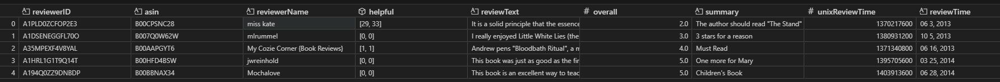

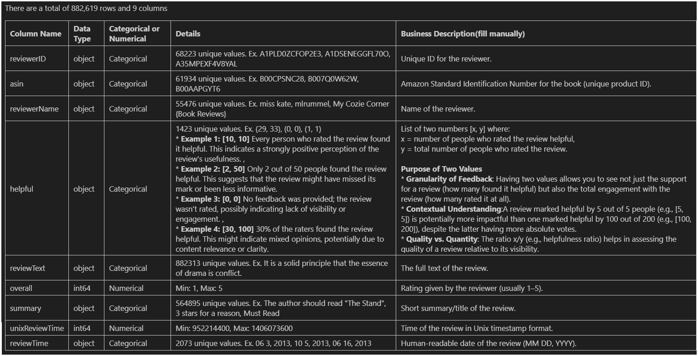

---
## Capturing the insights methodically

The EDA findings were systematically captured in a **structured grid format**, allowing clear comparison of relationships between variables.  
This tabular layout ensured a **methodical, consistent, and transparent documentation** of insights across all key dataset fields, making analysis reproducible and easy to interpret.

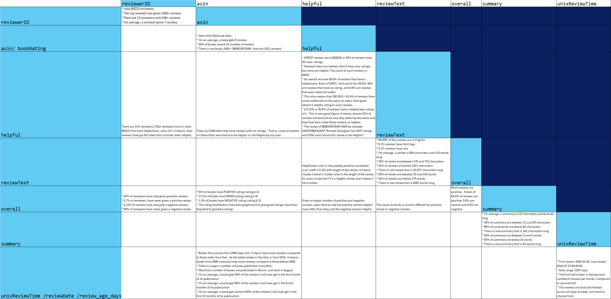

Below are the summarized insights derived from correlations and descriptive analysis across major fields.

---

### 🧾 Reviewer Insights (`reviewerID`)
- Total of **68,223 reviewers** contributing reviews.  
- The **most active reviewer** has given **over 1,000 reviews**.  
- **13 reviewers** have written **more than 500 reviews each**.  
- On average, each reviewer has contributed **7 reviews**.

---

### 📚 Product Insights (`asin` / Book Rating)
- Dataset includes **61,934 unique book titles**.  
- On average, each book receives **8 reviews**.  
- **50% of books** have **1–6 reviews**.  
- One popular book (`ASIN = B006GWO5WK`) has **1,012 reviews**.

---

### 🤝 Helpfulness Metrics (`helpful`)
- **54% of reviews (≈ 47,823 of 88,269)** have **no helpfulness rating**.  
- **11% of reviewers (≈ 7,412)** have never received a single helpful vote (helpfulness = 0).  
- **58.6% of reviews** show a helpfulness ratio of zero; only **41.4%** have at least one helpful rating.  
- Among rated reviews, about **31% were found genuinely helpful** by readers.  
- The most‑rated review (`ASIN B006GWO5WK`) received **2,357 helpful votes**.  
- Helpfulness is **weakly correlated with review length** (correlation ≈ 0.15).  
  - Length does not strongly determine whether other users find a review helpful.

---

### ✍️ Review Content (`reviewText`)
- **99.8%** of reviews are in **English**.  
- Only **0.1%** contain HTML tags, 0.1% contain urls.
- **Average review length:** ~604 characters (~110 words).  
- **Length statistics:**
  - 50% of reviews: **176–714 characters** long.  
  - 91% of reviews: **< 1,521 characters**.  
  - Longest review: **4,385 words**.  
- The median textual length **does not differ significantly by sentiment label (positive, neutral, negative).**

---

### ⭐ Overall Ratings (`overall`)
- **84.4% of all reviews are positive** (rating ≥ 4).  
- **9.8% are neutral** and **5.8% are negative**.  
- **45% of reviewers** have *only ever given positive* reviews.  
- **0.7%** have *never given a positive* review, while **0.1%** gave *only negative* reviews.  
- **68% of reviewers** have *never written a negative* review.  
- Trend indicates a **positive bias** among users — they tend to give high ratings.  
- Users rate **positive reviews as helpful** more often than negative ones given equal content length.  The rating distribution indicates people tend to give good ratings more than they tend to give bad ratings (it is not wrong to assume that we have bad books and we have good books.)
  - Let us ponder on why people leave reviews
  - **Positive Review Bias**:
      - Confirmation Bias: People might leave positive reviews to confirm their positive initial expectations.
      - Social Influence: Writing a positive review can be influenced by wanting to belong to a group that appreciates quality content.
  - **Negative Review Hesitation**:
      - Cognitive Dissonance: Buyers might avoid leaving a negative review to reduce the discomfort of a purchase they regret.
      - Fear of Judgment: Some may fear judgment for admitting they bought a "bad" book, especially if it was popular or highly rated.
  - **Motives to Leave Reviews**:
      - Altruism: Positive reviews are often motivated by the desire to support others in making good purchase decisions.
      - Personal Validation: Writing a review can serve as a way to validate one’s judgment and feelings about a book.
---

### 📝 Summary Field (`summary`)
- **Average summary length:** 22 characters / 4 words.  
- **50%** of summaries are **11–29 characters** long.  
- **96%** of summaries are **under 66 characters**.  
- Longest summary: **153 characters**.  
- **95%** of summaries are **below 110 words** (brief and concise).  
- Summary length shows **no significant impact** on helpfulness or rating.

---

### ⏰ Temporal Insights (`unixReviewTime` / `reviewDate` / `review_age_days`)
- Review data spans **from 2000‑03‑05 to 2014‑07‑20** (≈ 5,263 days).  
- **Older books ( > 5 years)** have more reviews than newer ones.  
- Peak in reviews observed for **books published around 2011–2014**.  
- **80% of reviews** are posted within the **first 6 months** after a book’s publication.  
- Reviews trend shows a **slightly higher review volume in the first half of each year**.

---


## 💡 Recommendations Based on EDA Insights

| Area | Observation | Recommendation |
|-------|--------------|----------------|
| **Reviewer Activity** | Small percentage of reviewers contribute most reviews. | <li> **For Business**: Incentivise users to become reviewers.  Engagement is always good.<ul><li>Brownie points, user tags can be considered. <li>Is it easy and hasslefree to write a review? <li>Can it take microphone input so that user can 'speak' their review? <li>Is it possible to send email and reminders to users on their email to share their review?<li>When user logs in next time, is it possible to prompt them to give a review.</ul>  <li> **For Model**: Consider weighting reviews or users to avoid overrepresentation of frequent reviewers. |
| **Positivity Bias** | Majority reviews are positive (84%) with very few negatives. | <li> **For Business**: To encourage negative reviews, option to post anonymously may be explored <li> **For Model**: Employ **class balancing techniques** (e.g., class weights or resampling) to mitigate bias in training data. |
| **Helpfulness Ratings** | Over half of reviews lack helpful votes. | <li> **For Business**: One can check the reasons, like<ul><li>How easy it is in the UI to mark a review as helpful/not helpful.<li>How easy it is for users to even locate the review section. Is there as easy direct way to reach it.  Where is the reviews section placed on the page?</ul><li> **For Model**: Consider excluding or down-weighting reviews without feedback when modeling helpfulness prediction. |
| **Review Length** | Median review length does not correlate strongly with quality or helpfulness. | <li> **For Business**: System designed to store reviews needs to be capable of storing very long reviews.  Typical RDBMS may not support this.  Use of NoSQL databases is the way to go that store json objects<li> **For Model**: Avoid using review length as a primary predictive feature; focus more on linguistic or sentiment-based features. |
| **Summary Texts** | Summaries are short and consistent across reviews. | <li> **For Model**: Combine summaries with review texts for better context enrichment rather than analyzing alone. |
| **Temporal Patterns** | Majority of reviews occur early in a book’s life cycle. | <li> **For Business**: Marketing efforts can focus here.<ul><li>New books can be promoted on own website.<li>If a book gets great reviews,same can be highlighted.<li>Targeted marketing can be explored where the book is promoted in channels relevant for the book.</ul><li> **For Model**: Recent reviews could be weighted more to capture current sentiment trends. |
| **Language Consistency** | Nearly all reviews are in English. | <li> **For Business**: Most readers seem to be English speaking. Marketing campaigns can use this information for regional focussing <li> **For Model**: No language normalization required; focus preprocessing on English NLP techniques. |

---

### ✅ EDA Takeaway

The dataset is **heavily skewed toward positive sentiments**, with limited negative samples and sparse helpfulness ratings.  
Modeling efforts must focus on:
- **Balancing sentiment classes.**  
- **Handling missing “helpful” values.**  
- **Leveraging both summary and reviewText fields.**

These adjustments help ensure a more robust and unbiased sentiment classification model.


# 🧭 Modeling Thought Process — From Heuristics to Deep Learning

## 1️⃣ Understanding the NLP Landscape

Natural‑Language Processing (NLP) models can be broadly categorized into three generations:

| Category | Concept | Examples |
|-----------|----------|-----------|
| **Heuristic / Statistical models** | Text represented using simple counting or frequency rules. Words are treated as independent features. | Bag‑of‑Words (BoW), TF‑IDF, n‑grams |
| **Classical Machine Learning models** | Combine numerical text features with a linear or tree‑based classifier. | TF‑IDF + SVM / Logistic Regression, HashingVectorizer + SGD |
| **Deep Learning / Transformer models** | Use pre‑trained embeddings that capture semantic relationships between words and context. | BERT, DistilBERT, RoBERTa, etc. |

We explored these options progressively — from simpler, computationally efficient baselines to more complex, resource‑intensive architectures.

---

## 2️⃣ Step 1 — TF‑IDF + Linear Model (Baseline)

TF‑IDF converts text into a sparse matrix of word importance scores across documents.

### Why TF‑IDF first
- Classic and interpretive baseline for most text classification tasks.  
- Easy to implement and tune.  

### What happened
- Our dataset contained **~882 k reviews**.  
- TF‑IDF vocabulary size exploded into the millions of features (especially with bigrams).  
- The resulting matrix couldn’t fit into memory → **out‑of‑memory (RAM) error.**

### Conclusion
TF‑IDF is ideal for small or moderate datasets, but it **didn’t scale** to our 800 k+ reviews.

---

## 3️⃣ Step 2 — HashingVectorizer + SGDClassifier (Scalable Classical ML)

To overcome TF‑IDF’s scalability issue, we adopted **HashingVectorizer**, a constant‑memory alternative.

### Why HashingVectorizer
- No vocabulary storage → fixed, small memory footprint.  
- Easily scales to millions of documents.  
- Supports **streaming / online learning** via `partial_fit`.  
- Works efficiently with linear classifiers like `SGDClassifier`.

### How HashingVectorizer works (conceptually)

Suppose you have a sentence:

```text
"I love machine learning"
```

- Each token (word) is hashed using a hash function (like MurmurHash3).
- The hash value is mapped to a fixed range `[0, n_features)`.
- That index’s value is incremented (like CountVectorizer).

If `n_features=8`, then maybe:

| Word       | Hash    | Index (hash % 8) | Count                                 |
|------------|---------|------------------|----------------------------------------|
| "I"        | 920391  | 7                | +1                                     |
| "love"     | 304923  | 3                | +1                                     |
| "machine"  | 123011  | 3                | +1 → collision with "love"             |
| "learning" | 501829  | 5                | +1                                     |

So final vector (size 8):

```
[0, 0, 0, 2, 0, 1, 0, 1]
```

You get a **fixed-length vector**, even if you have billions of possible words. In our model we have used 2**16 or 65536 vector length.

### 🛠️ How Stochastic Gradient Descent Classifier works
It’s not a single algorithm — it’s a *training method* that can mimic others (like Linear SVM, Logistic Regression, Perceptron, etc.) by just changing its **loss function**.

---
Instead of training on the *entire dataset at once* (like normal LogisticRegression or LinearSVC do), it trains on **one mini-batch (or even one sample) at a time** and updates model weights *incrementally*.

Imagine you’re trying to fit a model to 100 million reviews:

- You can’t load all of them into memory.
- So you stream one batch at a time.
- After each batch, you adjust weights a little bit.
- That’s *stochastic gradient descent*.
- In our case, the batch size was 1, so after every record, the weights were updated

---

#### ⚡ Benefits

| Feature                                      | `SGDClassifier` | `LogisticRegression` / `LinearSVC`    |
|----------------------------------------------|:---------------:|:-------------------------------------:|
| Trains incrementally (`partial_fit`)         | ✅ Yes          | ❌ No                                 |
| Works with large or streaming data           | 🟢 Excellent    | 🟡 Memory-heavy                       |
| Uses stochastic gradient descent             | ✅              | ❌                                    |
| Slower for small datasets                    | 🟡 Yes          | 🟢 Fast                               |
| Replicable training (deterministic)          | 🟡 Not always   | ✅ Yes                                |
| Needs more hyperparameter tuning             | 🟡 Often        | 🟢 Less                               |

---


### Implementation
- `HashingVectorizer(n_features=2**15, stop_words='english')`
- `SGDClassifier(loss='log_loss', class_weight='balanced', n_jobs=-1)`
- 3‑fold cross‑validation on **all 882 619 records**.

### Results

| Metric | Value |
|--------|-------|
| **Accuracy** | 0.8817 |
| **F1‑score** | 0.8813 |
| **Precision** | 0.8816 |
| **Recall** | 0.8817 |

### Outcome
- Scaled painlessly to the full dataset.  
- Excellent accuracy for a lightweight model.  
- Memory < 2 GB, training < 130 seconds (with a only once 1-hour run to tune hyper parameters)
- Ideal for CPU‑based deployment.

---

## 4️⃣ Step 3 — Deep Learning with BERT

Next, we tested a **Transformers‑based** model (DistilBERT) for potential accuracy gains.

### Why BERT
- Captures the *context* and meaning of words beyond simple token frequencies.  
- Proven state‑of‑the‑art on many NLP tasks.

### Constraints
- Training full BERT on 882 k records is GPU‑intensive.  
- We trained it on a **subset of 9,000 reviews** for comparison.

### Results (9 k subset)

| Metric | Value |
|--------|-------|
| **Accuracy** | 0.8931 |
| **F1‑score** | 0.8852 |
| **Precision** | 0.8809 |
| **Recall** | 0.8931 |

### Observations
- BERT yielded **similar metrics** to HashingVectorizer + SGD (≈ +0.01 accuracy).  
- Substantially slower (minutes per epoch) and GPU‑dependent.  
- Scaling to full 882 k records would be computationally expensive for marginal gains.

### Conclusion
While BERT captures deeper linguistic context, **the performance gain (~1 %) didn’t justify the massive training and inference cost** for this task.

---

## 5️⃣ Comparative Summary

| Aspect | TF‑IDF + Linear SVM | HashingVectorizer + SGD | BERT (DistilBERT) |
|--------|--------------------|-------------------------|-------------------|
| **Data used** | 882 k | 882 k | 9 k subset |
| **Train time** | ❌ OOM error | ✅ Scalable (~minutes) | ⚠️ Slow (> hours for full set) |
| **Memory use** | High (vocabulary) | Constant | Very high (GPU) |
| **Accuracy (CV)** | — | 0.8817 | 0.8931 |
| **Interpretability** | High | High | Low (black box) |
| **Deployment ease** | ✅ Excellent | ✅ Excellent | ⚠️ Complex / GPU needed |

---

## 6️⃣ Final Decision

Given that both models achieved **≈ 88 – 89 % accuracy**, the marginal 1 % gain with BERT was outweighed by its computational and operational overhead.

### ✅ Selected Model
**HashingVectorizer + SGDClassifier**

**Reasons:**
- Scales to full dataset easily  
- Lightweight and fast inference (CPU‑friendly)  
- Competitively accurate  
- Simple to retrain or update incrementally  

---

## 7️⃣ Key Takeaways

- Always begin with **simple baselines** (BoW, TF‑IDF) before moving to deep models.  
- When scaling becomes an issue, **HashingVectorizer + SGD** is a robust, production‑ready choice.  
- **Transformers (BERT)** offer semantic understanding, but their cost‑to‑benefit ratio on large, labeled review data is often poor unless extremely high accuracy is required.  
- Classical ML still competes very strongly when ample data are available.

---

## 8️⃣ Future Exploration

| Area | Possible Enhancement | Rationale |
|-------|---------------------|------------|
| **Model Ensembling** | Combine HashingVectorizer+SGD with another shallow model or averaged BERT predictions. | Often improves accuracy by 1–2 points while remaining interpretable. |
| **Feature Enrichment** | Incorporate sentiment lexicons, part‑of‑speech counts, or review length as extra numeric features. | Adds complementary signals beyond text content. |
| **Fine‑Tuning BERT on full data** | Use DistilBERT or TinyBERT and fine‑tune selectively (frozen layers + small LR). | Might close the remaining 1–2 % gap without full training cost. |
| **Language / Spelling Normalization** | Apply lemmatization or subword normalization if vocabulary noise increases. | Reduces sparsity, decent win on smaller sub‑domains. |
| **Hybrid Representations** | Combine TF‑IDF or hashed features with dense embeddings (via PCA or averaged BERT vectors). | Balances interpretability and deep semantics. |
| **Model Monitoring & Drift Detection** | Continuous accuracy tracking as new reviews arrive. | Ensures long‑term model health in production. |

---

### 🏁 Summary

> Our modeling path evolved from **heuristic word‑count baselines → scalable linear ML models → deep contextual transformers**.  
> The **HashingVectorizer + SGDClassifier** combination delivered the optimal trade‑off between **accuracy (~88 %)**, **scalability**, and **computational efficiency**.  
> Future efforts can focus on hybridization or incremental BERT fine‑tuning if higher accuracy or richer semantics become necessary.

---


# Usage
Now we will go through details of how the artifacts that were created in this project can be used to create a model and then use it for inference.  This repository contains two Python scripts `model_train.py` and `model_train.py` that perform the main task of model building and inference on test data.  Details of all files is given below.


## 📂 Files Overview

| File | Description |
|------|-------------|
| [app.py](app.py) | FastAPI application for serving model predictions as an API. |
| [BookReview_AmitG.ipynb](BookReview_AmitG.ipynb) | EDA Jupyter Notebook for exploratory data analysis and experimentation. |
| [bert.ipynb](./scratchCodes/bert.ipynb) | BERT model developed during evaluation.  Trained on 9000 training samples |
| [demo_gradio.py](demo_gradio.py) | Gradio demo script for interactive web-based model demo. |
| [demo_streamlit.py](demo_streamlit.py) | Streamlit demo script for web-based model demo. |
| [final_model.pkl](final_model.pkl) | Trained model file (pickle format). 770 KB|
| [model_train.py](model_train.py) | Handles training, cross-validation, and model saving. |
| [model_predict.py](model_predict.py) | Loads the trained model and generates predictions for test data. |
| [readme.md](readme.md) | Project documentation and instructions (you're here!). |
| [requirements.txt](requirements.txt) | Python dependencies for this project. |
| [result.csv](result.csv) | Sample result/prediction file. |
| [reviews_test.json](reviews_test.json) | Sample test data file (JSON format). 10,000 records, 80 MB|
| [reviews_train.json](reviews_train.json) | Sample training data file (JSON format). 882,619 records, 727 MB|
| [tfidf_script_v4_gridSearch.py](./scratchCodes/tfidf_script_v4_gridSearch.py) | Standalone GridSearchCV code for hyper parameter tuning|


---
## Installation

Python 3.8+ and the following packages:

```bash
pip install -r requirements.txt
```
## NLTK Resources

After installing nltk, download required resources:

```python
import nltk
nltk.download('stopwords')
nltk.download('omw-1.4')
nltk.download('wordnet')
```

## Data Format

The training and test files can be either:

- **JSON array**:  
```json
[
  {"summary": "Good book", "reviewText": "Really enjoyed it", "overall": 4},
  {"summary": "Bad", "reviewText": "Did not like", "overall": 1}
]
```

- **JSON Lines**:  
```json
{"summary": "Good book", "reviewText": "Really enjoyed it", "overall": 4}
{"summary": "Bad", "reviewText": "Did not like", "overall": 1}
```

### Columns expected in training data:
* summary: short review summary
* reviewText: full review text
* overall: numeric score (0–5)

## 🚀 Training the Model
Run the training script to train the model and save it as a pickle file (final_model.pkl):
```bash
python model_train.py
```
This uses the default training file: `reviews_train.json`

### Using a Custom Training File
You can pass a custom file name via the --train_file argument:
```bash
python model_train.py --train_file my_training_data.json
```

### What Happens During Training
1. Loads and preprocesses the training data.
2. Performs K-fold cross-validation (default 3 splits) to evaluate model performance.
3. Trains the final model on the entire dataset.
4. Saves the trained model to a .pkl file (final_model.pkl by default).
5. Reports performance metrics and memory usage.

### Sample Training Run
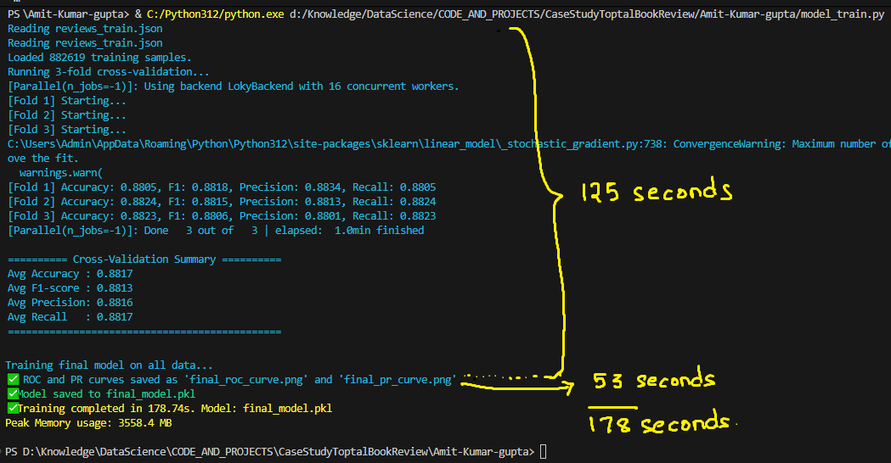

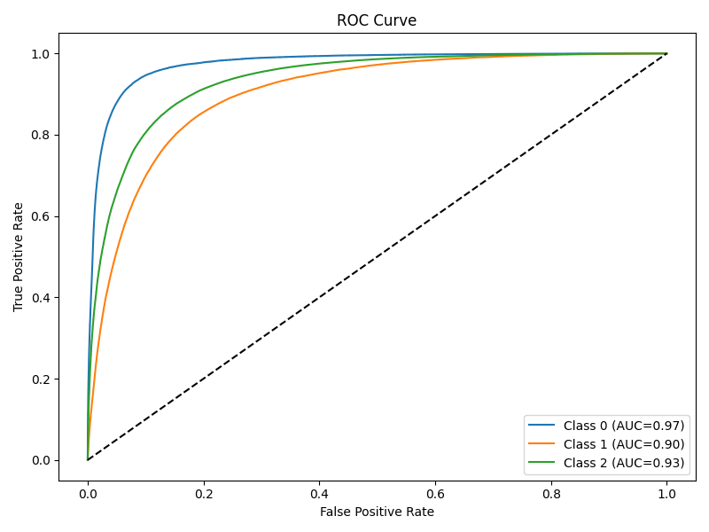

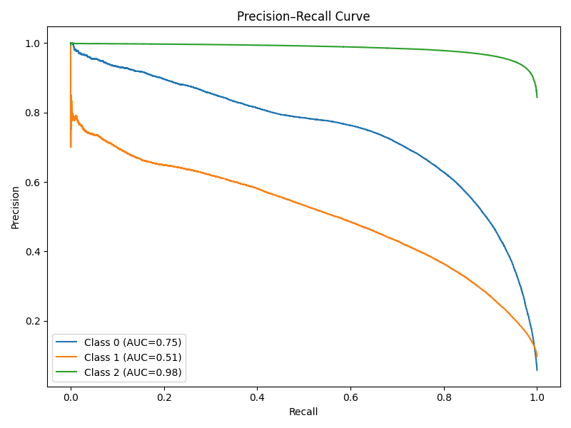

## 🔮 Making Predictions
Once you have a trained model (final_model.pkl), run predictions on your test data:

```bash
python model_predict.py
```
By default, this uses:
```bash
Test input: reviews_test.json
Output file: result.csv
Model path: final_model.pkl
```

### Using Custom Paths
You can specify custom files:

```bash
python model_predict.py --test_file my_test.json --out_file output.csv --model_path my_model.pkl
```


### Sample Training Run
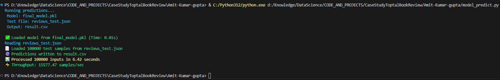

Output

The script writes a CSV file with one prediction per test record:

Where:

* 0 → Negative
* 1 → Mixed
* 2 → Positive

#### Sample Results


## Deployment of Model to Production

The goal of putting the trained **HashingVectorizer + SGDClassifier** model in production is to make automated review‑sentiment prediction available to downstream systems — for example:
- Real‑time scoring of new customer reviews, or  
- Batch scoring of incoming review datasets.

Because this model is lightweight, deterministic, and CPU‑friendly, it’s very well suited for production deployment.

### Expose as an API
 - Use lightweight frameworks like FastAPI or Flask.  This has been done in the file [`app.py`](./app.py)
 - Run with `uvicorn api:app --host 0.0.0.0 --port 8080 --reload`
 - Go to Documentation UI (Swagger) - http://127.0.0.1:8000/docs. It also gives a testing environment 
 - See steps here 
 - 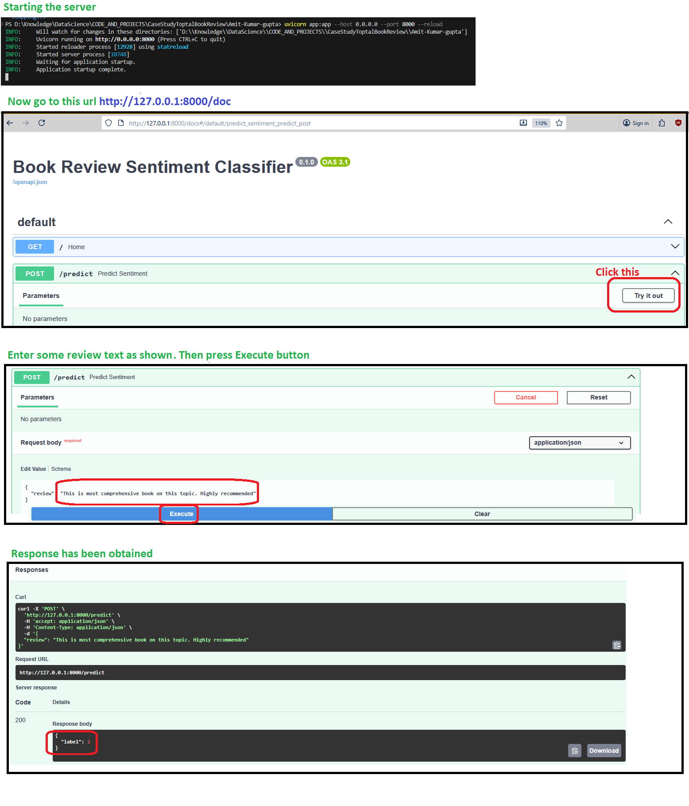
 - For real production deployment, this can be containerized and deployed.

#### Deploy Dockerized API 
  ```dockerfile
  FROM python:3.9
  WORKDIR /app
  COPY . .
  RUN pip install -r requirements.txt
  EXPOSE 8000
  CMD ["uvicorn", "app:app", "--host", "0.0.0.0", "--port", "8000"]
  ```
  Then:
  ```bash
  docker build -t review-api .
  docker run -p 8000:8000 review-api
  ```


### Created a mini demo app using Gradio

- This has been done in the file [`demo_gradio.py`](./demo_gradio.py)
- To run it, simply run this on a command line
  ```bash
  python demo_gradio.py
  ```
- See steps here 
- 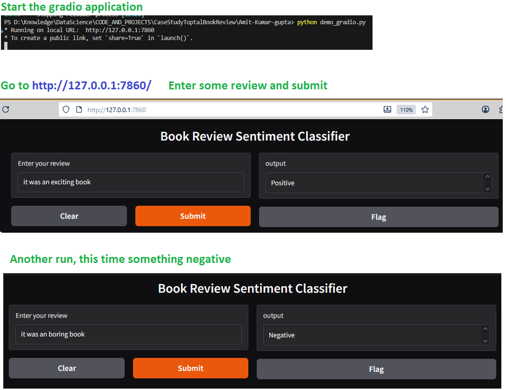

### Created a mini demo app using Streamlit

- This has been done in the file [`demo_streamlit.py`](./demo_streamlit.py)
- To run it, simply run this on a command line
  ```bash
  streamlit run demo_streamlit.py
  ```
- See steps here 
- 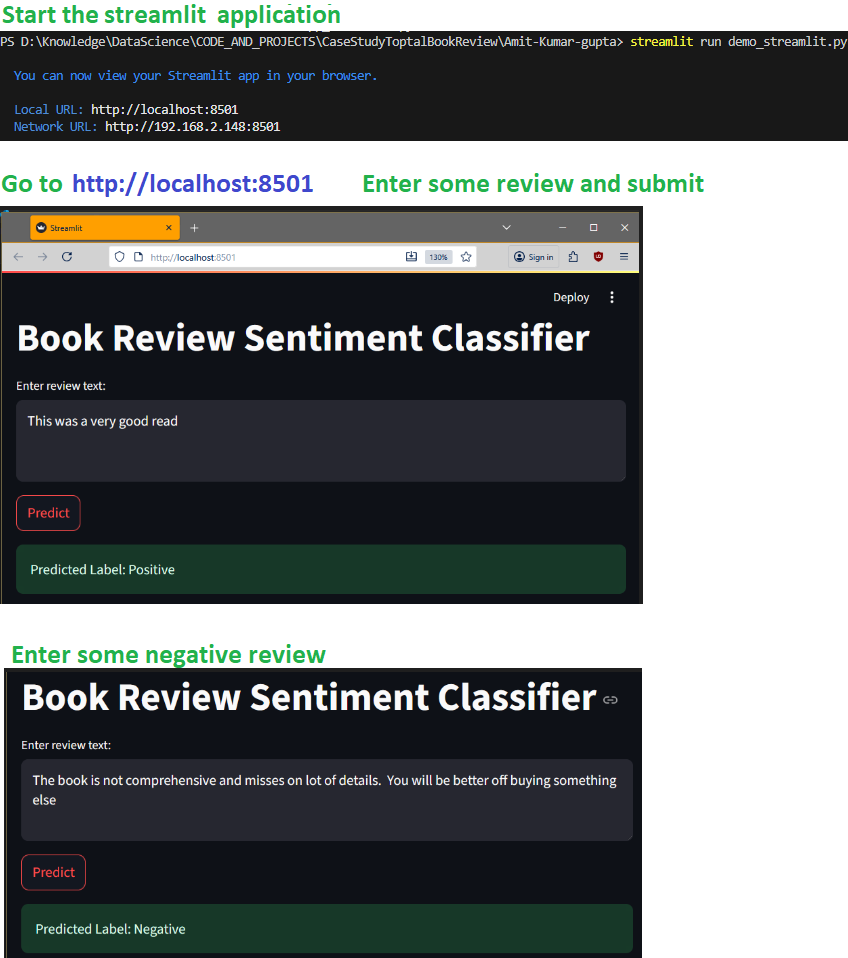

---

# 🧩 Technical Summary of the HashingVectorizer-SGDClassifier based model

Now we get into more technical details about the model that was chosen and refined

## 1. Overall Architecture

The project implements a memory-efficient text classification pipeline optimized for large-scale text review analysis using Scikit-learn.
The model leverages feature hashing for text representation and stochastic gradient descent (SGD) for efficient linear classification.

## 2. Sequence Diagram

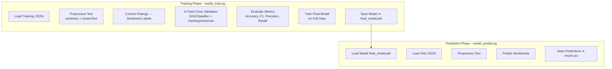

## 3. Components

### a. HashingVectorizer

Transforms raw text into fixed-length numerical vectors using the **hashing trick**, allowing constant memory usage without storing a vocabulary.

| Parameter | Default | Description |
|------------|----------|-------------|
| `n_features` | `2**16` | Number of hash bins or features. Higher = finer granularity, more memory. |
| `ngram_range` | `(1, 2)` | Uses unigrams and bigrams to capture more context. |
| `stop_words` | `'english'` | Removes common English words that don’t add meaning. |
| `alternate_sign` | `False` | Prevents hashed features from flipping signs. |
| `norm` | `"l2"` | Normalizes each feature vector to unit length. |
| `dtype` | `np.float32` | Reduces memory footprint during computation. |
| `lowercase` / `strip_accents` | `True` / `"unicode"` | Standardizes input text for consistency. |

**Advantages:**
- Scales efficiently to large datasets.
- No vocabulary storage overhead.
- Parallelization-friendly for distributed systems.

---

### b. SGDClassifier

Implements a **linear classifier** trained using **Stochastic Gradient Descent (SGD)** — ideal for large, sparse text data.

| Parameter | Default | Description |
|------------|----------|-------------|
| `loss` | `"hinge"` | Defines learning objective.<br>`hinge` → SVM-like margin-based learning.<br>`log_loss` → Logistic regression (probability-based). |
| `alpha` | `1e-5` | Regularization strength. Smaller values = lower regularization (risk of overfitting). |
| `max_iter` | `10` | Maximum number of passes (epochs) over the training dataset. |
| `early_stopping` | `True` | Stops training automatically when validation score stops improving. |
| `n_iter_no_change` | `3` | Number of epochs with no improvement before stopping. |
| `learning_rate` | `"optimal"` | Automatically adjusts step size during training. |
| `class_weight` | `"balanced"` | Adjusts class importance inversely to class frequency. |
| `n_jobs` | `-1` | Runs training on all available CPU cores in parallel. |
| `random_state` | `42` | Seeds random operations for reproducibility. |
| `warm_start` | `True` | Reuses previous model weights between runs for incremental training. |

**Advantages:**
- Efficient for large-scale linear text classification.
- Flexible: supports SVM and logistic regression styles.
- Built-in early stopping reduces overtraining.

---

### c. Cross-Validation Setup

Cross-validation was implemented to rigorously assess the model’s performance and generalization capability.  
A **K-Fold Cross-Validation** approach was used to ensure that the model’s evaluation was not biased toward any specific data partition.

| Parameter | Default | Description |
|------------|----------|-------------|
| **`n_splits`** | `3` | Number of folds used in K-Fold cross-validation. Each subset serves once as a validation set while the remaining folds are used for training. |
| **`shuffle`** | `True` | Ensures random shuffling of data before splitting to reduce sampling bias. |
| **`random_state`** | `42` | Guarantees reproducibility of folds and consistent partitioning across runs. |
| **`Evaluation Metrics`** | Accuracy, F1-score, Precision, Recall | Key metrics used to evaluate model performance per fold. |

**Process Summary:**
1. The entire dataset is split into *k* subsets (default = 3).  
2. The model is trained on *k – 1* folds and validated on the remaining fold in each iteration.  
3. The process repeats *k* times, ensuring every record is used for both training and validation.  
4. Metrics from all folds are averaged to produce a robust overall performance estimate.

**Advantages:**
- Reduces risk of overfitting to a particular data split.  
- Provides a more reliable measure of the model’s real-world performance.  
- Combined with **parallel execution (via Joblib)**, all folds are processed simultaneously for faster results.


### 🧾 Notes

The HashingVectorizer is used for memory-efficient feature extraction (no vocabulary stored).
The SGDClassifier supports both hinge (SVM) and log_loss (logistic regression) training.
All processing and evaluation are parallelized across CPU cores.
Memory usage is tracked using memory-profiler.


## 4. Efficiency Techniques

The model is designed with scalability and performance optimization in mind.  
Several key techniques are applied to ensure **high efficiency**, **low memory usage**, and **fast runtime**, even on large text datasets.

| Technique | Purpose | Benefit |
|------------|----------|----------|
| **Feature Hashing** | Uses a hashing function to map tokens directly to indices in a fixed-size feature space. | Avoids storing a growing vocabulary, ensuring constant memory usage and linear scalability. |
| **Float32 Computation** | Uses 32-bit floating-point numbers for internal calculations. | Reduces memory footprint by ~50% compared to `float64`, with minimal precision loss. |
| **Parallel Cross-Validation** | Runs each K-Fold training and validation subset in parallel using **Joblib**. | Fully utilizes CPU cores, significantly reducing training time. |
| **Early Stopping** | Monitors validation loss and stops training when no improvement is detected. | Prevents overfitting and reduces unnecessary computation. |
| **Memory Profiling** | Integrates the `memory_profiler` package to measure peak memory usage during model training. | Helps monitor and manage memory consumption in large experiments. |
| **Class Weight Balancing** | Automatically adjusts class weights inversely to class frequency. | Prevents majority class bias, improving performance on imbalanced datasets. |
| **Warm Start** | Retains fitted model parameters for subsequent runs. | Enables incremental training and reuse, saving overhead in repeated experiments. |
| **Hash-Based N-Grams** | Extracts unigrams and bigrams efficiently without maintaining token-index mappings. | Captures contextual relationships between words without vocabulary explosion. |

**Summary:**
- The combination of **feature hashing**, **float32 usage**, and **multi-core<span class="ml-2" /><span class="inline-block w-3 h-3 rounded-full bg-neutral-a12 align-middle mb-[0.1rem]" />

## 5. Evaluation Metrics

Model performance is evaluated using multiple metrics to ensure a well-rounded understanding of classification quality across all sentiment classes.  
Evaluation occurs during **K-Fold Cross-Validation**, with metrics aggregated across all folds.

---

### 📊 Metrics Used

| Metric | Formula / Definition | Description |
|---------|----------------------|--------------|
| **Accuracy** | `(TP + TN) / (TP + TN + FP + FN)` | Measures the proportion of correctly classified samples. Provides an overall performance indicator but can be misleading for imbalanced datasets. |
| **Precision** | `TP / (TP + FP)` | Indicates how many predicted positives are actually correct. High precision means fewer false positives. |
| **Recall (Sensitivity)** | `TP / (TP + FN)` | Measures how many actual positives were correctly identified. High recall means fewer false negatives. |
| **F1-Score** | `2 * (Precision * Recall) / (Precision + Recall)` | Harmonic mean of precision and recall; balances the trade-off between both metrics. Useful when class distribution is uneven. |

> **TP**, **TN**, **FP**, and **FN** represent true positives, true negatives, false positives, and false negatives, respectively.

---

### ⚙️ Evaluation Process

1. The training data is split into *k* folds (default = 3).
2. For each fold:
   - The model is trained on *k-1* folds and validated on the remaining fold.
   - Metrics (Accuracy, Precision, Recall, F1-score) are computed on the validation subset.
3. Metrics are averaged across all folds to estimate the model’s generalization performance.

---

### 📈 Example Output
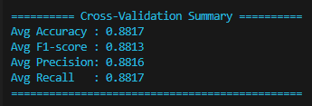

---

### 🧩 Interpretation

- **High Accuracy** ✅ → Model performs well across all classes.  
- **Balanced F1-score** 🔁 → Indicates consistent precision and recall.  
- **Precision > Recall** ⚠️ → Fewer false positives but more false negatives — model is conservative.  
- **Recall > Precision** ⚠️ → Model is liberal in predicting positives, with potential false alarms.  

---

### 📑 Summary

| Metric | Focus Area | Ideal Goal |
|---------|-------------|-------------|
| Accuracy | Overall correctness | As high as possible |
| Precision | Prediction quality | Minimize false positives |
| Recall | Detection sensitivity | Minimize false negatives |
| F1-score | Balance of precision and recall | Stable across all classes |

Combined, these metrics provide a holistic understanding of how well the model generalizes across **negative**, **neutral**, and **positive** sentiments.


## 6. System Configurations

The model was trained on a Windows machine with following configuration

### 🖥️ System Configuration that was used for Model Training — Windows Machine


| Component | Details |
|------------|----------|
| **Operating System** | Microsoft Windows 10 Pro (Build 19045) |
| **System Type** | 64‑bit (x64-based PC) |
| **Processor** | AMD 8-core (3.8 GHz, Family 25 Model 80) |
| **Total Installed RAM** | 32 GB |
| **Available RAM at Runtime** | ~18 GB |
| **Virtual Memory (Max / Available)** | 47.9 GB / 23.2 GB |
| **Parallelization Capability** | Multi‑core (8 physical / 16 logical threads) |
| **Network / GPU** | CPU‑based training (Realtek Wi‑Fi, no discrete GPU detected) |

---


## 7. ⚙️ Hyperparameter Optimization (Grid Search)

To ensure optimal model performance, a **Grid Search** procedure was conducted using Scikit‑learn’s `GridSearchCV`.  
This automated process systematically evaluated multiple combinations of key hyperparameters for both the **HashingVectorizer** and the **SGDClassifier** components.

---

### 🔍 Objective

The goal was to find the combination of parameters that maximized the **weighted F1-score** via **cross-validation**.  
Each configuration was trained and validated across multiple folds to ensure model generalization.

---

### 📦 Parameters Tuned

| Component | Parameter | Tested Values |
|------------|------------|----------------|
| **HashingVectorizer** | `vect__n_features` | `[2**14, 2**15, 2**16]` → 16K, 32K, 64K feature dimensions |
|  | `vect__ngram_range` | `[(1, 1), (1, 2)]` → Unigrams and Unigrams+Bigrams |
| **SGDClassifier** | `clf__loss` | `["hinge", "log_loss"]` → SVM vs Logistic Regression |
|  | `clf__alpha` | `[1e-6, 1e-5, 1e-4]` → Regularization strength |
|  | `clf__max_iter` | `[10, 20, 30]` → Training iterations |

**Total parameter combinations:** 108  
**With 3-fold cross-validation:** 324 total fits executed.

---

### 🧮 Procedure Overview

1. **Pipeline Definition**  
   - A Scikit-learn `Pipeline` was created combining:
     - `HashingVectorizer` for feature extraction.
     - `SGDClassifier` for classification.
   - The parameters were dynamically overridden by `GridSearchCV` based on the grid.

2. **Grid Search Execution**  
   - `GridSearchCV` iterated through all parameter combinations using `cv=3` folds.
   - Each model was evaluated on the **weighted F1-score** metric.
   - Computations were parallelized with `n_jobs=-1` to utilize all CPU cores.

3. **Results Evaluation**  
   - The best-performing parameter set was identified.
   - The model was retrained using all available data with those optimal parameters.
   - Evaluation metrics (Accuracy, Precision, Recall, F1-score) were calculated on the training and test sets.

4. **Logging & Memory Tracking**  
   - The process was monitored using `memory_profiler` for peak memory usage.
   - Execution time was recorded for full reproducibility.

---

### 🏆 Outcome

- Identified and selected **best hyperparameters** for the model pipeline.  
- Achieved improved **weighted F1-score** compared to default configurations.  
- Generated a detailed performance summary for the **top 5 parameter combinations**.  
- Exercise took around 58 minutes to evaluate 324 models
 

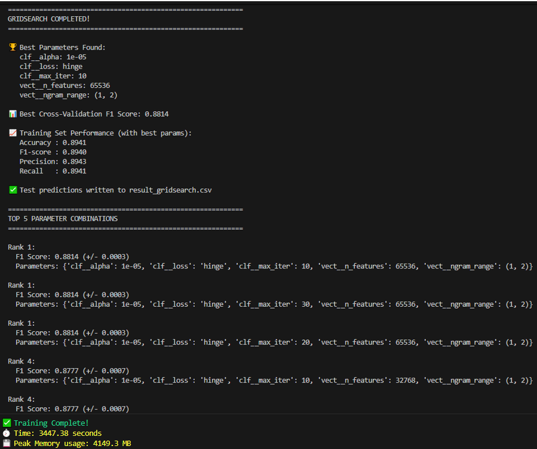


---

### ✅ Summary

Grid Search enabled **automated hyperparameter tuning** and ensured that the chosen configuration delivered the best trade-off between accuracy, generalization, and computational efficiency.  
The final model thus represents a **data-driven optimization** rather than relying on manually set parameters.


## 8. Recommended Configurations

To optimize model performance for different workloads and hardware environments, the following configurations are recommended.  
Each setup balances **accuracy**, **speed**, and **memory usage** according to the intended use case.


| Scenario | Description | Recommended Settings |
|-----------|--------------|----------------------|
| **Baseline / Default** | A balanced configuration for general use — good accuracy with modest runtime. | `loss="hinge"`, `n_features=2**16`, `alpha=1e-5`, `max_iter=10`, `n_jobs=-1` |
| **High-Quality Model** | Prioritizes accuracy over speed. Suitable when compute resources are not a limiting factor. | `loss="log_loss"` (enables probabilities), `alpha=1e-6`, `n_features=2**18`, `max_iter=20`, `early_stopping=True` |
| **Large Dataset** | Designed for millions of reviews — optimized memory and parallelism. | `n_features=2**18`, `dtype=np.float32`, `class_weight="balanced"`, `n_jobs=-1`, monitor `memory_profiler` |
| **Class Imbalance** | Best for datasets where certain sentiment classes dominate. | Keep `class_weight="balanced"`, or manually tune class weights for finer control. |
| **Fast Experimentation** | Quick model iteration with reduced runtime. | `n_features=2**14`, `max_iter=5`, `early_stopping=True`, single-thread (`n_jobs=1`) |
| **Interpretability / Probability Outputs** | Use probabilistic output for ROC and PR curves. | Set `loss="log_loss"`, use `predict_proba<span class="ml-2" /><span class="inline-block w-3 h-3 rounded-full bg-neutral-a12 align-middle mb-[0.1rem]" />


## 9. Summary Table

| Component | Technique Used | Purpose | Key Strength |
|------------|----------------|----------|---------------|
| **Vectorization** | `HashingVectorizer` (n‑gram range (1, 2)) | Converts text into fixed‑length hashed feature vectors. | Memory‑efficient and scalable. |
| **Classifier** | `SGDClassifier` (hinge / log_loss) | Linear model trained with stochastic gradient descent. | Fast, supports SVM and logistic regression behavior. |
| **Cross‑Validation** | `KFold`, `Joblib` parallel execution | Splits dataset into k‑folds for unbiased evaluation. | Improves generalization and fully utilizes CPU cores. |
| **Feature Combination** | Summary + ReviewText | Captures richer context per review. | Enhances classification performance. |
| **Hyperparameter Tuning** | `GridSearchCV` | Systematic search over parameter grid. | Finds optimal model settings automatically. |
| **Efficiency Controls** | Early Stopping + Float32 Computations | Halts training when loss stabilizes; uses lower‑precision floats. | Saves time and reduces memory consumption. |
| **Evaluation Metrics** | Accuracy, Precision, Recall, F1‑Score | Quantitative assessment of performance. | Balanced and comprehensive view of model quality. |
| **Memory Tracking** | `memory_profiler` | Monitors RAM usage throughout training. | Ensures scalable and stable training on large datasets. |
| **Prediction Output** | `.csv` predictions file | Exports final sentiment labels for test data. | Simple integration into downstream analytics. |
| **Model Output** | Pickle file (`final_model.pkl`) | Serialized trained pipeline. | Ready for reuse during inference. |

---

## 10. At a Glance

> 🧠 **A lightweight, scalable text classification system for sentiment analysis**  
> leveraging Scikit‑learn’s `HashingVectorizer` and `SGDClassifier` with  
> built‑in cross‑validation, efficiency tuning, and automated hyperparameter optimization.

### ⚡ Key Highlights
- **Pipeline Architecture:** Hashing‑based vectorization + Linear SGD classifier.  
- **Performance Tuning:** GridSearchCV explored 100+ parameter combinations.  
- **Parallel Processing:** All CPU cores leveraged for training and cross‑validation.  
- **Memory Optimization:** Uses `float32` and `memory_profiler` for efficient large‑scale execution.  
- **Model Evaluation:** Accuracy / Precision / Recall / F1 reported across folds.  
- **Deployment Ready:** Final model and predictions saved as `.pkl` and `.csv` artifacts.  

### 🚀 Takeaway
A **fully optimized**, **memory‑efficient**, and **production‑ready** sentiment classifier  
that balances speed, accuracy, and reproducibility — ideal for large review datasets and scalable ML workflows.