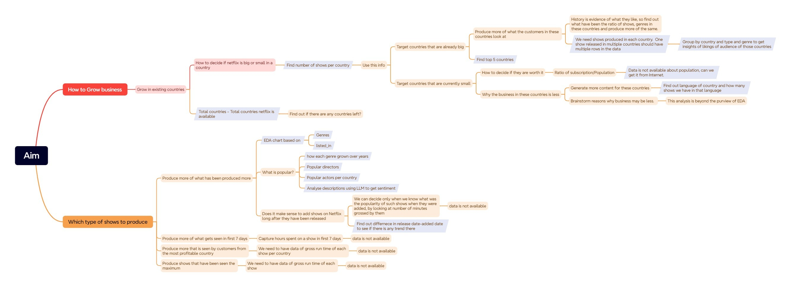
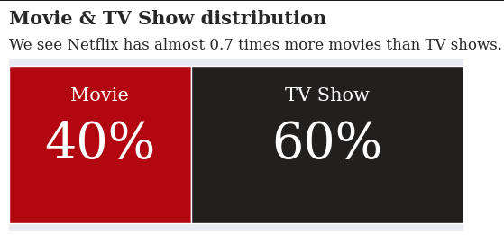
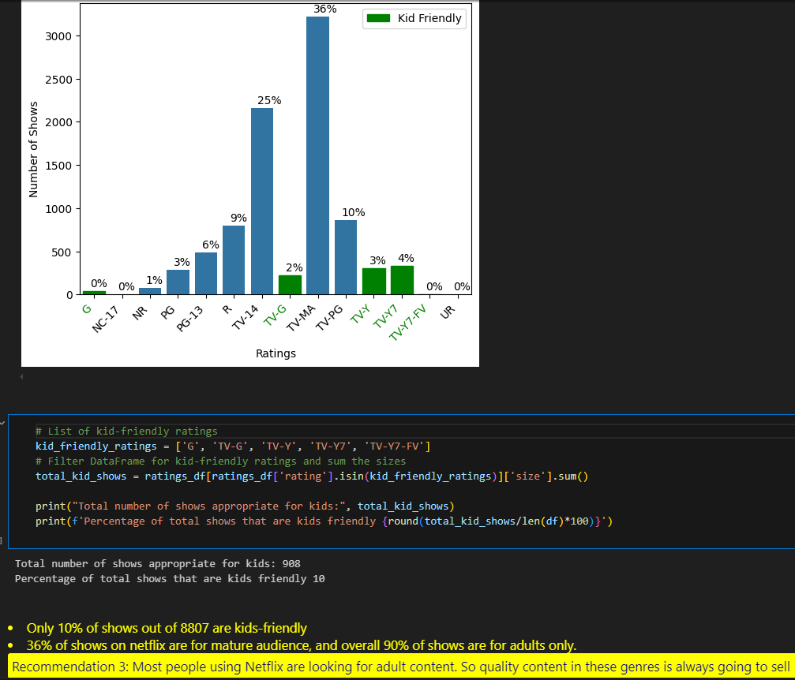
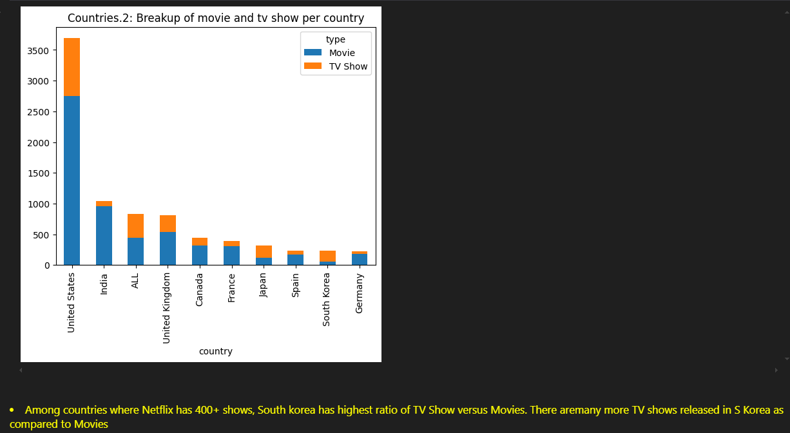
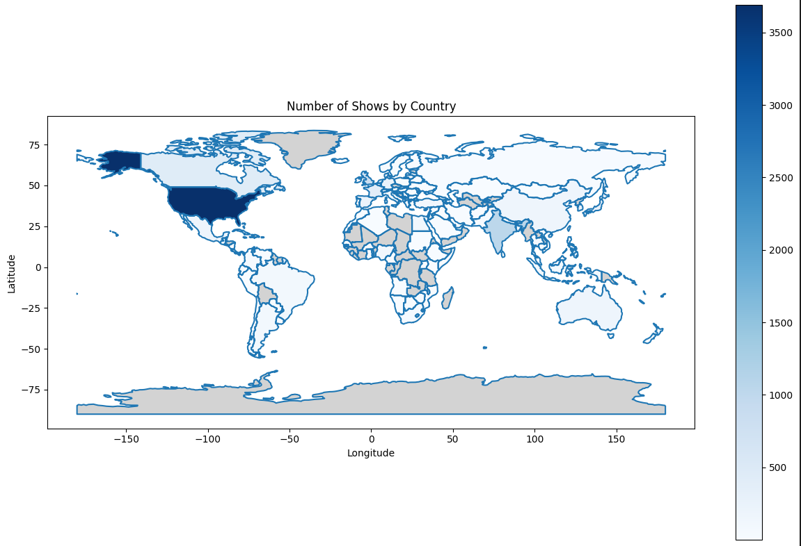
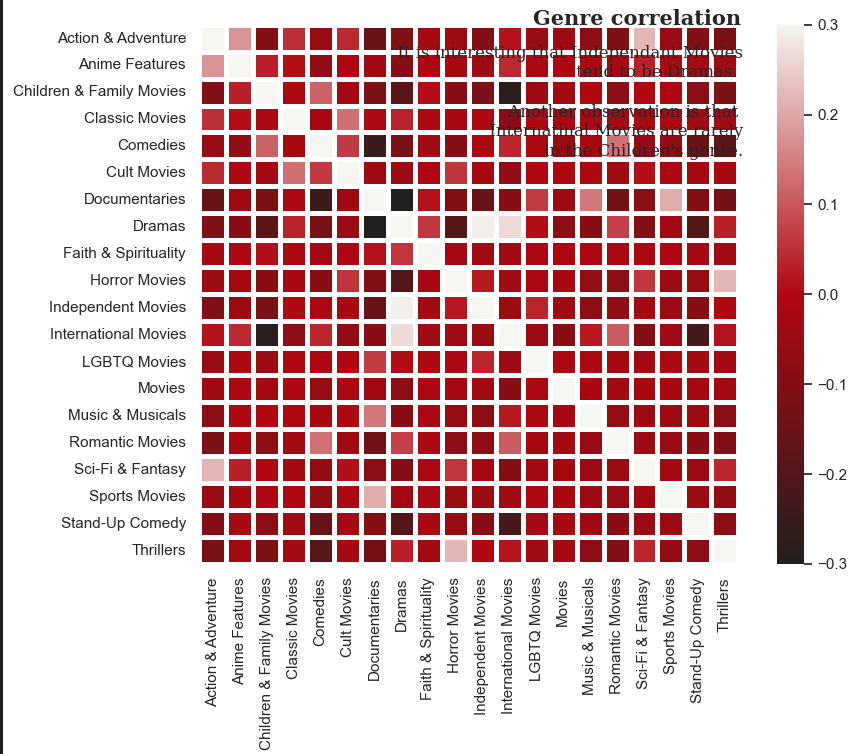
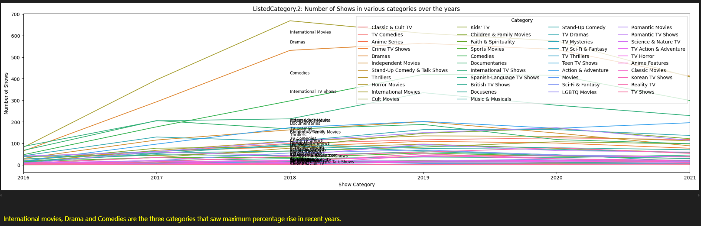

# Netflix Data Analysis - Exploratory Data Analysis and Visualization

## Project Overview
This case study explores Netflix's content library using exploratory data analysis (EDA) and advanced visualization techniques. The analysis investigates content trends, distribution patterns, and relationships between various attributes to provide insights into Netflix's content strategy and evolution over time.

## Business Context
Netflix is a leading streaming entertainment service with millions of subscribers worldwide. Understanding the composition of its content library is crucial for:
- Content acquisition and development strategy
- Audience targeting and engagement
- Market positioning against competitors
- Regional content distribution decisions

This analysis examines Netflix's content catalog to uncover patterns and insights that could inform strategic business decisions.

As the data is vast and presents many ideas worthy of pursuing from a analysis point of view, I created a mindmap to guide what to explore so that I can prioritize that data analysis when doing EDA

## Dataset Description
The analysis uses Netflix's content library dataset containing information about movies and TV shows available on the platform, including:
- Content type (Movie/TV Show)
- Title
- Director
- Cast
- Country of origin
- Release year
- Rating (age appropriateness)
- Duration
- Listed genres/categories
- Description
- Date added to Netflix

## Exploratory Data Analysis Concepts Explored

### 1. Data Cleaning and Preprocessing
- **Missing Value Analysis**: Identification and handling of null values across different attributes
- **Data Type Transformation**: Converting categorical and date fields to appropriate formats
- **Feature Engineering**: Creating new variables from existing data to enhance analysis
- **Text Data Processing**: Cleaning and standardizing text fields for consistency

### 2. Univariate Analysis
- **Distribution Analysis**: Examining the distribution of individual variables
- **Frequency Analysis**: Analyzing the count and proportion of categorical variables
- **Descriptive Statistics**: Calculating statistical measures for numerical variables
- **Temporal Analysis**: Exploring trends over time

### 3. Multivariate Analysis
- **Cross-tabulation**: Examining relationships between multiple categorical variables
- **Correlation Analysis**: Identifying associations between different attributes
- **Segmentation Analysis**: Grouping content based on multiple characteristics
- **Comparative Analysis**: Contrasting different segments across various dimensions

### 4. Visualization Techniques
- **Bar Charts and Histograms**: Representing distributions and frequencies
- **Pie Charts**: Showing proportional compositions
- **Line Plots**: Illustrating trends over time
- **Heatmaps**: Visualizing correlations and patterns
- **Treemaps**: Displaying hierarchical data and proportions
- **Word Clouds**: Representing text data frequency
- **Geographic Maps**: Showing content distribution by country

## Key Visualizations

### Content Type Distribution

*This visualization shows the distribution of content types (Movies vs. TV Shows) in the Netflix library, illustrating the platform's content balance.*

### Number of Shows in various categories

*This plot shows that what genres are most liked by Netflix audience

### Content Rating Distribution

*This visualization breaks down Netflix content by rating categories, providing insights into audience targeting across different age groups.*

### Top 10 Countries Producing Netflix Content

*This chart compares what type of shows are more popular in each of Top 10 countries for Netflix*

### Every country in which Netflix is present

*This chart shows the geographic distribution of content production, highlighting Netflix's global content strategy. 

### Genre Distribution Word Cloud

*This word cloud visually represents the frequency of different genres in the Netflix library, emphasizing popular content categories.*

### Trend of type of shows over the years

*This time series shows how viewers' interests have changed over the years for different genres types.*

## Key Findings

1. **Content Type Balance**: 
   - Movies comprise approximately 69.6% of Netflix's content library, while TV Shows make up 30.4%
   - This balance has gradually shifted toward more TV Shows in recent years

2. **Growth Patterns**:
   - Significant acceleration in content addition between 2015-2019
   - Potential slowdown observed in more recent periods, possibly due to quality focus or production impacts

3. **Geographic Insights**:
   - United States, India, and United Kingdom are the top content producers
   - Regional content hubs show emerging patterns in international markets

4. **Content Aging**:
   - Most content is added within 2-3 years of its original release
   - Vintage content (10+ years old) represents a smaller but significant portion of the library

5. **Audience Targeting**:
   - TV-MA (Mature) and TV-14 ratings dominate the library
   - Family content (G, PG, TV-Y) represents a smaller proportion

6. **Genre Preferences**:
   - Dramas, Comedies, and Documentaries are the most prevalent genres
   - International Movies and TV Shows have increased significantly

## Business Recommendations

1. **Content Strategy**:
   - Continue investing in TV Show development to build subscriber loyalty
   - Maintain balance between new releases and quality vintage content
   - Consider expanding family-friendly content offerings to broaden appeal

2. **Regional Focus**:
   - Leverage data insights to target content investments in emerging markets
   - Foster production relationships in high-growth regions
   - Develop region-specific content strategies based on local preferences

3. **Competitive Positioning**:
   - Differentiate through content category strengths
   - Consider genre gaps as opportunities for content development
   - Use temporal analysis to anticipate subscriber needs

4. **Content Acquisition**:
   - Prioritize content types showing positive growth trends
   - Balance portfolio between experimental and proven genres
   - Consider strategic vintage content acquisitions for specific audience segments

## Technical Implementation

This analysis was conducted using Python with the following libraries:
- Pandas for data manipulation
- Matplotlib and Seaborn for standard visualizations
- Plotly for interactive visualizations
- WordCloud for text visualization
- NumPy for numerical operations
- Datetime for temporal analysis

The analytical approach included:
- Comprehensive data cleaning and preprocessing
- Systematic exploration of individual variables
- Cross-variable relationship analysis
- Advanced visualization techniques
- Insight generation and recommendation development

## Conclusion

This exploratory data analysis of Netflix's content library provides valuable insights into the streaming giant's content strategy and evolution. By systematically analyzing various dimensions of the dataset, the study reveals patterns in content type distribution, geographical focus, temporal trends, and audience targeting.

The visualization-heavy approach effectively communicates complex relationships and patterns within the data, enabling data-driven decision-making for content strategy, acquisition planning, and audience development. The findings demonstrate the power of exploratory data analysis and visualization in extracting actionable business insights from entertainment content data.
