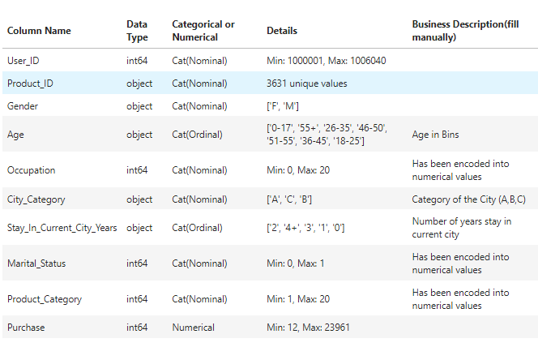
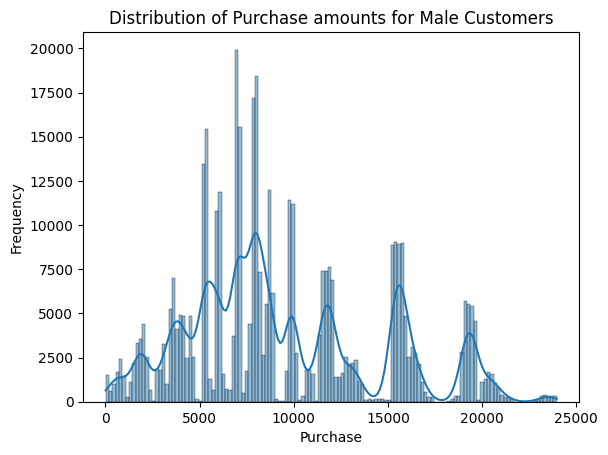
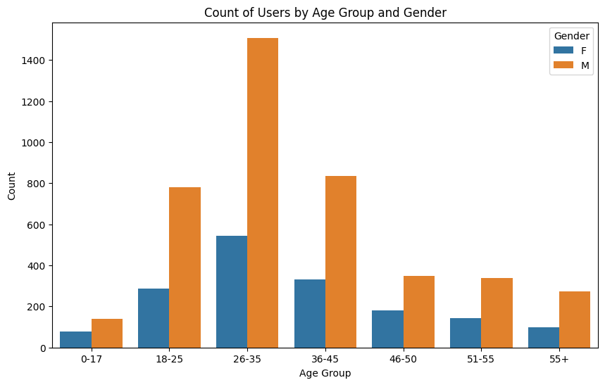
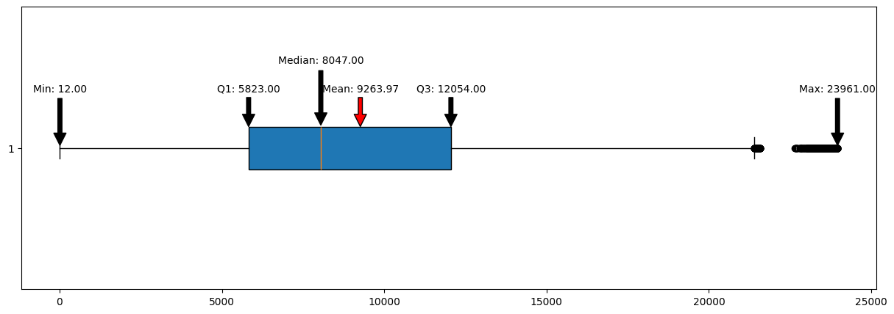
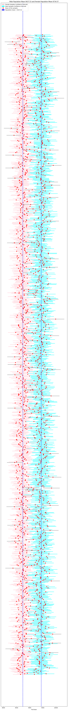
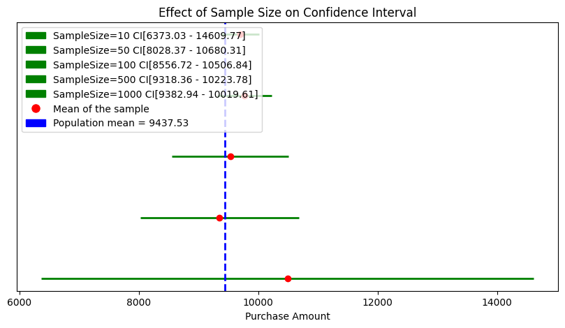
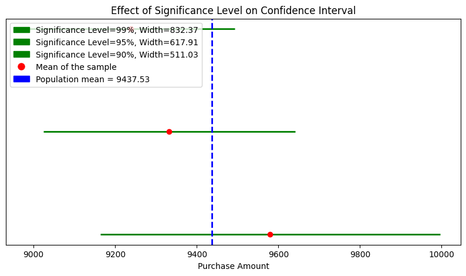
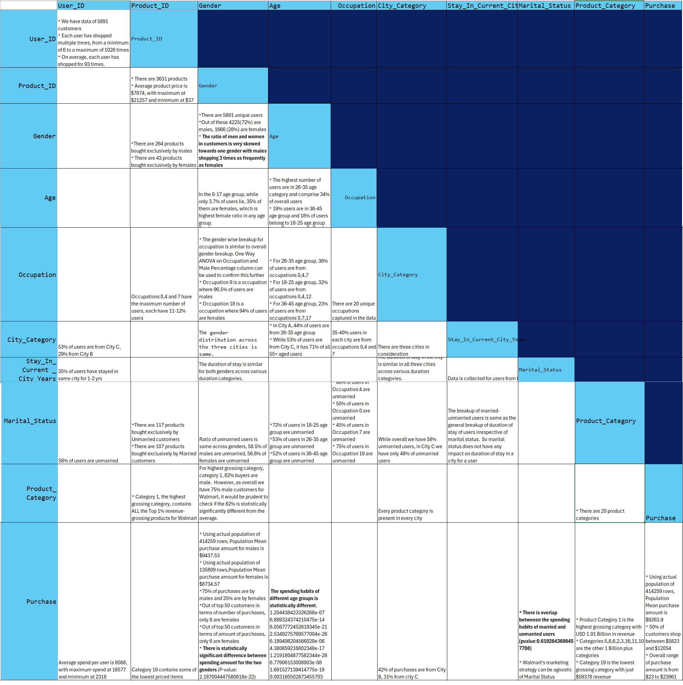

# Walmart Data Analysis - Exploring Confidence Interval and Central Limit Theorem

## 📊 Business Case Overview

Walmart, one of the world's largest retail corporations, needs to understand customer purchasing behavior during their biggest sales event - Black Friday. This analysis focuses on exploring confidence intervals and applying the Central Limit Theorem to make statistical inferences about customer spending patterns across different demographics.

### 🎯 Business Objective
- Analyze customer purchase behavior during Black Friday sales
- Apply statistical concepts of Confidence Intervals and Central Limit Theorem
- Provide insights on customer spending patterns across different segments
- Make data-driven recommendations for future marketing strategies

## 📈 Dataset Information

The dataset contains transactional data of customers who purchased products from Walmart stores during Black Friday. It includes information about approximately 0.5 million transactions.

### Key Features:
- **User_ID**: Unique identifier for customers
- **Product_ID**: Unique identifier for products
- **Gender**: Customer gender (M/F)
- **Age**: Age groups of customers
- **Occupation**: Customer occupation codes
- **City_Category**: Category of city (A/B/C)
- **Stay_In_Current_City_Years**: Number of years in current city
- **Marital_Status**: Customer marital status
- **Product_Category_1/2/3**: Product category codes
- **Purchase**: Purchase amount (target variable)

We did analyse these columns further and here are the results



## 🔍 Analysis Approach

### 1. Exploratory Data Analysis (EDA)
- Data cleaning and preprocessing
- Descriptive statistics analysis
- Visualization of customer demographics and purchase patterns
- Identification of outliers and data quality issues

### 2. Statistical Analysis
- **Central Limit Theorem Application**: Demonstrating how sample means approach normal distribution
- **Confidence Interval Calculation**: Computing confidence intervals for population parameters
- **Hypothesis Testing**: Testing assumptions about customer spending behavior
- **Sampling Distribution Analysis**: Understanding sampling variability

### 3. Key Statistical Concepts Explored
- **Central Limit Theorem (CLT)**: How sample means converge to normal distribution
- **Confidence Intervals**: Range estimation for population parameters
- **Standard Error**: Measure of sampling variability
- **Population vs Sample Statistics**: Understanding the relationship

## 🛠️ Tools and Technologies

- **Python 3.x**
- **Libraries Used**:
  - `pandas` - Data manipulation and analysis
  - `numpy` - Numerical computations
  - `matplotlib` - Data visualization
  - `seaborn` - Statistical data visualization
  - `scipy` - Statistical functions
  - `plotly` - Interactive visualizations


## 📊 Visualizations

The analysis includes various visualizations:
- Distribution plots showing purchase amount patterns


- Bar charts for demographic analysis

- Box plots for outlier identification

- Confidence interval visualizations

- CLT demonstration plots




## 📈 Results

### Business Insights: 
- We have data of 5891 customers
- Each user has shopped multiple times, from a minimum of 6 to a maximum of 1026 times
- On average, each user has shopped for 93 times.
- 53% of users are from City C, 29% from City B
- 35% of users have stayed in same city for 1-2 yrs
- 58% of users are unmarried
- Average spend per user is 9568, with maximum spend at 18577 and minimum at 2318
- There are 3631 products
- Average product price is $7874, with maximum at $21257 and minimum at $37
- There are 264 products bought exclusively by males
- There are 43 products bought exclusively by females
- Occupations 0,4 and 7 have the maximum number of users, each have 11-12% users
- There are 117 products bought exclusively by Unmarried customers
- There are 107 products bought exclusively by Married customers
- Category 1, the highest grossing category, contains ALL the Top 1% revenue-grossing products for Walmart
- Category 19 contains some of the lowest priced items
- Out of these 4225(72%) are males, 1666 (28%) are females
- The ratio of men and women in customers is very skewed towards one gender with males shopping 3 times as frequently as females
- In the 0-17 age group, while only 3.7% of users lie, 35% of them are females, which is highest female ratio in any age group.
- The gender wise breakup for occupation is similar to overall gender breakup. One Way ANOVA on Occupation and Male Percentage column can be used to confirm this further
- Occupation 9 is a occupation where 96.5% of users are males
- Occupation 18 is a occupation where 94% of users are females
- The gender distribution across the three cities is same.
- The duration of stay is similar for both genders across various duration categories.
- Ratio of unmarried users is same across genders, 58.5% of males are unmarried, 56.8% of females are unmarried
- For highest grossing category, category 1, 82% buyers are male.  However, as overall we have 75% male customers for Walmart, it would be prudent to check if the 82% is statistically significantly different from the average.
- Using actual population of 414259 rows, Population Mean purchase amount for males is $9437.53
- Using actual population of 135809 rows,Population Mean purchase amount for females is $8734.57
- 75% of purchases are by males and 25% are by females
- Out of top 50 customers in terms of number of purchases, only 8 are females
- Out of top 50 customers in terms of amount of purchases, only 6 are females
- There is statistically significant difference between spending amount for the two genders (P-value: 2.187004447580818e-22)
- The highest number of users are in 26-35 age category and comprise 34% of overall users
- 19% users are in 36-45 age group and 18% of users belong to 18-25 age group
- For 26-35 age group, 36% of users are from occupations 0,4,7
- For 18-25 age group, 32% of users are from occupations 0,4,12
- For 36-45 age group, 23% of users are from occupations 0,7,17
- In City A, 44% of users are from 26-35 age group
- While 53% of users are from City C, it has 71% of all 55+ aged users  
- 72% of users in 18-25 age group are unmarried
- 53% of users in 26-35 age group are unmarried
- 52% of users in 36-45 age group are unmarried
- The spending habits of different age groups is statistically different.
- There are 20 unique occupations captured in the data
- 35-40% users in each city are from occupations 0,4 and 7
- 66% of users in Occupation 4 are unmarried
- 50% of users in Occupation 0 are unmarried
- 45% of users in Occupation 7 are unmarried
- 75% of users in Occupation 19 are unmarried
- There are three cities in consideration
- The duration of stay in the city is similar in all three cities across various duration categories.
- While overall we have 58% unmarried users, in City C we have only 48% of unmarried users
- Every product category is present in every city
- 42% of purchases are from City B, 31% from city C
- Data is collected for users from 0 to 4+ yrs of stay in a city
- The breakup of married-unmarried users is same as the general breakup of duration of stay of users irrespective of marital status.  So marital status does not have any impact on duration of stay in a city for a user
- There is overlap betweeen the spending habits of married and unmarried users (pvalue:0.6192843698457708)
- Walmart's marketing strategy can be agnostic of Marital Status
- There are 20 product categories
- Product Category 1 is the highest grossing category with USD 1.91 Billion in revenue
- Categories 5,8,6,2,3,16,11,10 are the other 1 Billion plus categories
- Category 19 is the lowest grossing category with just $59378 revenue
- Using actual population of 414259 rows, Population Mean purchase amount is $9263.9
- 50% of customers shop between $5823 and $12054
- Overall range of purchase amount is from $23 to $23961





### <span style="font-size:26px; font-family:Arial;color:yellow">Recommendations</span>

### <span style="font-size:16px; font-family:Arial;color:yellow">Conclusion 1</span>
There is statistically significant difference between spending behaviour of the two genders. In simpler words, spending behaviors of the two genders is different, with a high level of confidence.

### <span style="font-size:16px; font-family:Arial;color:yellow">Recommended Actions</span>

### Targeted Marketing Campaigns
- Walmart can tailor marketing messages and promotions to cater specifically to the unique spending behaviors of each gender. For example, separate campaigns can be created to highlight products or services that are more appealing to each group.

### Product Selection
- Understanding the distinct spending patterns can help Walmart curate their product offerings to better meet the preferences of male and female customers.

### Merchandising and Layout: 
- Store layouts and merchandising strategies can be adjusted to cater to the different spending habits. For instance, products that are more popular with one gender can be strategically placed in areas where that demographic is more likely to shop.


### <span style="font-size:16px; font-family:Arial;color:yellow">Conclusion 2</span>
There is statistically significant difference between spending behaviour of the various age groups

### <span style="font-size:16px; font-family:Arial;color:yellow">Recommended Actions</span>

### Targeted Marketing Campaigns
- Develop targeted marketing campaigns for different age groups, focusing on products and offers that appeal to each group.
- Use social media and digital marketing to reach younger customers, while traditional advertising methods can be employed for older customers.

### Personalized Promotions:

- Implement personalized promotions and discounts based on the purchasing history and preferences of different age groups.
- Offer loyalty programs tailored to various age groups to encourage repeat purchases.

### Product Assortment:
- Adjust the product assortment to cater to the preferences of different age groups. For example, increase the stock of trendy fashion items for younger customers and premium quality products for older customers.
- Introduce exclusive products or brands that resonate with specific age groups.

### In-Store Experience:
- Enhance the in-store experience by creating age-specific sections or displays. For example, a tech corner for younger customers and a wellness section for older customers.
- Provide excellent customer service tailored to the needs of different age groups. Train staff to address the concerns and preferences of each age group effectively.

### Online Shopping Experience:
- Optimize the online shopping experience by offering user-friendly interfaces and personalized recommendations for different age groups.
- Ensure mobile compatibility and ease of use for younger customers who are more likely to shop via smartphones.

### Events and Workshops:
- Organize in-store events and workshops that cater to the interests of different age groups. For example, DIY workshops for younger customers and health and wellness seminars for older customers.


### <span style="font-size:16px; font-family:Arial;color:yellow">Conclusion 3</span>
Less women are visiting Walmart
We observe that only 25% of customers are women as per given data.

### <span style="font-size:16px; font-family:Arial;color:yellow">Possible reasons</span>
- Walmart's marketing strategies might be more appealing to men, leading to higher male foot traffic and spending
- Cultural norms and societal expectations might influence shopping behaviors. For example, women might be more likely to shop for groceries and household items, while men might shop for higher-ticket items
- Gender Roles: Traditional gender roles might play a part in determining who does the shopping and what they buy.

### <span style="font-size:16px; font-family:Arial;color:yellow">It could indicate that shopping experience of women needs improvement</span>
This can be done by 
- keeping more items relevant to women. The product mix at Walmart might cater more to male preferences, such as electronics and automotive products, which could result in higher spending by men
- making it easier to reach 
- helpful and women friendly staff
- ensuring women safety
- Women are more likely to use coupons and look for discounts, which might lead them to shop at stores that offer better deals

## 🔧 How to Run the Analysis

1. **Clone the Repository**
```bash
git clone [repository-url]
cd CaseStudyWalmart-Exploring\ Confidence\ Interval\ and\ CLT/
```

2. **Install Required Libraries**
```bash
pip install pandas numpy matplotlib seaborn scipy plotly
```

3. **Run the Jupyter Notebook**
```bash
jupyter notebook 2.WallMartDataAnalysis.ipynb
```

## 📝 File Structure

```
CaseStudyWalmart-Exploring Confidence Interval and CLT/
│
├── 2.WallMartDataAnalysis.ipynb    # Main analysis notebook
├── data/                           # Dataset files
├── images/                         # Generated plots and visualizations
└── README.md                       # Project documentation
```

## 🎓 Learning Outcomes

This project demonstrates:
- **Statistical Inference**: Making conclusions about populations from samples
- **Central Limit Theorem**: Practical application and verification
- **Confidence Intervals**: Construction, interpretation, and business application
- **Data Analysis Skills**: EDA, visualization, and statistical testing
- **Business Analytics**: Translating statistical insights into actionable recommendations

## 📚 References and Resources

- Central Limit Theorem theoretical foundations
- Confidence Interval methodology
- Statistical inference best practices
- Retail analytics case studies
- Python statistical libraries documentation

## 🤝 Contributing

Feel free to contribute to this project by:
- Suggesting improvements to the analysis
- Adding new statistical methods
- Enhancing visualizations
- Providing feedback on interpretations

## 📧 Contact

For questions or suggestions regarding this analysis, please feel free to reach out.

---

**Note**: This analysis is for educational and portfolio demonstration purposes. The insights and recommendations should be validated with domain experts before implementation in real business scenarios.