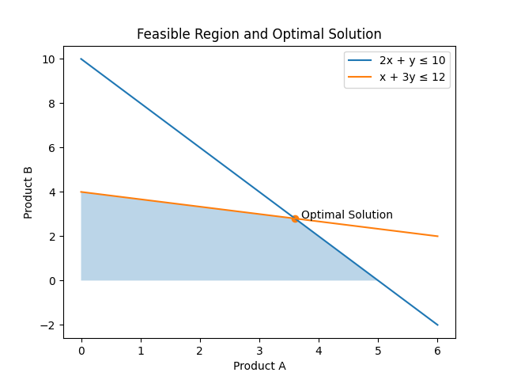

No worries at all — this is a **great request**, and this README will make your project look *real*, *thoughtful*, and *interview-ready*.

Below is a **complete `README.md`** you can copy-paste directly into a GitHub repo.
It includes:

* Clear problem context
* Math formulation
* **Mermaid diagrams**
* Gurobi code snippets
* A **separate visualization script** you can run locally to generate plots

---

````md
# 🏭 Production Planning Optimization using Gurobi

## Overview
This project demonstrates how **mathematical optimization** can be used to support
production planning decisions in a small manufacturing plant.

The factory produces two products:
- **Product A (Standard)**
- **Product B (Premium)**

Both products share limited **machine time** and **labor hours**.
Additionally, Product B requires a **setup decision**, meaning it can only be produced if the setup is enabled.

The goal is to **maximize daily profit** while respecting all operational constraints.

---

## Business Problem
Production managers must answer:
- How many units of each product should be produced today?
- Is it worth enabling the premium product line given limited resources?
- Which resource becomes the bottleneck?

This project models and solves the problem using **Linear Programming (LP)** and **Mixed-Integer Linear Programming (MILP)**.

---

## Decision Variables
| Variable | Type | Description |
|-------|----|-----------|
| `x_A` | Continuous | Units of Product A produced |
| `x_B` | Continuous | Units of Product B produced |
| `z_B` | Binary | 1 if Product B setup is enabled, 0 otherwise |

---

## Objective Function
Maximize total profit:

\[
\text{Maximize } 3x_A + 5x_B
\]

---

## Constraints
### Machine Capacity
\[
2x_A + x_B \le 10
\]

### Labor Capacity
\[
x_A + 3x_B \le 12
\]

### Setup Logic (Big-M Constraint)
\[
x_B \le M \cdot z_B
\]

### Non-negativity
\[
x_A, x_B \ge 0
\]

---

## Optimization Flow

```mermaid
flowchart TD
    A[Business Requirements] --> B[Define Decision Variables]
    B --> C[Formulate Objective Function]
    C --> D[Add Resource Constraints]
    D --> E[Add Binary Setup Logic]
    E --> F[Solve using Gurobi]
    F --> G[Analyze Optimal Solution]
````

---

## Model Geometry (LP Intuition)

```mermaid
flowchart LR
    A[Constraint: 2x + y ≤ 10]
    B[Constraint: x + 3y ≤ 12]
    A --> C[Feasible Region]
    B --> C
    C --> D[Corner Points]
    D --> E[Optimal Solution]
```

---

## Gurobi Implementation (Core Model)

```python
import gurobipy as gp
from gurobipy import GRB

# Create model
m = gp.Model("factory_production")

# Decision variables
x_A = m.addVar(lb=0, name="Product_A")
x_B = m.addVar(lb=0, name="Product_B")
z_B = m.addVar(vtype=GRB.BINARY, name="Setup_B")

# Objective
m.setObjective(3*x_A + 5*x_B, GRB.MAXIMIZE)

# Constraints
m.addConstr(2*x_A + x_B <= 10, name="Machine")
m.addConstr(x_A + 3*x_B <= 12, name="Labor")

# Big-M setup constraint
M = 10
m.addConstr(x_B <= M * z_B, name="Setup_Logic")

# Solve
m.optimize()

# Results
for v in m.getVars():
    print(f"{v.VarName}: {v.X}")
print("Optimal Profit:", m.ObjVal)
```

---

## Expected Outcome

* Optimal production quantities for each product
* Automatic decision on whether Product B should be produced
* Identification of binding (bottleneck) constraints

---

## Visualization

The script below plots:

* Feasible region
* Constraint lines
* Optimal solution point

### 📈 `visualize_lp.py`

```python
import numpy as np
import matplotlib.pyplot as plt

# Constraint lines
x = np.linspace(0, 6, 400)
y1 = 10 - 2*x        # Machine
y2 = (12 - x) / 3   # Labor

# Feasible region
y = np.minimum(y1, y2)
y[y < 0] = 0

# Optimal point (from solver)
x_opt, y_opt = 3.6, 2.8

plt.figure()
plt.plot(x, y1, label="2x + y ≤ 10")
plt.plot(x, y2, label="x + 3y ≤ 12")
plt.fill_between(x, 0, y, alpha=0.3)

plt.scatter(x_opt, y_opt)
plt.text(x_opt + 0.1, y_opt, "Optimal Solution")

plt.xlabel("Product A")
plt.ylabel("Product B")
plt.legend()
plt.title("Feasible Region and Optimal Solution")
plt.show()
```

Run:

```bash
python visualize_lp.py
```


---

## Key Learnings

* Translating real-world production constraints into linear inequalities
* Using binary variables to model setup decisions
* Understanding why LP solutions lie at corner points
* Comparing LP vs MILP behavior in operational settings

---

## Tools & Technologies

* Python
* Gurobi Optimizer
* Linear Programming (LP)
* Mixed-Integer Linear Programming (MILP)
* Matplotlib (visualization)

---

## Author

**Amit Gupta**
Role: Optimization Modeler
Focus: Mathematical formulation, solver implementation, and result interpretation

```


