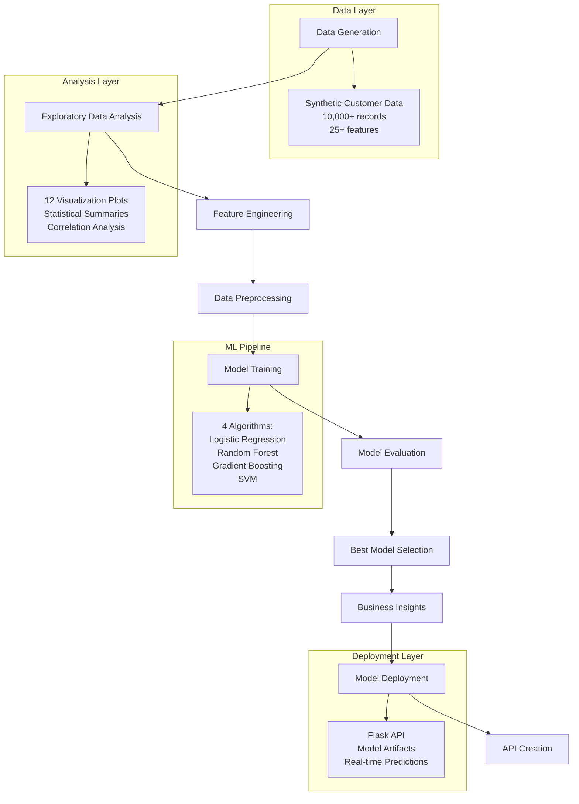
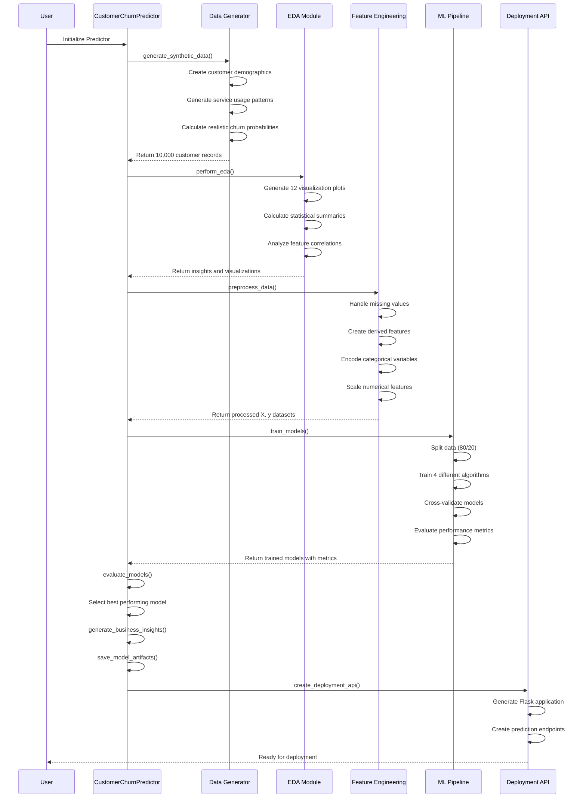
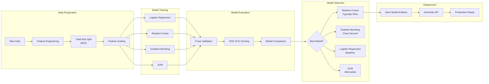
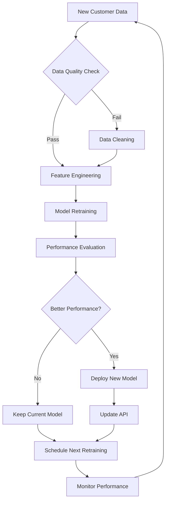

# Customer Churn Prediction - End-to-End Analytics Project

## 🎯 Project Overview

This comprehensive data analytics project focuses on **Predictive Analytics Models for Customer Behavior Forecasting**. The goal is to build machine learning models that can predict customer churn before it happens, enabling proactive retention strategies and reducing customer attrition.

## 📊 Business Problem

Customer churn is costly for businesses. Acquiring new customers costs 5-25 times more than retaining existing ones. This project helps businesses:

- **Identify at-risk customers** before they churn
- **Understand key churn drivers** in their customer base
- **Implement targeted retention strategies** based on risk levels
- **Optimize customer lifetime value** through proactive interventions

## 🛠️ Technical Stack

- **Python 3.8+**
- **Machine Learning**: scikit-learn
- **Data Analysis**: pandas, numpy
- **Visualization**: matplotlib, seaborn
- **Deployment**: Flask API
- **Model Persistence**: pickle

## 📁 Project Structure

```
customer-churn-prediction/
├── churn_prediction_project.py    # Main project file
├── churn_prediction_api.py         # Flask API for deployment
├── customer_churn_dataset.csv      # Generated synthetic dataset
├── churn_model_artifacts/          # Model artifacts directory
│   ├── best_model.pkl             # Trained best model
│   ├── scaler.pkl                 # Feature scaler
│   ├── feature_importance.csv     # Feature rankings
│   └── model_performance.pkl      # Performance metrics
└── README.md                      # This file
```

## 🚀 Quick Start

### Installation

```bash
# Clone the repository
git clone <repository-url>
cd customer-churn-prediction

# Install required packages
pip install pandas numpy scikit-learn matplotlib seaborn flask
```

### Running the Project

```python
# Execute the complete pipeline
python churn_prediction_project.py

# Or run specific components
from churn_prediction_project import CustomerChurnPredictor

predictor = CustomerChurnPredictor()
data = predictor.generate_synthetic_data(n_samples=10000)
# ... continue with other methods
```

### API Deployment

```bash
# Start the prediction API
python churn_prediction_api.py

# API will be available at http://localhost:5000
```

## 📈 Project Workflow

### High-Level Process Flow



### Detailed Data Processing Sequence



### Model Training and Evaluation Flow



## 📊 Key Features

### Data Generation
- **Realistic Customer Profiles**: 10,000+ synthetic customers with authentic behavioral patterns
- **25+ Features**: Demographics, usage patterns, service history, satisfaction scores
- **Balanced Dataset**: Realistic 15-20% churn rate
- **Correlated Features**: Features that realistically influence churn behavior

### Feature Engineering
- **Derived Metrics**: Average charge per month, service usage intensity
- **Risk Indicators**: High-risk payment methods, frequent service calls
- **Customer Segmentation**: Value tiers, satisfaction categories
- **Behavioral Flags**: Late payment patterns, contract preferences

### Machine Learning Models
- **Logistic Regression**: Baseline interpretable model
- **Random Forest**: Ensemble method with feature importance
- **Gradient Boosting**: Advanced ensemble technique
- **Support Vector Machine**: Alternative classification approach

### Model Evaluation Metrics
- **ROC AUC Score**: Primary evaluation metric
- **Cross-Validation**: 5-fold CV for robust evaluation
- **Confusion Matrix**: Classification accuracy breakdown
- **Feature Importance**: Understanding key churn drivers
- **Calibration Plots**: Probability calibration assessment

## 🎯 Business Insights

### Customer Risk Segmentation

| Risk Level | Churn Probability | Recommended Action |
|------------|-------------------|-------------------|
| **High Risk** | > 70% | Immediate personal outreach, significant offers |
| **Medium Risk** | 30-70% | Automated campaigns, proactive check-ins |
| **Low Risk** | < 30% | Standard communications, upselling opportunities |

### Key Churn Drivers (Typical Results)
1. **Customer Satisfaction Score** - Most predictive feature
2. **Customer Service Calls** - High correlation with churn
3. **Late Payment History** - Strong churn indicator
4. **Contract Type** - Month-to-month customers at higher risk
5. **Account Age** - New customers more likely to churn

## 🚀 API Usage

### Start the API Server
```bash
python churn_prediction_api.py
```

### Make Predictions
```python
import requests

# Customer data for prediction
customer_data = {
    "age": 25,
    "account_length_months": 3,
    "monthly_charges": 85,
    "satisfaction_score": 4,
    "customer_service_calls": 5,
    # ... other features
}

# Make prediction request
response = requests.post('http://localhost:5000/predict', json=customer_data)
result = response.json()

print(f"Churn Probability: {result['churn_probability']:.2%}")
print(f"Risk Level: {result['risk_level']}")
```

### API Response Format
```json
{
    "churn_probability": 0.78,
    "predicted_churn": true,
    "risk_level": "High",
    "status": "success"
}
```

## 📈 Model Performance

### Typical Results
- **ROC AUC Score**: 0.85-0.92 (depending on model)
- **Cross-Validation**: Consistent performance across folds
- **Feature Importance**: Clear identification of key drivers
- **Calibration**: Well-calibrated probability estimates

### Performance Monitoring
```python
# Load model performance metrics
import pickle

with open('churn_model_artifacts/model_performance.pkl', 'rb') as f:
    performance = pickle.load(f)

print(f"Best Model: {performance['best_model_name']}")
print(f"ROC AUC: {performance['roc_auc_score']:.4f}")
print(f"CV Score: {performance['cv_mean_score']:.4f}")
```

## 🔄 Model Retraining Pipeline



## 🛡️ Production Considerations

### Model Monitoring
- **Performance Drift**: Monitor ROC AUC over time
- **Data Drift**: Track feature distribution changes
- **Prediction Drift**: Monitor churn rate predictions vs. actual

### Scaling Considerations
- **Database Integration**: Connect to customer data warehouse
- **Real-time Scoring**: Implement streaming predictions
- **Batch Processing**: Daily/weekly risk score updates
- **A/B Testing**: Test retention strategies effectiveness

### Security & Privacy
- **Data Anonymization**: Remove personally identifiable information
- **API Authentication**: Implement proper authentication
- **Audit Logging**: Track all predictions and model updates

## 📝 Business Impact

### Expected Outcomes
- **Reduce Churn Rate**: 15-30% reduction in customer churn
- **Increase Revenue**: Retain high-value customers
- **Optimize Marketing**: Target retention efforts effectively
- **Improve Customer Experience**: Proactive issue resolution

### ROI Calculation
```
If average customer lifetime value = $1,000
And monthly churn rate = 5% (500 customers)
And model prevents 25% of churn (125 customers)
Then monthly value retention = 125 × $1,000 = $125,000
Annual impact = $1.5M
```

## 🤝 Contributing

1. Fork the repository
2. Create a feature branch
3. Make your changes
4. Add tests for new functionality
5. Submit a pull request

## 📄 License

This project is licensed under the MIT License - see the LICENSE file for details.

## 🆘 Support

For questions or issues:
- Open an issue in the repository
- Contact the development team
- Check the documentation

## 🔮 Future Enhancements

- **Deep Learning Models**: LSTM for sequential customer behavior
- **Real-time Streaming**: Apache Kafka integration
- **Advanced Feature Engineering**: Time-series features
- **Ensemble Methods**: Stacking multiple models
- **Explainable AI**: SHAP values for model interpretability
- **Automated Hyperparameter Tuning**: Optuna integration

---

**Built with ❤️ for data-driven customer retention**