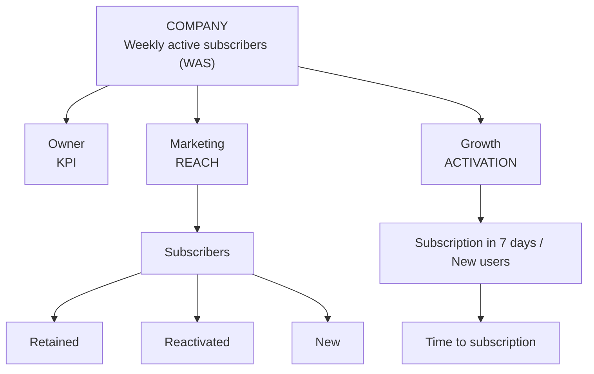
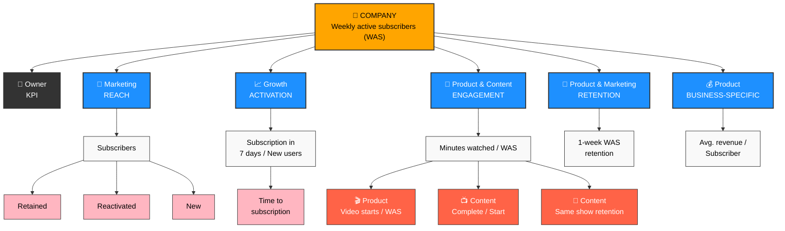

# KPI Tree Generator

A Python-based tool for programmatically generating hierarchical KPI (Key Performance Indicator) breakdown diagrams. This project supports both matplotlib-based static diagrams and Mermaid diagram generation for different use cases.

## Overview - What are product metrics?

- Product metrics are quantifiable data points that a business tracks and analyzes to evaluate the success of its product. 
- By using interactive product metrics, companies can optimize product strategies to ensure business growth.
- Determining the right metrics to monitor and analyze leads to more intelligent decision-making throughout the product development process.
- These metrics, sometimes called key performance indicators (KPIs), give the company quantifiable evidence about which aspects of the product / customer experience are resonating with customers, and which aren’t.
- Product KPIs can be related to user requirements, size, quality, product growth, or user comfort. 
They can evaluate architectural measures, quality measures, software complexity, or functional size.

In order to get their head around with so many possible metrics, companies usually categorise their metrics into a pyramidal or tree like structure


### Focus metric / North Star metric 

This is the single most important measure of success that matters a lot to a company. 

A North Star Metric (NSM) should be:

- A direct reflection of the company’s mission
- An indicator of how a company brings value to its customers.
- The only one of its kind. (Avoid having multiple NSMs as this tends to create complexity and confusion)
- The answer to the following question: What is the one metric that best represents the desired outcome of your company?

Which metric, if it were to increase today, would most accelerate my business’ flywheel?


## See 200+ Examples of North Star metrics across a variety of industries

- [Technology & Software](#technology--software)
- [Retail & E-Commerce](#retail--e-commerce)
- [Finance & Banking](#finance--banking)
- [Travel & Hospitality](#travel--hospitality)
- [Healthcare & Wellness](#healthcare--wellness)
- [Entertainment & Media](#entertainment--media)
- [Education & Learning](#education--learning)
- [Transportation & Logistics](#transportation--logistics)
- [Food & Beverage](#food--beverage)
- [Real Estate & Property](#real-estate--property)
- [Consumer & Lifestyle](#consumer--lifestyle)
- [Manufacturing & Industrial](#manufacturing--industrial)
- [Sustainability & Environment](#sustainability--environment)
- [Miscellaneous & Emerging Industries](#miscellaneous--emerging-industries)
- [Social Impact & Nonprofits](#social-impact--nonprofits)


### Level 1 metric / Primary metric

Primary metrics depict the desired outcome of a particular product, team, or initiative. This is unlike the NSM, which represents the desired outcome of the company as a whole.

Level 1 (L1) or primary metrics should either directly contribute to the focus metric or act as a check to make sure the product is growing in a healthy direction.

The primary metric can be more valuable than the NSM in the short-term because of its narrower focus, tighter feedback loop and more immediate association with the specific product, team, or initiative in question.

<span style="color:orange">
For example, if a product’s focus metric is Weekly active user, a good L1 metric would be 7-day retention to ensure you aren’t spending precious marketing funds to acquire new users who leave after a day or two.
</span>

### Supporting/ Tracking/ Input metric / Level 2 metric -

Performance indicators which are set for the current initiatives that are most granular and mostly used for tracking the progress at lowest level. 

<span style="color:orange">
For example - There may be some targeted marketing or segmented offers that need to be checked.
</span>

Supporting metrics are indicators that the primary metric is moving in the right direction.

To take the retention example one step further, the Level 2 metric could be iOS app retention.

Another could be a Level 2 metric such as the retention of a region or segment of customers. 


Here is an example of L1 metrics from multiple domains (Financial Services, SaaS, Retail, Media)


## Overview of the Tool in this repository

This tool helps product analysts and business intelligence teams **create KPI breakdown trees programmatically** that show how top-level metrics cascade down through different organizational levels and teams. Perfect for creating consistent KPI documentation across multiple companies or business units.

## Features

- **Hierarchical KPI Visualization**: Create multi-level KPI trees showing relationships between metrics
- **Two Output Formats**: 
  - High-quality matplotlib diagrams for presentations and reports
  - Mermaid diagrams for documentation and web integration
- **Customizable Styling**: Different colors for teams, actions, and metric types
- **Flexible Data Structure**: Easy to configure for different companies and KPI structures
- **Scalable Design**: Add or remove categories and metrics without code changes

## Installation

```bash
pip install matplotlib numpy
```

For Mermaid diagrams, you can use online renderers or install mermaid-cli:
```bash
npm install -g @mermaid-js/mermaid-cli
```

## Quick Start

### 1. Matplotlib Approach

```python
from kpi_tree_generator import KPITreeGenerator, create_example_diagram

# Use the built-in example
fig = create_example_diagram()

# Or create your own
kpi_data = {
    'top_kpi': {
        'name': 'GROWTH',
        'description': 'Monthly Active Users (MAU)'
    },
    'categories': [
        {
            'name': 'ACQUISITION',
            'team': 'Marketing',
            'metric': 'New user signups',
            'subcategories': [
                {'name': 'Organic', 'type': 'normal'},
                {'name': 'Paid', 'type': 'normal'},
                {'name': 'Referral', 'type': 'action'}
            ]
        },
        {
            'name': 'ACTIVATION',
            'team': 'Product',
            'metric': 'Day 1 retention rate',
            'subcategories': [
                {'name': 'Onboarding completion', 'type': 'action'}
            ]
        }
    ]
}

generator = KPITreeGenerator()
fig = generator.generate_kpi_tree(kpi_data)
fig.savefig('my_kpi_tree.png', dpi=300, bbox_inches='tight')
```

**Output**: A professionally styled diagram with colored boxes, connecting lines, and hierarchical layout. The matplotlib version produces publication-ready images suitable for presentations and reports.


### 2. Mermaid Approach

```python
from kpi_tree_generator import generate_mermaid_diagram

# Generate Mermaid code
mermaid_code = generate_mermaid_diagram(kpi_data)
print(mermaid_code)

# Save to file
with open('kpi_tree.mmd', 'w') as f:
    f.write(mermaid_code)
```

**Output**: Clean Mermaid diagram code that can be:
- Rendered online at [mermaid.live](images/https://mermaid.live)
- Embedded in Markdown documentation
- Used in GitLab/GitHub wikis
- Converted to images using mermaid-cli


After embedding in a readme.md file using ```mermaid tags, this code will render as below


Ofcourse, you can beautify the mermaid diagram as per your wish.
Here is that version with some manual efforts.



## Data Structure

The KPI data follows this structure:

```python
kpi_data = {
    'top_kpi': {
        'name': 'KPI_NAME',           # Main KPI title
        'description': 'DESCRIPTION'  # KPI description/metric
    },
    'categories': [
        {
            'name': 'CATEGORY_NAME',      # e.g., 'REACH', 'ENGAGEMENT'
            'team': 'TEAM_NAME',          # e.g., 'Marketing', 'Product'
            'metric': 'METRIC_DESC',      # Main metric for this category
            'subcategories': [            # Optional subcategories
                {
                    'name': 'SUBCAT_NAME',
                    'type': 'normal'      # 'normal' or 'action'
                },
                # ... more subcategories
            ]
        },
        # ... more categories
    ]
}
```

## Usage Examples

### Example 1: SaaS Company KPIs

```python
saas_kpis = {
    'top_kpi': {
        'name': 'ARR GROWTH',
        'description': 'Annual Recurring Revenue'
    },
    'categories': [
        {
            'name': 'NEW BUSINESS',
            'team': 'Sales',
            'metric': 'New customer ARR',
            'subcategories': [
                {'name': 'Enterprise', 'type': 'normal'},
                {'name': 'SMB', 'type': 'normal'}
            ]
        },
        {
            'name': 'EXPANSION',
            'team': 'Customer Success',
            'metric': 'Expansion rate %',
            'subcategories': [
                {'name': 'Upsells', 'type': 'action'},
                {'name': 'Cross-sells', 'type': 'action'}
            ]
        },
        {
            'name': 'RETENTION',
            'team': 'Product',
            'metric': 'Net revenue retention',
            'subcategories': [
                {'name': 'Churn reduction', 'type': 'action'}
            ]
        }
    ]
}
```


### Example 2: E-commerce KPIs

```python
ecommerce_kpis = {
    'top_kpi': {
        'name': 'REVENUE',
        'description': 'Monthly Gross Merchandise Value'
    },
    'categories': [
        {
            'name': 'TRAFFIC',
            'team': 'Marketing',
            'metric': 'Unique visitors',
            'subcategories': [
                {'name': 'SEO', 'type': 'normal'},
                {'name': 'Paid ads', 'type': 'normal'},
                {'name': 'Social', 'type': 'normal'}
            ]
        },
        {
            'name': 'CONVERSION',
            'team': 'Product',
            'metric': 'Conversion rate %',
            'subcategories': [
                {'name': 'Cart abandonment', 'type': 'action'},
                {'name': 'Checkout flow', 'type': 'action'}
            ]
        },
        {
            'name': 'AOV',
            'team': 'Merchandising',
            'metric': 'Average order value',
            'subcategories': [
                {'name': 'Recommendations', 'type': 'action'},
                {'name': 'Bundles', 'type': 'action'}
            ]
        }
    ]
}
```


## Customization

### Colors and Styling (Matplotlib)

```python
generator = KPITreeGenerator()
# Modify colors
generator.colors = {
    'primary': '#2E86AB',     # Blue for top KPI
    'secondary': '#A23B72',  # Purple for categories
    'tertiary': '#F18F01',   # Orange for subcategories
    'quaternary': '#C73E1D'  # Red for actions
}
```

### Mermaid Styling

The Mermaid output includes CSS classes that can be customized:

```python
classDef topKPI fill:#2E86AB,stroke:#333,color:#fff
classDef team fill:#A23B72,stroke:#333,color:#fff
classDef action fill:#C73E1D,stroke:#333,color:#fff
```

## Sample Outputs

### Matplotlib Output
The matplotlib version generates a hierarchical diagram with:
- **Top Level**: Orange box with company KPI
- **Category Level**: Blue boxes with team names and category labels
- **Metric Level**: White boxes with specific metrics
- **Sub-metric Level**: Pink boxes for normal items, red boxes for action items
- **Connecting Lines**: Gray lines showing relationships
- **Level Labels**: Left-side labels indicating hierarchy levels


### Mermaid Output
The Mermaid version creates a flowchart with:
- **Clean Node Structure**: Rectangular nodes with clear hierarchy
- **Icon Integration**: Emojis to distinguish different types of metrics
- **Color Coding**: Different colors for different organizational levels
- **Professional Layout**: Automatic positioning and connection routing


## Advanced Features

### Batch Processing Multiple Companies

```python
companies = {
    'company_a': saas_kpis,
    'company_b': ecommerce_kpis,
    'company_c': media_kpis
}

for company_name, kpi_data in companies.items():
    generator = KPITreeGenerator()
    fig = generator.generate_kpi_tree(kpi_data)
    fig.savefig(f'{company_name}_kpi_tree.png', dpi=300, bbox_inches='tight')
    plt.close(fig)
```

### Export Options

```python
# High-resolution PNG for presentations
fig.savefig('kpi_tree.png', dpi=300, bbox_inches='tight')

# Vector PDF for print
fig.savefig('kpi_tree.pdf', bbox_inches='tight')

# SVG for web
fig.savefig('kpi_tree.svg', bbox_inches='tight')
```

## Best Practices

1. **Keep Categories Balanced**: Aim for 3-5 main categories for optimal visual balance
2. **Consistent Naming**: Use consistent naming conventions across companies
3. **Action Items**: Use the 'action' type for metrics that represent actionable initiatives
4. **Metric Clarity**: Keep metric descriptions concise but clear
5. **Team Alignment**: Ensure team names match your organizational structure

## Troubleshooting

### Common Issues

1. **Text Overlap**: If text overlaps, reduce font sizes or increase figure size
2. **Too Many Categories**: Consider grouping related categories or using multiple diagrams
3. **Long Metric Names**: Break long names into multiple lines using `\n`

### Performance Tips

- For batch processing, close matplotlib figures to free memory: `plt.close(fig)`
- Use vector formats (PDF, SVG) for scalable output
- Consider Mermaid for documentation that needs frequent updates

<br/>
<br/>


# Industry KPIs Reference Guide

A comprehensive reference of Key Performance Indicators (KPIs) across various industries and business models. This guide provides top-level metrics that companies typically use to measure their success and can serve as input for KPI tree generation tools.

## Table of Contents

- [Technology & Software](#technology--software)
- [Retail & E-Commerce](#retail--e-commerce)
- [Finance & Banking](#finance--banking)
- [Travel & Hospitality](#travel--hospitality)
- [Healthcare & Wellness](#healthcare--wellness)
- [Entertainment & Media](#entertainment--media)
- [Education & Learning](#education--learning)
- [Transportation & Logistics](#transportation--logistics)
- [Food & Beverage](#food--beverage)
- [Real Estate & Property](#real-estate--property)
- [Consumer & Lifestyle](#consumer--lifestyle)
- [Manufacturing & Industrial](#manufacturing--industrial)
- [Sustainability & Environment](#sustainability--environment)
- [Miscellaneous & Emerging Industries](#miscellaneous--emerging-industries)
- [Social Impact & Nonprofits](#social-impact--nonprofits)

---

## Technology & Software

1. **Social Media Platform** – Daily Active Users (DAUs)
2. **Search Engine** – Number of Searches Conducted
3. **SaaS Subscription Business** – Monthly Recurring Revenue (MRR)
4. **Cloud Computing Service** – Server Utilization Rate
5. **E-commerce Platform** – Gross Merchandise Volume (GMV)
6. **Cybersecurity Firm** – Number of Threats Blocked per Day
7. **AI Research Company** – Successful Model Deployments
8. **Web Hosting Provider** – Server Uptime %
9. **Augmented Reality (AR) Platform** – AR Sessions per User
10. **Virtual Reality (VR) Gaming** – Total Time Spent in VR
11. **No-Code Development Platform** – Number of Apps Built
12. **Mobile App Store** (Google Play, App Store) – App Downloads per User
13. **Data Analytics SaaS** – Reports Generated per User
14. **IT Consulting Firm** – Client Retention Rate
15. **Software Testing Company** – Bugs Identified & Resolved

---

## Retail & E-Commerce

1. **Online Marketplace** (Amazon, Flipkart) – Total Sales Volume (GMV)
2. **Grocery Store** – Average Basket Size (Total Spend per Visit)
3. **Luxury Brand** – Customer Lifetime Value (CLV)
4. **Fashion Retailer** – Average Order Value (AOV)
5. **Subscription Box Service** – Retention Rate
6. **DTC (Direct-to-Consumer) Brand** – Repeat Purchases per Customer
7. **Secondhand Marketplace** (eBay, Poshmark) – Transactions per Seller
8. **Wholesale Distributor** – Average Order Value (AOV)
9. **Boutique Clothing Store** – Customer Retention Rate
10. **Handmade Goods Marketplace** (Etsy) – Total Artisan Sales
11. **Furniture Retailer** – Delivery Timeliness
12. **Consumer Electronics Store** – Product Upgrade Rate
13. **Department Store Chain** – Foot Traffic per Store
14. **Beauty & Skincare Brand** – Subscription Refill Rate
15. **Jewelry Store** – Average Revenue per Sale

---

## Finance & Banking

1. **Banking App** – Number of Active Accounts
2. **Credit Card Company** – Transaction Volume per Customer
3. **Investment Platform** – Assets Under Management (AUM)
4. **Insurance Company** – Policy Renewal Rate
5. **Fintech Startup** – Number of Transactions Processed
6. **Crypto Exchange Platform** – Daily Trading Volume
7. **Peer-to-Peer Lending Platform** – Loan Completion Rate
8. **Microfinance Institution** – Loan Repayment Rate
9. **Mobile Payment App** (PayPal, PhonePe) – Transactions per User
10. **Stock Brokerage Firm** – Number of Trades per Customer
11. **Digital Bank** – Active Monthly Users
12. **Personal Finance App** – Budget Completion Rate
13. **Corporate Lending Business** – Loan Conversion Rate
14. **ATM Service Provider** – Successful Withdrawals per Machine
15. **Fraud Prevention Company** – Fraud Cases Prevented

---

## Travel & Hospitality

1. **Online Travel Agency** (Expedia, MakeMyTrip) – Number of Booked Nights
2. **Hotel Chain** – Revenue per Available Room (RevPAR)
3. **Airline Company** – Load Factor (% of Seats Filled per Flight)
4. **Car Rental Service** – Utilization Rate (Vehicles Rented per Day)
5. **Vacation Rental Platform** (Airbnb) – Nights Booked per User
6. **Luxury Hotel Chain** – Customer Satisfaction Score
7. **Budget Hostel Service** – Occupancy Rate
8. **Cruise Line** – Average Cruise Duration
9. **Online Ticketing Platform** (RedBus, Booking.com) – Seats Sold per Trip
10. **Business Travel Management Company** – Corporate Retention Rate
11. **Glamping & Eco-Resorts** – Average Booking Duration
12. **Railway Ticketing Platform** – Number of Train Seat Bookings
13. **City Tour Agency** – Number of Tours Sold
14. **Long-Term Stay Housing Platform** – Average Stay Length
15. **Road Trip Rental Business** – Miles Driven per Customer

---

## Healthcare & Wellness

1. **Pharmacy Chain** – Prescription Refill Rate
2. **Health Insurance Provider** – Member Retention Rate
3. **Hospital System** – Bed Occupancy Rate
4. **Telemedicine Service** – Number of Consultations
5. **Fitness App** – Monthly Active Users (MAU)
6. **Mental Health Platform** – Sessions Completed per User
7. **Diet & Nutrition Coaching Service** – Weight Loss Success Rate
8. **Rehabilitation Center** – Patient Recovery Rate
9. **Dental Clinic Chain** – Appointment Completion Rate
10. **Health & Wellness Retreats** – Return Booking Rate
11. **Wearable Health Tech** (Fitbit, Apple Watch) – Active User Engagement
12. **Home Healthcare Provider** – Visits per Patient
13. **Personal Trainer Business** – Workout Adherence Rate
14. **Wellness Supplements Brand** – Subscription Retention Rate
15. **Hearing Aid & Vision Correction Services** – Product Adoption Rate

---

## Entertainment & Media

1. **Streaming Service** (Netflix, Spotify) – Hours of Content Consumed
2. **Gaming Platform** – Monthly Active Players (MAP)
3. **News Website** – Time Spent per Session
4. **Podcast Platform** – Total Listening Hours
5. **Movie Theatre Chain** – Seats Sold per Screening
6. **TV Network** – Total Hours Watched per Viewer
7. **Live Streaming Platform** (Twitch, YouTube Live) – Average Watch Time per Stream
8. **Film Production Studio** – Box Office Revenue per Release
9. **Live Concert Business** – Ticket Sales per Event
10. **Online Magazine Subscription** – Reader Retention Rate
11. **Ad-Supported News Website** – Click-Through Rate on Ads
12. **Book Publishing Company** – Book Sales per Author
13. **Comic Book Platform** – Chapters Read per User
14. **Music Record Label** – Streaming Royalties per Artist
15. **Esports Organization** – Viewership per Tournament

---

## Education & Learning

1. **Online Learning Platform** (Coursera, Udemy) – Course Completion Rate
2. **University** – Student Graduation Rate
3. **Language Learning App** – Daily Active Learners
4. **Tutoring Service** – Student Retention Rate
5. **Corporate Training Business** – Engagement Rate (Lessons Completed)
6. **Private Tutoring Business** – Student Success Rate
7. **Online Certification Provider** – Certifications Earned per User
8. **K-12 Learning App** – Homework Completion Rate
9. **Skill-Based Training Platform** – Lessons Completed per User
10. **Test Preparation Company** – Exam Score Improvement Rate
11. **Coding Bootcamp** – Job Placement Rate
12. **University Alumni Organization** – Alumni Engagement Index
13. **EdTech SaaS** (School Management Software) – Adoption Rate by Institutions
14. **Corporate Learning Platform** – Employee Course Completion Rate
15. **Student Loan Refinancing Service** – Loan Repayment Success

---

## Transportation & Logistics

1. **Rideshare App** (Uber, Ola) – Completed Rides per Driver
2. **Public Transit System** – Passenger Utilization Rate
3. **Freight & Logistics Company** – On-time Delivery Rate
4. **Courier Delivery Service** – Parcels Delivered per Day
5. **Electric Scooter Rental** – Number of Rides per Vehicle per Day
6. **Bike-Sharing Service** – Daily Active Riders
7. **Hyperloop/High-Speed Rail Project** – Passenger Throughput
8. **Airport Management Company** – Passenger Satisfaction Score
9. **Shipping Container Business** – Cargo Utilization Rate
10. **Truck Fleet Logistics Service** – Fuel Efficiency per Mile
11. **Drone Delivery Service** – Successful Deliveries per Route
12. **Rental Car Subscription Business** – Fleet Utilization per City
13. **EV Charging Station Network** – Charging Sessions per Station
14. **Luxury Chauffeur Service** – Ride Completion Rate
15. **Long-Distance Bus Operator** – Seat Occupancy Rate

---

## Food & Beverage

1. **Restaurant Chain** – Revenue per Table Turn
2. **Coffee Shop** – Average Ticket Size (Spend per Customer)
3. **Meal Kit Subscription** – Subscription Retention Rate
4. **Food Delivery App** – Orders per Active User
5. **Fast Food Franchise** – Repeat Customer Visits per Month
6. **Organic Food Retailer** – Returning Customer Rate
7. **Farm-to-Table Restaurant** – Customer Satisfaction Score
8. **Online Recipe Platform** – Recipe Completion Rate
9. **Meal Planning App** – Ingredients Purchased per Plan
10. **Food Processing Company** – Supply Chain Efficiency Score
11. **Craft Brewery** – Taproom Foot Traffic per Month
12. **Alcohol Subscription Service** – Retention Rate of Members
13. **Convenience Store Chain** – Basket Size Growth
14. **Frozen Food Brand** – Total SKUs Sold per Month
15. **Snack Subscription Box** – Engagement Rate

---

## Real Estate & Property

1. **Real Estate Marketplace** – Property Listings Viewed per User
2. **Property Management Firm** – Occupancy Rate
3. **Co-Working Space** – Desk Utilization Rate
4. **Home Rental Platform** – Monthly Rental Volume
5. **Construction Firm** – Project Completion Rate
6. **Commercial Property Management** – Occupancy Growth Rate
7. **Smart Home Tech Provider** – Devices Activated per Household
8. **Office Space Leasing Service** – Lease Renewal Rate
9. **Affordable Housing Developer** – Units Sold per Year
10. **Senior Living Community** – Resident Retention Rate
11. **Vacation Property Investment** – Revenue per Rental Night
12. **Real Estate Agent Marketplace** – Leads Converted per Agent
13. **Student Housing Platform** – Average Rental Period per Tenant
14. **Interior Design Consultancy** – Project Completion Satisfaction Rate
15. **Home Improvement Service** – Repeat Customer Engagement

---

## Consumer & Lifestyle

1. **Luxury Car Dealership** – Repeat Customer Purchase Cycle
2. **Premium Watch Brand** – Referral Rate per Buyer
3. **Eyewear Subscription** – Glasses Renewed per Subscriber
4. **Personal Finance Coaching Service** – Savings Growth Rate per User
5. **Wedding Planning Service** – Vendor Satisfaction Score
6. **Pet Insurance Company** – Policy Renewal Rate
7. **Online Personal Styling Platform** – User Engagement per Session
8. **Subscription-Based Laundry Service** – Monthly Utilization Rate
9. **Gift Shopping & Registry Platform** – Order Conversion Rate
10. **Custom Print-on-Demand Merchandise** – Total Items Sold

---

## Manufacturing & Industrial

1. **Automobile Manufacturer** – Production Efficiency per Factory
2. **Aerospace Equipment Supplier** – Parts Reliability Score
3. **Heavy Machinery Producer** – Equipment Lifespan per Unit
4. **Solar Panel Manufacturer** – Installed Capacity Growth Rate
5. **Battery Tech Innovator** – Energy Density Efficiency Progress
6. **Consumer Electronics Company** – Device Upgrade Retention Rate
7. **Medical Equipment Manufacturer** – Compliance Certification Completion
8. **Chemical Production Business** – Safety Compliance Score
9. **Smart Factory Automation** – Reduction in Manual Labor Time
10. **Textile Mill** – Fabric Production Output per Day

---

## Sustainability & Environment

1. **Waste Recycling Service** – Tons of Waste Diverted from Landfills
2. **Sustainable Fashion Brand** – Eco-Friendly Materials Usage Rate
3. **Electric Vehicle Manufacturer** – EV Adoption Growth Rate
4. **Green Energy Provider** (Solar/Wind) – Gigawatts of Clean Energy Produced
5. **Carbon Offset Marketplace** – Verified CO2 Offset per Customer
6. **Water Purification System Provider** – Households Served with Clean Water
7. **Eco-Friendly Packaging Company** – Reduction in Plastic Waste per Unit
8. **Smart Agriculture Business** – Yield Efficiency per Hectare
9. **Ocean Cleanup Initiative** – Volume of Plastic Removed per Year
10. **Renewable Energy Storage Company** – Battery Efficiency Improvement Rate

---

## Miscellaneous & Emerging Industries

1. **NFT Marketplace** – Volume of NFTs Traded per Week
2. **Metaverse Real Estate Developer** – Virtual Land Sales Volume
3. **AI Personal Assistant App** – User Satisfaction Score
4. **Quantum Computing Startup** – Stable Qubit Retention Rate
5. **Autonomous Robotics Manufacturer** – Operational Success per Deployment
6. **Cryonics & Longevity Research** – Viability Rate of Human Preservation
7. **Space Tourism Company** – Successful Flights per Year
8. **Vertical Farming Business** – Yield per Vertical Acre
9. **3D Printed Housing Firm** – Construction Time Reduction per Home
10. **Blockchain-Based Identity Verification** – Fraud Prevention Success Rate

---

## Social Impact & Nonprofits

1. **Nonprofit Fundraising Platform** – Donation Growth Rate
2. **Microfinance for Developing Countries** – Business Sustainability Rate
3. **Online Charity Crowdfunding** – Donor Retention Rate
4. **Educational Equality Foundation** – Number of Students Sponsored
5. **Affordable Medicine Initiative** – Life-Saving Treatment Access Rate
6. **Wildlife Conservation Organization** – Protected Species Population Growth
7. **Disaster Relief Logistics Provider** – Aid Delivery Speed per Crisis
8. **Diversity & Inclusion Consultancy** – Workplace Equity Score
9. **Public Health Awareness Program** – Campaign Reach Metrics
10. **Human Rights Advocacy Group** – Policy Change Effectiveness

---

## How to Use This Reference

### For KPI Tree Generation
Each entry in this reference can serve as the top-level KPI for your KPI tree generator. For example:

```python
streaming_service_kpi = {
    'top_kpi': {
        'name': 'CONTENT ENGAGEMENT',
        'description': 'Hours of Content Consumed'
    },
    'categories': [
        {
            'name': 'CONTENT ACQUISITION',
            'team': 'Content',
            'metric': 'New titles added per month',
            'subcategories': [
                {'name': 'Original content', 'type': 'action'},
                {'name': 'Licensed content', 'type': 'normal'}
            ]
        },
        {
            'name': 'USER ENGAGEMENT',
            'team': 'Product',
            'metric': 'Average watch time per user',
            'subcategories': [
                {'name': 'Completion rate', 'type': 'action'},
                {'name': 'Binge sessions', 'type': 'normal'}
            ]
        }
    ]
}
```

### Industry Insights
- **Technology & Software**: Focus on user engagement, retention, and scalability metrics
- **Retail & E-Commerce**: Emphasize transaction volume, customer lifetime value, and conversion rates
- **Finance & Banking**: Prioritize security, compliance, and transaction efficiency
- **Healthcare**: Balance patient outcomes with operational efficiency
- **Entertainment**: Measure engagement depth and content consumption patterns

### Choosing the Right KPI
When selecting a top-level KPI for your organization:

1. **Alignment**: Ensure it aligns with your business model and strategic goals
2. **Actionability**: Choose metrics that can be influenced by your team's actions
3. **Measurability**: Select KPIs with reliable data sources and clear definitions
4. **Relevance**: Pick metrics that matter to your stakeholders and customers
5. **Balance**: Consider leading vs. lagging indicators

---

## Contributing

This reference is continuously evolving. To contribute:

1. **Add New Industries**: Suggest additional industry categories
2. **Update KPIs**: Propose more relevant metrics for existing industries
3. **Industry Insights**: Share best practices for specific sectors
4. **Use Cases**: Provide real-world examples of KPI implementations


## License

MIT License - feel free to use in your projects!

---

**Created for Product Analytics Teams** - Making KPI visualization simple and consistent across organizations.