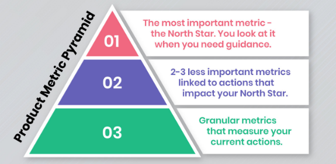
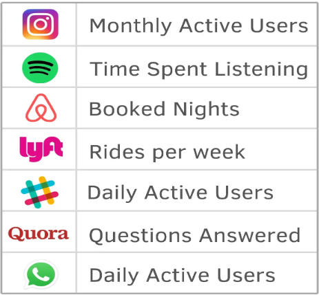
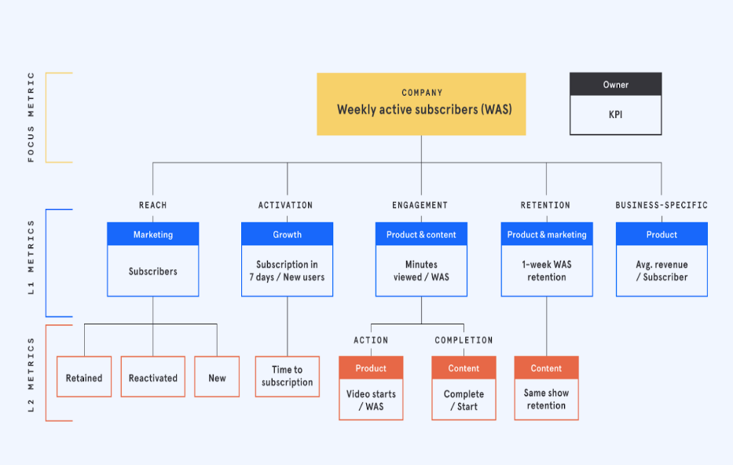
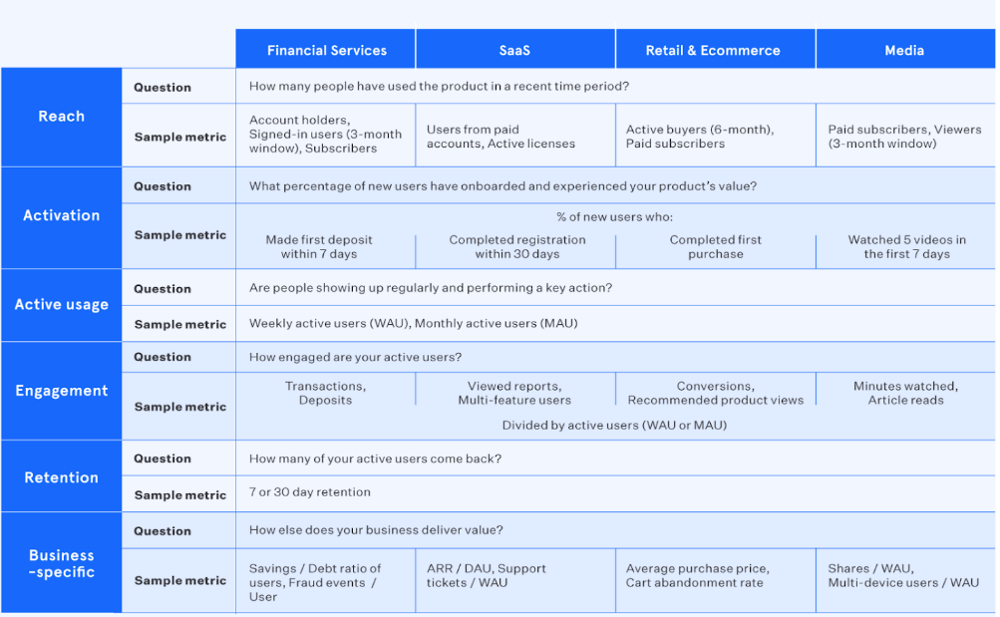
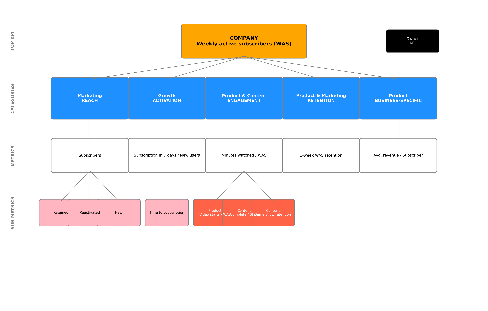
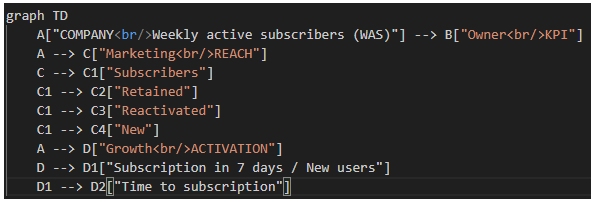
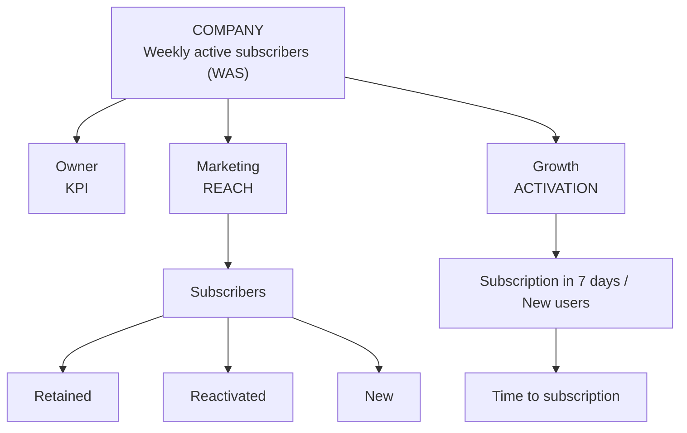
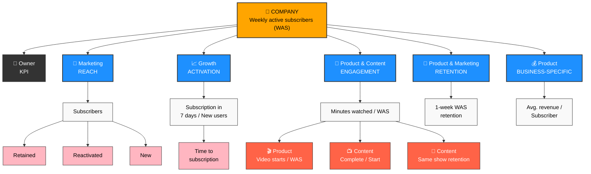

# KPI Tree Generator

A Python-based tool for programmatically generating hierarchical KPI (Key Performance Indicator) breakdown diagrams. This project supports both matplotlib-based static diagrams and Mermaid diagram generation for different use cases.

## Overview - What are KPIs or Product Metrics?

- Product metrics are quantifiable data points that a business tracks and analyzes to evaluate the success of its product. 
- By using actionable product metrics, companies can optimize product strategies to ensure business growth.
- Determining the right metrics to monitor and analyze leads to more intelligent decision-making throughout the product development process.
- These metrics, sometimes called key performance indicators (KPIs), give the company quantifiable evidence about which aspects of the product / customer experience are resonating with customers, and which aren’t.
- Product KPIs can be related to user requirements, size, quality, product growth, or user comfort. 
- They can evaluate architectural measures, quality measures, software complexity, or functional size.

In order to get their head around with so many possible metrics, companies usually categorise their metrics into a pyramidal or tree like structure



### Focus metric / North Star metric 

This is the single most important measure of success that matters a lot to a company. 

A North Star Metric (NSM) should be:

- A direct reflection of the company’s mission
- An indicator of how a company brings value to its customers.
- The only one of its kind. (Avoid having multiple NSMs as this tends to create complexity and confusion)
- The answer to the following question: What is the one metric that best represents the desired outcome of your company?

Which metric, if it were to increase today, would most accelerate my business’ flywheel?


## See 200+ Examples of North Star metrics across a variety of industries

- [Technology & Software](#technology--software)
- [Retail & E-Commerce](#retail--e-commerce)
- [Finance & Banking](#finance--banking)
- [Travel & Hospitality](#travel--hospitality)
- [Healthcare & Wellness](#healthcare--wellness)
- [Entertainment & Media](#entertainment--media)
- [Education & Learning](#education--learning)
- [Transportation & Logistics](#transportation--logistics)
- [Food & Beverage](#food--beverage)
- [Real Estate & Property](#real-estate--property)
- [Consumer & Lifestyle](#consumer--lifestyle)
- [Manufacturing & Industrial](#manufacturing--industrial)
- [Sustainability & Environment](#sustainability--environment)
- [Miscellaneous & Emerging Industries](#miscellaneous--emerging-industries)
- [Social Impact & Nonprofits](#social-impact--nonprofits)


### Level 1 metric / Primary metric

Primary metrics depict the desired outcome of a particular product, team, or initiative. This is unlike the NSM, which represents the desired outcome of the company as a whole.

Level 1 (L1) or primary metrics should either directly contribute to the focus metric or act as a check to make sure the product is growing in a healthy direction.

The primary metric can be more valuable than the NSM in the short-term because of its narrower focus, tighter feedback loop and more immediate association with the specific product, team, or initiative in question.

<span style="color:orange">
For example, if a product’s focus metric is Weekly active user, a good L1 metric would be 7-day retention to ensure you aren’t spending precious marketing funds to acquire new users who leave after a day or two.
</span>

### Supporting/ Tracking/ Input metric / Level 2 metric -

Performance indicators which are set for the current initiatives that are most granular and mostly used for tracking the progress at lowest level. 

<span style="color:orange">
For example - There may be some targeted marketing or segmented offers that need to be checked.
</span>

Supporting metrics are indicators that the primary metric is moving in the right direction.

To take the retention example one step further, the Level 2 metric could be iOS app retention.

Another could be a Level 2 metric such as the retention of a region or segment of customers. 



Here is an example of L1 metrics from multiple domains (Financial Services, SaaS, Retail, Media)




## Overview of the Tool in this repository

This tool helps product analysts and business intelligence teams **create KPI breakdown trees programmatically** that show how top-level metrics cascade down through different organizational levels and teams. Perfect for creating consistent KPI documentation across multiple companies or business units.

## Features

- **Hierarchical KPI Visualization**: Create multi-level KPI trees showing relationships between metrics
- **Two Output Formats**: 
  - High-quality matplotlib diagrams for presentations and reports
  - Mermaid diagrams for documentation and web integration
- **Customizable Styling**: Different colors for teams, actions, and metric types
- **Flexible Data Structure**: Easy to configure for different companies and KPI structures
- **Scalable Design**: Add or remove categories and metrics without code changes

## Installation

```bash
pip install matplotlib numpy
```

For Mermaid diagrams, you can use online renderers or install mermaid-cli:
```bash
npm install -g @mermaid-js/mermaid-cli
```

## Quick Start

### 1. Matplotlib Approach

```python
from kpi_tree_generator import KPITreeGenerator, create_example_diagram

# Use the built-in example
fig = create_example_diagram()

# Or create your own
kpi_data = {
    'top_kpi': {
        'name': 'GROWTH',
        'description': 'Monthly Active Users (MAU)'
    },
    'categories': [
        {
            'name': 'ACQUISITION',
            'team': 'Marketing',
            'metric': 'New user signups',
            'subcategories': [
                {'name': 'Organic', 'type': 'normal'},
                {'name': 'Paid', 'type': 'normal'},
                {'name': 'Referral', 'type': 'action'}
            ]
        },
        {
            'name': 'ACTIVATION',
            'team': 'Product',
            'metric': 'Day 1 retention rate',
            'subcategories': [
                {'name': 'Onboarding completion', 'type': 'action'}
            ]
        }
    ]
}

generator = KPITreeGenerator()
fig = generator.generate_kpi_tree(kpi_data)
fig.savefig('my_kpi_tree.png', dpi=300, bbox_inches='tight')
```

**Output**: A professionally styled diagram with colored boxes, connecting lines, and hierarchical layout. The matplotlib version produces publication-ready images suitable for presentations and reports.


### 2. Mermaid Approach

```python
from kpi_tree_generator import generate_mermaid_diagram

# Generate Mermaid code
mermaid_code = generate_mermaid_diagram(kpi_data)
print(mermaid_code)

# Save to file
with open('kpi_tree.mmd', 'w') as f:
    f.write(mermaid_code)
```

**Output**: Clean Mermaid diagram code that can be:
- Rendered online at [mermaid.live](images/https://mermaid.live)
- Embedded in Markdown documentation
- Used in GitLab/GitHub wikis
- Converted to images using mermaid-cli



After embedding in a readme.md file using ```mermaid tags, this code will render as below


Ofcourse, you can beautify the mermaid diagram as per your wish.
Here is that version with some manual efforts.



## Data Structure

The KPI data follows this structure:

```python
kpi_data = {
    'top_kpi': {
        'name': 'KPI_NAME',           # Main KPI title
        'description': 'DESCRIPTION'  # KPI description/metric
    },
    'categories': [
        {
            'name': 'CATEGORY_NAME',      # e.g., 'REACH', 'ENGAGEMENT'
            'team': 'TEAM_NAME',          # e.g., 'Marketing', 'Product'
            'metric': 'METRIC_DESC',      # Main metric for this category
            'subcategories': [            # Optional subcategories
                {
                    'name': 'SUBCAT_NAME',
                    'type': 'normal'      # 'normal' or 'action'
                },
                # ... more subcategories
            ]
        },
        # ... more categories
    ]
}
```

## Usage Examples

### Example 1: SaaS Company KPIs

```python
saas_kpis = {
    'top_kpi': {
        'name': 'ARR GROWTH',
        'description': 'Annual Recurring Revenue'
    },
    'categories': [
        {
            'name': 'NEW BUSINESS',
            'team': 'Sales',
            'metric': 'New customer ARR',
            'subcategories': [
                {'name': 'Enterprise', 'type': 'normal'},
                {'name': 'SMB', 'type': 'normal'}
            ]
        },
        {
            'name': 'EXPANSION',
            'team': 'Customer Success',
            'metric': 'Expansion rate %',
            'subcategories': [
                {'name': 'Upsells', 'type': 'action'},
                {'name': 'Cross-sells', 'type': 'action'}
            ]
        },
        {
            'name': 'RETENTION',
            'team': 'Product',
            'metric': 'Net revenue retention',
            'subcategories': [
                {'name': 'Churn reduction', 'type': 'action'}
            ]
        }
    ]
}
```


### Example 2: E-commerce KPIs

```python
ecommerce_kpis = {
    'top_kpi': {
        'name': 'REVENUE',
        'description': 'Monthly Gross Merchandise Value'
    },
    'categories': [
        {
            'name': 'TRAFFIC',
            'team': 'Marketing',
            'metric': 'Unique visitors',
            'subcategories': [
                {'name': 'SEO', 'type': 'normal'},
                {'name': 'Paid ads', 'type': 'normal'},
                {'name': 'Social', 'type': 'normal'}
            ]
        },
        {
            'name': 'CONVERSION',
            'team': 'Product',
            'metric': 'Conversion rate %',
            'subcategories': [
                {'name': 'Cart abandonment', 'type': 'action'},
                {'name': 'Checkout flow', 'type': 'action'}
            ]
        },
        {
            'name': 'AOV',
            'team': 'Merchandising',
            'metric': 'Average order value',
            'subcategories': [
                {'name': 'Recommendations', 'type': 'action'},
                {'name': 'Bundles', 'type': 'action'}
            ]
        }
    ]
}
```


## Customization

### Colors and Styling (Matplotlib)

```python
generator = KPITreeGenerator()
# Modify colors
generator.colors = {
    'primary': '#2E86AB',     # Blue for top KPI
    'secondary': '#A23B72',  # Purple for categories
    'tertiary': '#F18F01',   # Orange for subcategories
    'quaternary': '#C73E1D'  # Red for actions
}
```

### Mermaid Styling

The Mermaid output includes CSS classes that can be customized:

```python
classDef topKPI fill:#2E86AB,stroke:#333,color:#fff
classDef team fill:#A23B72,stroke:#333,color:#fff
classDef action fill:#C73E1D,stroke:#333,color:#fff
```

## Sample Outputs

### Matplotlib Output
The matplotlib version generates a hierarchical diagram with:
- **Top Level**: Orange box with company KPI
- **Category Level**: Blue boxes with team names and category labels
- **Metric Level**: White boxes with specific metrics
- **Sub-metric Level**: Pink boxes for normal items, red boxes for action items
- **Connecting Lines**: Gray lines showing relationships
- **Level Labels**: Left-side labels indicating hierarchy levels


### Mermaid Output
The Mermaid version creates a flowchart with:
- **Clean Node Structure**: Rectangular nodes with clear hierarchy
- **Icon Integration**: Emojis to distinguish different types of metrics
- **Color Coding**: Different colors for different organizational levels
- **Professional Layout**: Automatic positioning and connection routing


## Advanced Features

### Batch Processing Multiple Companies

```python
companies = {
    'company_a': saas_kpis,
    'company_b': ecommerce_kpis,
    'company_c': media_kpis
}

for company_name, kpi_data in companies.items():
    generator = KPITreeGenerator()
    fig = generator.generate_kpi_tree(kpi_data)
    fig.savefig(f'{company_name}_kpi_tree.png', dpi=300, bbox_inches='tight')
    plt.close(fig)
```

### Export Options

```python
# High-resolution PNG for presentations
fig.savefig('kpi_tree.png', dpi=300, bbox_inches='tight')

# Vector PDF for print
fig.savefig('kpi_tree.pdf', bbox_inches='tight')

# SVG for web
fig.savefig('kpi_tree.svg', bbox_inches='tight')
```

## Best Practices

1. **Keep Categories Balanced**: Aim for 3-5 main categories for optimal visual balance
2. **Consistent Naming**: Use consistent naming conventions across companies
3. **Action Items**: Use the 'action' type for metrics that represent actionable initiatives
4. **Metric Clarity**: Keep metric descriptions concise but clear
5. **Team Alignment**: Ensure team names match your organizational structure

## Troubleshooting

### Common Issues

1. **Text Overlap**: If text overlaps, reduce font sizes or increase figure size
2. **Too Many Categories**: Consider grouping related categories or using multiple diagrams
3. **Long Metric Names**: Break long names into multiple lines using `\n`

### Performance Tips

- For batch processing, close matplotlib figures to free memory: `plt.close(fig)`
- Use vector formats (PDF, SVG) for scalable output
- Consider Mermaid for documentation that needs frequent updates

<br/>
<br/>


# Industry KPIs Reference Guide

A comprehensive reference of Key Performance Indicators (KPIs) across various industries and business models. This guide provides top-level metrics that companies typically use to measure their success and can serve as input for KPI tree generation tools.
<span style="color:orange">
I have tried to give examples of one or two companies in the domain for easy identification and recall
</span>
## Table of Contents

- [Technology & Software](#technology--software)
- [Retail & E-Commerce](#retail--e-commerce)
- [Finance & Banking](#finance--banking)
- [Travel & Hospitality](#travel--hospitality)
- [Healthcare & Wellness](#healthcare--wellness)
- [Entertainment & Media](#entertainment--media)
- [Education & Learning](#education--learning)
- [Transportation & Logistics](#transportation--logistics)
- [Food & Beverage](#food--beverage)
- [Real Estate & Property](#real-estate--property)
- [Consumer & Lifestyle](#consumer--lifestyle)
- [Manufacturing & Industrial](#manufacturing--industrial)
- [Sustainability & Environment](#sustainability--environment)
- [Miscellaneous & Emerging Industries](#miscellaneous--emerging-industries)
- [Social Impact & Nonprofits](#social-impact--nonprofits)

---

## Technology & Software

1. **Social Media Platform** *<span style="color:orange">(Facebook, Twitter)</span>* – Daily Active Users (DAUs)
2. **Search Engine** *<span style="color:orange">(Google, Bing)</span>* – Number of Searches Conducted
3. **SaaS Subscription Business** *<span style="color:orange">(Salesforce, Zoom)</span>* – Monthly Recurring Revenue (MRR)
4. **Cloud Computing Service** *<span style="color:orange">(AWS, Azure)</span>* – Server Utilization Rate
5. **E-commerce Platform** *<span style="color:orange">(Shopify, Magento)</span>* – Gross Merchandise Volume (GMV)
6. **Cybersecurity Firm** *<span style="color:orange">(CrowdStrike, Norton)</span>* – Number of Threats Blocked per Day
7. **AI Research Company** *<span style="color:orange">(NVIDIA, DeepMind)</span>* – Successful Model Deployments
8. **Web Hosting Provider** *<span style="color:orange">(Bluehost, HostGator)</span>* – Server Uptime %
9. **Augmented Reality (AR) Platform** *<span style="color:orange">(Snapchat, Pokémon Go)</span>* – AR Sessions per User
10. **Virtual Reality (VR) Gaming** *<span style="color:orange">(Oculus, Vive)</span>* – Total Time Spent in VR
11. **No-Code Development Platform** *<span style="color:orange">(Bubble, Adalo)</span>* – Number of Apps Built
12. **Mobile App Store** *<span style="color:orange">(Google Play, App Store)</span>* – App Downloads per User
13. **Data Analytics SaaS** *<span style="color:orange">(Tableau, Power BI)</span>* – Reports Generated per User
14. **IT Consulting Firm** *<span style="color:orange">(Accenture, Deloitte)</span>* – Client Retention Rate
15. **Software Testing Company** *<span style="color:orange">(Applause, Testim)</span>* – Bugs Identified & Resolved

## Retail & E-Commerce

1. **Online Marketplace** *<span style="color:orange">(Amazon, Flipkart)</span>* – Total Sales Volume (GMV)
2. **Grocery Store** *<span style="color:orange">(Walmart, Kroger)</span>* – Average Basket Size (Total Spend per Visit)
3. **Luxury Brand** *<span style="color:orange">(Gucci, Louis Vuitton)</span>* – Customer Lifetime Value (CLV)
4. **Fashion Retailer** *<span style="color:orange">(Zara, H&M)</span>* – Average Order Value (AOV)
5. **Subscription Box Service** *<span style="color:orange">(Birchbox, Dollar Shave Club)</span>* – Retention Rate
6. **DTC (Direct-to-Consumer) Brand** *<span style="color:orange">(Warby Parker, Casper)</span>* – Repeat Purchases per Customer
7. **Secondhand Marketplace** *<span style="color:orange">(eBay, Poshmark)</span>* – Transactions per Seller
8. **Wholesale Distributor** *<span style="color:orange">(Sysco, McLane)</span>* – Average Order Value (AOV)
9. **Boutique Clothing Store** *<span style="color:orange">(Anthropologie, Madewell)</span>* – Customer Retention Rate
10. **Handmade Goods Marketplace** *<span style="color:orange">(Etsy)</span>* – Total Artisan Sales
11. **Furniture Retailer** *<span style="color:orange">(IKEA, West Elm)</span>* – Delivery Timeliness
12. **Consumer Electronics Store** *<span style="color:orange">(Best Buy, Apple)</span>* – Product Upgrade Rate
13. **Department Store Chain** *<span style="color:orange">(Macy's, Nordstrom)</span>* – Foot Traffic per Store
14. **Beauty & Skincare Brand** *<span style="color:orange">(Sephora, Glossier)</span>* – Subscription Refill Rate
15. **Jewelry Store** *<span style="color:orange">(Tiffany & Co., Blue Nile)</span>* – Average Revenue per Sale

## Finance & Banking

1. **Banking App** *<span style="color:orange">(Chase, Bank of America)</span>* – Number of Active Accounts
2. **Credit Card Company** *<span style="color:orange">(Visa, Mastercard)</span>* – Transaction Volume per Customer
3. **Investment Platform** *<span style="color:orange">(Robinhood, Fidelity)</span>* – Assets Under Management (AUM)
4. **Insurance Company** *<span style="color:orange">(State Farm, Allstate)</span>* – Policy Renewal Rate
5. **Fintech Startup** *<span style="color:orange">(Stripe, Square)</span>* – Number of Transactions Processed
6. **Crypto Exchange Platform** *<span style="color:orange">(Coinbase, Binance)</span>* – Daily Trading Volume
7. **Peer-to-Peer Lending Platform** *<span style="color:orange">(Lending Club, Prosper)</span>* – Loan Completion Rate
8. **Microfinance Institution** *<span style="color:orange">(Kiva, Grameen Bank)</span>* – Loan Repayment Rate
9. **Mobile Payment App** *<span style="color:orange">(PayPal, PhonePe)</span>* – Transactions per User
10. **Stock Brokerage Firm** *<span style="color:orange">(E*TRADE, TD Ameritrade)</span>* – Number of Trades per Customer
11. **Digital Bank** *<span style="color:orange">(Chime, Monzo)</span>* – Active Monthly Users
12. **Personal Finance App** *<span style="color:orange">(Mint, You Need a Budget)</span>* – Budget Completion Rate
13. **Corporate Lending Business** *<span style="color:orange">(Goldman Sachs, JPMorgan)</span>* – Loan Conversion Rate
14. **ATM Service Provider** *<span style="color:orange">(NCR, Diebold Nixdorf)</span>* – Successful Withdrawals per Machine
15. **Fraud Prevention Company** *<span style="color:orange">(FICO, RSA Security)</span>* – Fraud Cases Prevented

## Travel & Hospitality

1. **Online Travel Agency** *<span style="color:orange">(Expedia, MakeMyTrip)</span>* – Number of Booked Nights
2. **Hotel Chain** *<span style="color:orange">(Marriott, Hilton)</span>* – Revenue per Available Room (RevPAR)
3. **Airline Company** *<span style="color:orange">(American Airlines, Delta Air Lines)</span>* – Load Factor (% of Seats Filled per Flight)
4. **Car Rental Service** *<span style="color:orange">(Hertz, Enterprise)</span>* – Utilization Rate (Vehicles Rented per Day)
5. **Vacation Rental Platform** *<span style="color:orange">(Airbnb)</span>* – Nights Booked per User
6. **Luxury Hotel Chain** *<span style="color:orange">(Four Seasons, Ritz-Carlton)</span>* – Customer Satisfaction Score
7. **Budget Hostel Service** *<span style="color:orange">(Hostelworld, Meininger)</span>* – Occupancy Rate
8. **Cruise Line** *<span style="color:orange">(Carnival, Royal Caribbean)</span>* – Average Cruise Duration
9. **Online Ticketing Platform** *<span style="color:orange">(RedBus, Booking.com)</span>* – Seats Sold per Trip
10. **Business Travel Management Company** *<span style="color:orange">(Concur, Egencia)</span>* – Corporate Retention Rate
11. **Glamping & Eco-Resorts** *<span style="color:orange">(Glamping Hub, EcoRetreats)</span>* – Average Booking Duration
12. **Railway Ticketing Platform** *<span style="color:orange">(Rail Europe, Trainline)</span>* – Number of Train Seat Bookings
13. **City Tour Agency** *<span style="color:orange">(Gray Line, Viator)</span>* – Number of Tours Sold
14. **Long-Term Stay Housing Platform** *<span style="color:orange">(Furnished Finder, Nestpick)</span>* – Average Stay Length
15. **Road Trip Rental Business** *<span style="color:orange">(Enterprise, Zipcar)</span>* – Miles Driven per Customer

## Healthcare & Wellness

1. **Pharmacy Chain** *<span style="color:orange">(CVS, Walgreens)</span>* – Prescription Refill Rate
2. **Health Insurance Provider** *<span style="color:orange">(UnitedHealthcare, Anthem)</span>* – Member Retention Rate
3. **Hospital System** *<span style="color:orange">(Mayo Clinic, Cleveland Clinic)</span>* – Bed Occupancy Rate
4. **Telemedicine Service** *<span style="color:orange">(Teladoc, Amwell)</span>* – Number of Consultations
5. **Fitness App** *<span style="color:orange">(MyFitnessPal, Fitbit Coach)</span>* – Monthly Active Users (MAU)
6. **Mental Health Platform** *<span style="color:orange">(BetterHelp, Talkspace)</span>* – Sessions Completed per User
7. **Diet & Nutrition Coaching Service** *<span style="color:orange">(Noom, Weight Watchers)</span>* – Weight Loss Success Rate
8. **Rehabilitation Center** *<span style="color:orange">(Sierra Tucson, RehabCare)</span>* – Patient Recovery Rate
9. **Dental Clinic Chain** *<span style="color:orange">(SmileDirectClub, Aspen Dental)</span>* – Appointment Completion Rate
10. **Health & Wellness Retreats** *<span style="color:orange">(Cal-a-Vie, Miraval)</span>* – Return Booking Rate
11. **Wearable Health Tech** *<span style="color:orange">(Fitbit, Apple Watch)</span>* – Active User Engagement
12. **Home Healthcare Provider** *<span style="color:orange">(Amedisys, LHC Group)</span>* – Visits per Patient
13. **Personal Trainer Business** *<span style="color:orange">(24 Hour Fitness, F45 Training)</span>* – Workout Adherence Rate
14. **Wellness Supplements Brand** *<span style="color:orange">(GNC, Ritual)</span>* – Subscription Retention Rate
15. **Hearing Aid & Vision Correction Services** *<span style="color:orange">(Audicus, LASIK MD)</span>* – Product Adoption Rate

## Entertainment & Media

1. **Streaming Service** *<span style="color:orange">(Netflix, Spotify)</span>* – Hours of Content Consumed
2. **Gaming Platform** *<span style="color:orange">(Steam, Xbox)</span>* – Monthly Active Players (MAP)
3. **News Website** *<span style="color:orange">(CNN, Fox News)</span>* – Time Spent per Session
4. **Podcast Platform** *<span style="color:orange">(Apple Podcasts, Spotify)</span>* – Total Listening Hours
5. **Movie Theatre Chain** *<span style="color:orange">(AMC, Regal)</span>* – Seats Sold per Screening
6. **TV Network** *<span style="color:orange">(NBC, ABC)</span>* – Total Hours Watched per Viewer
7. **Live Streaming Platform** *<span style="color:orange">(Twitch, YouTube Live)</span>* – Average Watch Time per Stream
8. **Film Production Studio** *<span style="color:orange">(Warner Bros., Universal)</span>* – Box Office Revenue per Release
9. **Live Concert Business** *<span style="color:orange">(Live Nation, AEG)</span>* – Ticket Sales per Event
10. **Online Magazine Subscription** *<span style="color:orange">(The New York Times, Forbes)</span>* – Reader Retention Rate
11. **Ad-Supported News Website** *<span style="color:orange">(HuffPost, BuzzFeed)</span>* – Click-Through Rate on Ads
12. **Book Publishing Company** *<span style="color:orange">(Penguin Random House, Hachette)</span>* – Book Sales per Author
13. **Comic Book Platform** *<span style="color:orange">(Comixology, Marvel Unlimited)</span>* – Chapters Read per User
14. **Music Record Label** *<span style="color:orange">(Universal Music, Sony Music)</span>* – Streaming Royalties per Artist
15. **Esports Organization** *<span style="color:orange">(ESL, Overwatch League)</span>* – Viewership per Tournament

## Education & Learning

1. **Online Learning Platform** *<span style="color:orange">(Coursera, Udemy)</span>* – Course Completion Rate
2. **University** *<span style="color:orange">(Harvard, Stanford)</span>* – Student Graduation Rate
3. **Language Learning App** *<span style="color:orange">(Duolingo, Babbel)</span>* – Daily Active Learners
4. **Tutoring Service** *<span style="color:orange">(Chegg, Varsity Tutors)</span>* – Student Retention Rate
5. **Corporate Training Business** *<span style="color:orange">(LinkedIn Learning, Skillsoft)</span>* – Engagement Rate (Lessons Completed)
6. **Private Tutoring Business** *<span style="color:orange">(Wyzant, TutorMe)</span>* – Student Success Rate
7. **Online Certification Provider** *<span style="color:orange">(CertNexus, CompTIA)</span>* – Certifications Earned per User
8. **K-12 Learning App** *<span style="color:orange">(Khan Academy, DreamBox)</span>* – Homework Completion Rate
9. **Skill-Based Training Platform** *<span style="color:orange">(Pluralsight, Udacity)</span>* – Lessons Completed per User
10. **Test Preparation Company** *<span style="color:orange">(Kaplan, Magoosh)</span>* – Exam Score Improvement Rate
11. **Coding Bootcamp** *<span style="color:orange">(General Assembly, App Academy)</span>* – Job Placement Rate
12. **University Alumni Organization** *<span style="color:orange">(Harvard Alumni, Stanford Alumni)</span>* – Alumni Engagement Index
13. **EdTech SaaS** *<span style="color:orange">(Schoology, PowerSchool)</span>* – Adoption Rate by Institutions
14. **Corporate Learning Platform** *<span style="color:orange">(Cornerstone, SAP Litmos)</span>* – Employee Course Completion Rate
15. **Student Loan Refinancing Service** *<span style="color:orange">(SoFi, CommonBond)</span>* – Loan Repayment Success

## Transportation & Logistics

1. **Rideshare App** *<span style="color:orange">(Uber, Ola)</span>* – Completed Rides per Driver
2. **Public Transit System** *<span style="color:orange">(MTA, LA Metro)</span>* – Passenger Utilization Rate
3. **Freight & Logistics Company** *<span style="color:orange">(UPS, FedEx)</span>* – On-time Delivery Rate
4. **Courier Delivery Service** *<span style="color:orange">(DHL, USPS)</span>* – Parcels Delivered per Day
5. **Electric Scooter Rental** *<span style="color:orange">(Lime, Bird)</span>* – Number of Rides per Vehicle per Day
6. **Bike-Sharing Service** *<span style="color:orange">(Citi Bike, Mobike)</span>* – Daily Active Riders
7. **Hyperloop/High-Speed Rail Project** – Passenger Throughput
8. **Airport Management Company** *<span style="color:orange">(LAX, Heathrow)</span>* – Passenger Satisfaction Score
9. **Shipping Container Business** *<span style="color:orange">(Maersk, Evergreen)</span>* – Cargo Utilization Rate
10. **Truck Fleet Logistics Service** *<span style="color:orange">(Swift Transportation, Schneider)</span>* – Fuel Efficiency per Mile
11. **Drone Delivery Service** *<span style="color:orange">(Wing, Amazon Prime Air)</span>* – Successful Deliveries per Route
12. **Rental Car Subscription Business** *<span style="color:orange">(Zipcar, Car2Go)</span>* – Fleet Utilization per City
13. **EV Charging Station Network** *<span style="color:orange">(ChargePoint, Electrify America)</span>* – Charging Sessions per Station
14. **Luxury Chauffeur Service** *<span style="color:orange">(Blacklane, Uber Black)</span>* – Ride Completion Rate
15. **Long-Distance Bus Operator** *<span style="color:orange">(Greyhound, Megabus)</span>* – Seat Occupancy Rate

## Food & Beverage

1. **Restaurant Chain** *<span style="color:orange">(McDonald's, Chipotle)</span>* – Revenue per Table Turn
2. **Coffee Shop** *<span style="color:orange">(Starbucks, Dunkin')</span>* – Average Ticket Size (Spend per Customer)
3. **Meal Kit Subscription** *<span style="color:orange">(Blue Apron, HelloFresh)</span>* – Subscription Retention Rate
4. **Food Delivery App** *<span style="color:orange">(DoorDash, Uber Eats)</span>* – Orders per Active User
5. **Fast Food Franchise** *<span style="color:orange">(Subway, KFC)</span>* – Repeat Customer Visits per Month
6. **Organic Food Retailer** *<span style="color:orange">(Whole Foods, Thrive Market)</span>* – Returning Customer Rate
7. **Farm-to-Table Restaurant** *<span style="color:orange">(Blue Hill, Chez Panisse)</span>* – Customer Satisfaction Score
8. **Online Recipe Platform** *<span style="color:orange">(Allrecipes, Food Network)</span>* – Recipe Completion Rate
9. **Meal Planning App** *<span style="color:orange">(Mealime, PlateJoy)</span>* – Ingredients Purchased per Plan
10. **Food Processing Company** *<span style="color:orange">(Tyson Foods, Nestlé)</span>* – Supply Chain Efficiency Score
11. **Craft Brewery** *<span style="color:orange">(Dogfish Head, Stone Brewing)</span>* – Taproom Foot Traffic per Month
12. **Alcohol Subscription Service** *<span style="color:orange">(Winc, Flaviar)</span>* – Retention Rate of Members
13. **Convenience Store Chain** *<span style="color:orange">(7-Eleven, Circle K)</span>* – Basket Size Growth
14. **Frozen Food Brand** *<span style="color:orange">(Amy's Kitchen, Stouffer's)</span>* – Total SKUs Sold per Month
15. **Snack Subscription Box** *<span style="color:orange">(Graze, NatureBox)</span>* – Engagement Rate

## Real Estate & Property

1. **Real Estate Marketplace** *<span style="color:orange">(Zillow, Realtor.com)</span>* – Property Listings Viewed per User
2. **Property Management Firm** *<span style="color:orange">(Greystar, AvalonBay)</span>* – Occupancy Rate
3. **Co-Working Space** *<span style="color:orange">(WeWork, Regus)</span>* – Desk Utilization Rate
4. **Home Rental Platform** *<span style="color:orange">(Apartments.com, Rent.com)</span>* – Monthly Rental Volume
5. **Construction Firm** *<span style="color:orange">(Lennar, D.R. Horton)</span>* – Project Completion Rate
6. **Commercial Property Management** *<span style="color:orange">(CBRE, Jones Lang LaSalle)</span>* – Occupancy Growth Rate
7. **Smart Home Tech Provider** *<span style="color:orange">(Nest, Ring)</span>* – Devices Activated per Household
8. **Office Space Leasing Service** *<span style="color:orange">(Knotel, Industrious)</span>* – Lease Renewal Rate
9. **Affordable Housing Developer** *<span style="color:orange">(Habitat for Humanity, Related Companies)</span>* – Units Sold per Year
10. **Senior Living Community** *<span style="color:orange">(Brookdale, Sunrise Senior Living)</span>* – Resident Retention Rate
11. **Vacation Property Investment** *<span style="color:orange">(Vacasa, RedAwning)</span>* – Revenue per Rental Night
12. **Real Estate Agent Marketplace** *<span style="color:orange">(Compass, Redfin)</span>* – Leads Converted per Agent
13. **Student Housing Platform** *<span style="color:orange">(American Campus Communities, Campus Advantage)</span>* – Average Rental Period per Tenant
14. **Interior Design Consultancy** *<span style="color:orange">(Havenly, Modsy)</span>* – Project Completion Satisfaction Rate
15. **Home Improvement Service** *<span style="color:orange">(TaskRabbit, Angie's List)</span>* – Repeat Customer Engagement

## Consumer & Lifestyle

1. **Luxury Car Dealership** *<span style="color:orange">(Ferrari, Lamborghini)</span>* – Repeat Customer Purchase Cycle
2. **Premium Watch Brand** *<span style="color:orange">(Rolex, Patek Philippe)</span>* – Referral Rate per Buyer
3. **Eyewear Subscription** *<span style="color:orange">(Warby Parker, Zenni Optical)</span>* – Glasses Renewed per Subscriber
4. **Personal Finance Coaching Service** *<span style="color:orange">(YNAB, Ramit Sethi)</span>* – Savings Growth Rate per User
5. **Wedding Planning Service** *<span style="color:orange">(The Knot, Zola)</span>* – Vendor Satisfaction Score
6. **Pet Insurance Company** *<span style="color:orange">(Petplan, Trupanion)</span>* – Policy Renewal Rate
7. **Online Personal Styling Platform** *<span style="color:orange">(Stitch Fix, Trunk Club)</span>* – User Engagement per Session
8. **Subscription-Based Laundry Service** *<span style="color:orange">(Rinse, Washio)</span>* – Monthly Utilization Rate
9. **Gift Shopping & Registry Platform** *<span style="color:orange">(Amazon Registry, Zola)</span>* – Order Conversion Rate
10. **Custom Print-on-Demand Merchandise** *<span style="color:orange">(Printful, Gooten)</span>* – Total Items Sold

## Manufacturing & Industrial

1. **Automobile Manufacturer** *<span style="color:orange">(Toyota, Ford)</span>* – Production Efficiency per Factory
2. **Aerospace Equipment Supplier** *<span style="color:orange">(Boeing, Airbus)</span>* – Parts Reliability Score
3. **Heavy Machinery Producer** *<span style="color:orange">(Caterpillar, John Deere)</span>* – Equipment Lifespan per Unit
4. **Solar Panel Manufacturer** *<span style="color:orange">(Tesla Solar, SunPower)</span>* – Installed Capacity Growth Rate
5. **Battery Tech Innovator** *<span style="color:orange">(Tesla, Panasonic)</span>* – Energy Density Efficiency Progress
6. **Consumer Electronics Company** *<span style="color:orange">(Samsung, LG)</span>* – Device Upgrade Retention Rate
7. **Medical Equipment Manufacturer** *<span style="color:orange">(Medtronic, GE Healthcare)</span>* – Compliance Certification Completion
8. **Chemical Production Business** *<span style="color:orange">(Dow Chemical, BASF)</span>* – Safety Compliance Score
9. **Smart Factory Automation** *<span style="color:orange">(Siemens, Rockwell Automation)</span>* – Reduction in Manual Labor Time
10. **Textile Mill** *<span style="color:orange">(Patagonia, Nike)</span>* – Fabric Production Output per Day

## Sustainability & Environment

1. **Waste Recycling Service** *<span style="color:orange">(Waste Management, Republic Services)</span>* – Tons of Waste Diverted from Landfills
2. **Sustainable Fashion Brand** *<span style="color:orange">(Patagonia, Eileen Fisher)</span>* – Eco-Friendly Materials Usage Rate
3. **Electric Vehicle Manufacturer** *<span style="color:orange">(Tesla, Rivian)</span>* – EV Adoption Growth Rate
4. **Green Energy Provider (Solar/Wind)</span>** *<span style="color:orange">(NextEra Energy, Vestas)</span>* – Gigawatts of Clean Energy Produced
5. **Carbon Offset Marketplace** *<span style="color:orange">(Terrapass, Cool Effect)</span>* – Verified CO2 Offset per Customer
6. **Water Purification System Provider** *<span style="color:orange">(Aqua America, American Water)</span>* – Households Served with Clean Water
7. **Eco-Friendly Packaging Company** *<span style="color:orange">(Ecovative, Novolex)</span>* – Reduction in Plastic Waste per Unit
8. **Smart Agriculture Business** *<span style="color:orange">(John Deere, Climate Corporation)</span>* – Yield Efficiency per Hectare
9. **Ocean Cleanup Initiative** *<span style="color:orange">(The Ocean Cleanup, 4ocean)</span>* – Volume of Plastic Removed per Year
10. **Renewable Energy Storage Company** *<span style="color:orange">(Tesla Energy, Fluence)</span>* – Battery Efficiency Improvement Rate

## Miscellaneous & Emerging Industries

1. **NFT Marketplace** *<span style="color:orange">(OpenSea, SuperRare)</span>* – Volume of NFTs Traded per Week
2. **Metaverse Real Estate Developer** *<span style="color:orange">(Decentraland, The Sandbox)</span>* – Virtual Land Sales Volume
3. **AI Personal Assistant App** *<span style="color:orange">(Siri, Alexa)</span>* – User Satisfaction Score
4. **Quantum Computing Startup** *<span style="color:orange">(IBM Quantum, Google Quantum)</span>* – Stable Qubit Retention Rate
5. **Autonomous Robotics Manufacturer** *<span style="color:orange">(Boston Dynamics, iRobot)</span>* – Operational Success per Deployment
6. **Cryonics & Longevity Research** *<span style="color:orange">(Alcor, Cryonics Institute)</span>* – Viability Rate of Human Preservation
7. **Space Tourism Company** *<span style="color:orange">(SpaceX, Blue Origin)</span>* – Successful Flights per Year
8. **Vertical Farming Business** *<span style="color:orange">(AeroFarms, Plenty)</span>* – Yield per Vertical Acre
9. **3D Printed Housing Firm** *<span style="color:orange">(ICON, Apis Cor)</span>* – Construction Time Reduction per Home
10. **Blockchain-Based Identity Verification** *<span style="color:orange">(Civic, SelfKey)</span>* – Fraud Prevention Success Rate

## Social Impact & Nonprofits

1. **Nonprofit Fundraising Platform** *<span style="color:orange">(GoFundMe, DonorsChoose)</span>* – Donation Growth Rate
2. **Microfinance for Developing Countries** *<span style="color:orange">(Kiva, Grameen Bank)</span>* – Business Sustainability Rate
3. **Online Charity Crowdfunding** *<span style="color:orange">(JustGiving, Fundrazr)</span>* – Donor Retention Rate
4. **Educational Equality Foundation** *<span style="color:orange">(Teach for America, Room to Read)</span>* – Number of Students Sponsored
5. **Affordable Medicine Initiative** *<span style="color:orange">(Doctors Without Borders, Partners in Health)</span>* – Life-Saving Treatment Access Rate
6. **Wildlife Conservation Organization** *<span style="color:orange">(WWF, Conservation International)</span>* – Protected Species Population Growth
7. **Disaster Relief Logistics Provider** *<span style="color:orange">(American Red Cross, Direct Relief)</span>* – Aid Delivery Speed per Crisis
8. **Diversity & Inclusion Consultancy** *<span style="color:orange">(McKinsey Institute, Catalyst)</span>* – Workplace Equity Score
9. **Public Health Awareness Program** *<span style="color:orange">(CDC Foundation, Gates Foundation)</span>* – Campaign Reach Metrics
10. **Human Rights Advocacy Group** *<span style="color:orange">(Amnesty International, Human Rights Watch)</span>* – Policy Change Effectiveness

---

## How to Use This Reference

### For KPI Tree Generation
Each entry in this reference can serve as the top-level KPI for your KPI tree generator. For example:

```python
streaming_service_kpi = {
    'top_kpi': {
        'name': 'CONTENT ENGAGEMENT',
        'description': 'Hours of Content Consumed'
    },
    'categories': [
        {
            'name': 'CONTENT ACQUISITION',
            'team': 'Content',
            'metric': 'New titles added per month',
            'subcategories': [
                {'name': 'Original content', 'type': 'action'},
                {'name': 'Licensed content', 'type': 'normal'}
            ]
        },
        {
            'name': 'USER ENGAGEMENT',
            'team': 'Product',
            'metric': 'Average watch time per user',
            'subcategories': [
                {'name': 'Completion rate', 'type': 'action'},
                {'name': 'Binge sessions', 'type': 'normal'}
            ]
        }
    ]
}
```

### Industry Insights
- **Technology & Software**: Focus on user engagement, retention, and scalability metrics
- **Retail & E-Commerce**: Emphasize transaction volume, customer lifetime value, and conversion rates
- **Finance & Banking**: Prioritize security, compliance, and transaction efficiency
- **Healthcare**: Balance patient outcomes with operational efficiency
- **Entertainment**: Measure engagement depth and content consumption patterns

### Choosing the Right KPI
When selecting a top-level KPI for your organization:

1. **Alignment**: Ensure it aligns with your business model and strategic goals
2. **Actionability**: Choose metrics that can be influenced by your team's actions
3. **Measurability**: Select KPIs with reliable data sources and clear definitions
4. **Relevance**: Pick metrics that matter to your stakeholders and customers
5. **Balance**: Consider leading vs. lagging indicators

---

## Contributing

This reference is continuously evolving. To contribute:

1. **Add New Industries**: Suggest additional industry categories
2. **Update KPIs**: Propose more relevant metrics for existing industries
3. **Industry Insights**: Share best practices for specific sectors
4. **Use Cases**: Provide real-world examples of KPI implementations


## License

MIT License - feel free to use in your projects!

---

**Created for Product Analytics Teams** - Making KPI visualization simple and consistent across organizations.