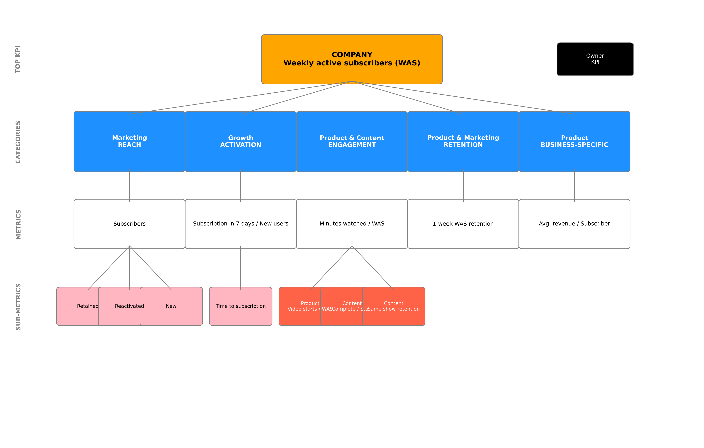
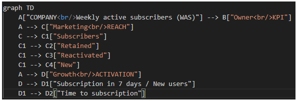
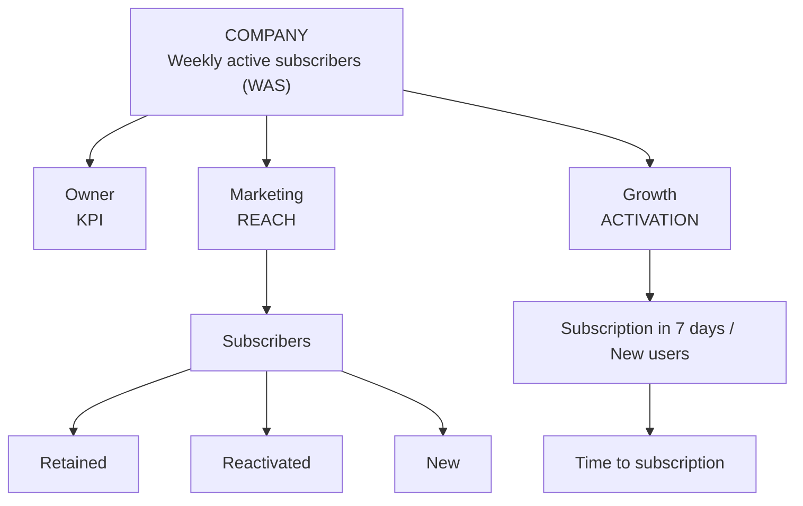
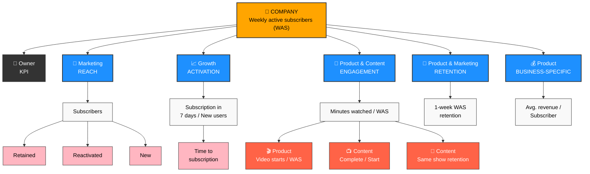

# KPI Tree Generator

A Python-based tool for programmatically generating hierarchical KPI (Key Performance Indicator) breakdown diagrams. This project supports both matplotlib-based static diagrams and Mermaid diagram generation for different use cases.

## Overview

This tool helps product analysts and business intelligence teams create visual KPI breakdown trees that show how top-level metrics cascade down through different organizational levels and teams. Perfect for creating consistent KPI documentation across multiple companies or business units.

## Features

- **Hierarchical KPI Visualization**: Create multi-level KPI trees showing relationships between metrics
- **Two Output Formats**: 
  - High-quality matplotlib diagrams for presentations and reports
  - Mermaid diagrams for documentation and web integration
- **Customizable Styling**: Different colors for teams, actions, and metric types
- **Flexible Data Structure**: Easy to configure for different companies and KPI structures
- **Scalable Design**: Add or remove categories and metrics without code changes

## Installation

```bash
pip install matplotlib numpy
```

For Mermaid diagrams, you can use online renderers or install mermaid-cli:
```bash
npm install -g @mermaid-js/mermaid-cli
```

## Quick Start

### 1. Matplotlib Approach

```python
from kpi_tree_generator import KPITreeGenerator, create_example_diagram

# Use the built-in example
fig = create_example_diagram()

# Or create your own
kpi_data = {
    'top_kpi': {
        'name': 'GROWTH',
        'description': 'Monthly Active Users (MAU)'
    },
    'categories': [
        {
            'name': 'ACQUISITION',
            'team': 'Marketing',
            'metric': 'New user signups',
            'subcategories': [
                {'name': 'Organic', 'type': 'normal'},
                {'name': 'Paid', 'type': 'normal'},
                {'name': 'Referral', 'type': 'action'}
            ]
        },
        {
            'name': 'ACTIVATION',
            'team': 'Product',
            'metric': 'Day 1 retention rate',
            'subcategories': [
                {'name': 'Onboarding completion', 'type': 'action'}
            ]
        }
    ]
}

generator = KPITreeGenerator()
fig = generator.generate_kpi_tree(kpi_data)
fig.savefig('my_kpi_tree.png', dpi=300, bbox_inches='tight')
```

**Output**: A professionally styled diagram with colored boxes, connecting lines, and hierarchical layout. The matplotlib version produces publication-ready images suitable for presentations and reports.


### 2. Mermaid Approach

```python
from kpi_tree_generator import generate_mermaid_diagram

# Generate Mermaid code
mermaid_code = generate_mermaid_diagram(kpi_data)
print(mermaid_code)

# Save to file
with open('kpi_tree.mmd', 'w') as f:
    f.write(mermaid_code)
```

**Output**: Clean Mermaid diagram code that can be:
- Rendered online at [mermaid.live](https://mermaid.live)
- Embedded in Markdown documentation
- Used in GitLab/GitHub wikis
- Converted to images using mermaid-cli



After embedding in a readme.md file using ```mermaid tags, this code will render as below


Ofcourse, you can beautify the mermaid diagram as per your wish.
Here is that version with some manual efforts.



## Data Structure

The KPI data follows this structure:

```python
kpi_data = {
    'top_kpi': {
        'name': 'KPI_NAME',           # Main KPI title
        'description': 'DESCRIPTION'  # KPI description/metric
    },
    'categories': [
        {
            'name': 'CATEGORY_NAME',      # e.g., 'REACH', 'ENGAGEMENT'
            'team': 'TEAM_NAME',          # e.g., 'Marketing', 'Product'
            'metric': 'METRIC_DESC',      # Main metric for this category
            'subcategories': [            # Optional subcategories
                {
                    'name': 'SUBCAT_NAME',
                    'type': 'normal'      # 'normal' or 'action'
                },
                # ... more subcategories
            ]
        },
        # ... more categories
    ]
}
```

## Usage Examples

### Example 1: SaaS Company KPIs

```python
saas_kpis = {
    'top_kpi': {
        'name': 'ARR GROWTH',
        'description': 'Annual Recurring Revenue'
    },
    'categories': [
        {
            'name': 'NEW BUSINESS',
            'team': 'Sales',
            'metric': 'New customer ARR',
            'subcategories': [
                {'name': 'Enterprise', 'type': 'normal'},
                {'name': 'SMB', 'type': 'normal'}
            ]
        },
        {
            'name': 'EXPANSION',
            'team': 'Customer Success',
            'metric': 'Expansion rate %',
            'subcategories': [
                {'name': 'Upsells', 'type': 'action'},
                {'name': 'Cross-sells', 'type': 'action'}
            ]
        },
        {
            'name': 'RETENTION',
            'team': 'Product',
            'metric': 'Net revenue retention',
            'subcategories': [
                {'name': 'Churn reduction', 'type': 'action'}
            ]
        }
    ]
}
```

### Example 2: E-commerce KPIs

```python
ecommerce_kpis = {
    'top_kpi': {
        'name': 'REVENUE',
        'description': 'Monthly Gross Merchandise Value'
    },
    'categories': [
        {
            'name': 'TRAFFIC',
            'team': 'Marketing',
            'metric': 'Unique visitors',
            'subcategories': [
                {'name': 'SEO', 'type': 'normal'},
                {'name': 'Paid ads', 'type': 'normal'},
                {'name': 'Social', 'type': 'normal'}
            ]
        },
        {
            'name': 'CONVERSION',
            'team': 'Product',
            'metric': 'Conversion rate %',
            'subcategories': [
                {'name': 'Cart abandonment', 'type': 'action'},
                {'name': 'Checkout flow', 'type': 'action'}
            ]
        },
        {
            'name': 'AOV',
            'team': 'Merchandising',
            'metric': 'Average order value',
            'subcategories': [
                {'name': 'Recommendations', 'type': 'action'},
                {'name': 'Bundles', 'type': 'action'}
            ]
        }
    ]
}
```

## Customization

### Colors and Styling (Matplotlib)

```python
generator = KPITreeGenerator()
# Modify colors
generator.colors = {
    'primary': '#2E86AB',     # Blue for top KPI
    'secondary': '#A23B72',  # Purple for categories
    'tertiary': '#F18F01',   # Orange for subcategories
    'quaternary': '#C73E1D'  # Red for actions
}
```

### Mermaid Styling

The Mermaid output includes CSS classes that can be customized:

```mermaid
classDef topKPI fill:#2E86AB,stroke:#333,color:#fff
classDef team fill:#A23B72,stroke:#333,color:#fff
classDef action fill:#C73E1D,stroke:#333,color:#fff
```

## Sample Outputs

### Matplotlib Output
The matplotlib version generates a hierarchical diagram with:
- **Top Level**: Orange box with company KPI
- **Category Level**: Blue boxes with team names and category labels
- **Metric Level**: White boxes with specific metrics
- **Sub-metric Level**: Pink boxes for normal items, red boxes for action items
- **Connecting Lines**: Gray lines showing relationships
- **Level Labels**: Left-side labels indicating hierarchy levels

### Mermaid Output
The Mermaid version creates a flowchart with:
- **Clean Node Structure**: Rectangular nodes with clear hierarchy
- **Icon Integration**: Emojis to distinguish different types of metrics
- **Color Coding**: Different colors for different organizational levels
- **Professional Layout**: Automatic positioning and connection routing

## Advanced Features

### Batch Processing Multiple Companies

```python
companies = {
    'company_a': saas_kpis,
    'company_b': ecommerce_kpis,
    'company_c': media_kpis
}

for company_name, kpi_data in companies.items():
    generator = KPITreeGenerator()
    fig = generator.generate_kpi_tree(kpi_data)
    fig.savefig(f'{company_name}_kpi_tree.png', dpi=300, bbox_inches='tight')
    plt.close(fig)
```

### Export Options

```python
# High-resolution PNG for presentations
fig.savefig('kpi_tree.png', dpi=300, bbox_inches='tight')

# Vector PDF for print
fig.savefig('kpi_tree.pdf', bbox_inches='tight')

# SVG for web
fig.savefig('kpi_tree.svg', bbox_inches='tight')
```

## Best Practices

1. **Keep Categories Balanced**: Aim for 3-5 main categories for optimal visual balance
2. **Consistent Naming**: Use consistent naming conventions across companies
3. **Action Items**: Use the 'action' type for metrics that represent actionable initiatives
4. **Metric Clarity**: Keep metric descriptions concise but clear
5. **Team Alignment**: Ensure team names match your organizational structure

## Troubleshooting

### Common Issues

1. **Text Overlap**: If text overlaps, reduce font sizes or increase figure size
2. **Too Many Categories**: Consider grouping related categories or using multiple diagrams
3. **Long Metric Names**: Break long names into multiple lines using `\n`

### Performance Tips

- For batch processing, close matplotlib figures to free memory: `plt.close(fig)`
- Use vector formats (PDF, SVG) for scalable output
- Consider Mermaid for documentation that needs frequent updates

## Contributing

Feel free to contribute improvements:
- Additional styling options
- New export formats
- Layout algorithms
- Template presets for common industries

## License

MIT License - feel free to use in your projects!

---

**Created for Product Analytics Teams** - Making KPI visualization simple and consistent across organizations.